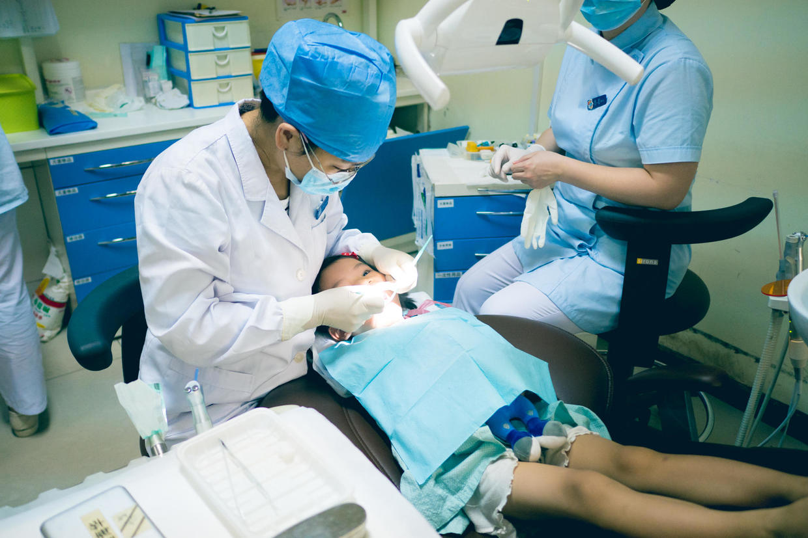
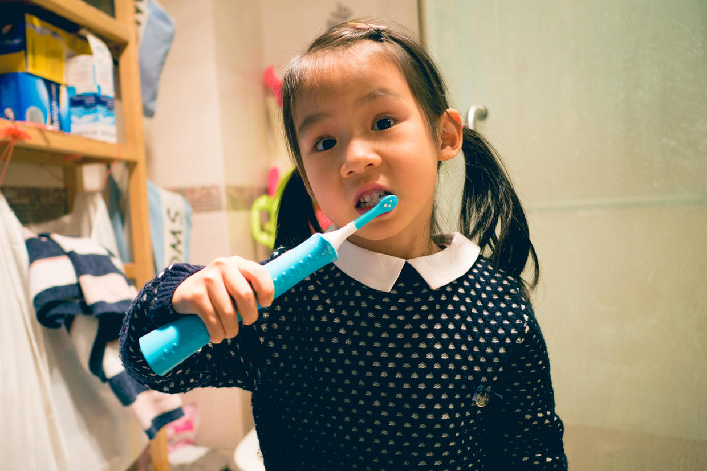

          
            
**2016.12.06**

11月份，喵要去复查牙齿。

喵妈电话预约时，被问到预约大夫的名字。由于时间有些长，实在不记得了。

我印象是姓雷，喵脱口而出：
>雷海华大夫。

小人儿的记性真是不错，而且雷大夫确实是手段高超。

每次看牙，都会不厌其烦地介绍一遍自己的所有看牙工具，消除小朋友的紧张感，最后还会让小朋友在一个大铁盒子里挑一个贴纸作奖励。

喵这次去复查，回来还像我们炫耀了得到的贴纸。

不过，这次又有牙出了小问题，补了一下，大夫特意交代，刷牙要更加仔细。

于是我们每天晚上和周末的中午都会严格刷牙。

喵自己刷一遍，我们再补一遍。

每到晚上20点，我们都会在“刷牙啦”的呼哨声中，奔向厕所。

喵自己先刷一遍，经过多次观察后，感觉确实不认真，只好经常指点，不行就再刷。

封面

逐渐地有些进步了。

然后是我来刷一遍，上下牙，分左右部分，每个部分上面、里面、外面都要反复刷3遍。

刷完牙用牙线，然后漱口洗脸。

虽然每次都腰酸背疼，但是这10几分钟，欢声笑语，嘻嘻哈哈，也真是很难得。

三个月后之后，还要复查，希望这次牙能得到大夫的表扬。

***下期预告：长沙之美食***

**个人微信公众号，请搜索：摹喵居士（momiaojushi）**

**喜欢作者写写哪些话题，可以公众号留言**

          
        