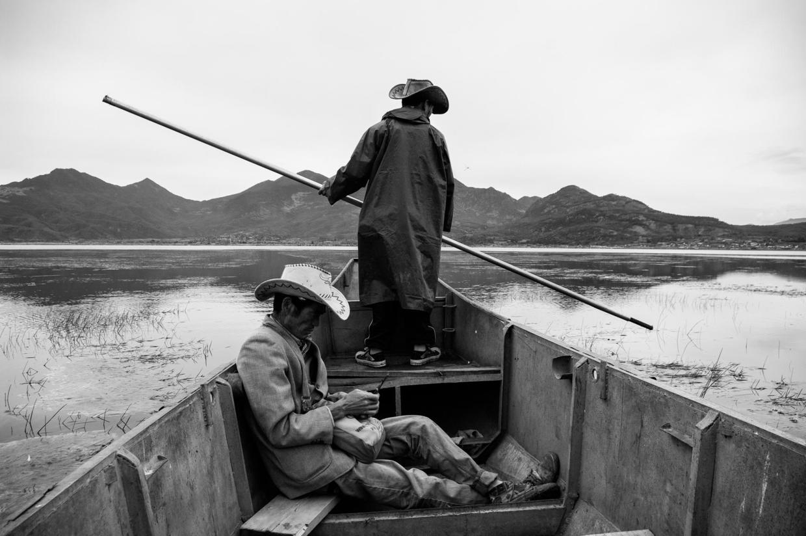

          
            
**2016.12.08**

继续回顾一下2008年丽江的蜜月照片。

和现在出行相比，当年真是毫无计划。到了大研古镇才开始研究下一步去哪儿，既不想去太折腾的梅里雪山，也不想去雨季路上危险的香格里拉。

于是决定去比较近的拉市海逛逛。

包了一辆小面包，一路上都能看到稻田。

拉市海是一片湿地，两个纳西族兄弟为我们撑船。

树从岸边一直长到水中。

第一次亲眼看到湿地的样子，幻想开着气垫船驰骋其间。

风吹芦苇，看不够的美景。

湿地也是逐年萎缩，干涸的地方成了放牧的草原。这两匹马的照片，后来洗了大幅照片，送给了同属马的父母。

丽江的天，说变就变，转眼间乌云来了又走。

走了很远，草甸中间的一间小屋里的纳西族老奶奶招待我们吃了饭。鸡蛋粑粑、萝卜干、饮料，最后只象征性地收了几块钱。

多年后，听说丽江连续干旱，不知道拉市海如今犹在否。

***下期预告：衣锦夜行***

**个人微信公众号，请搜索：摹喵居士（momiaojushi）**

**喜欢作者写写哪些话题，可以公众号留言**

          
        