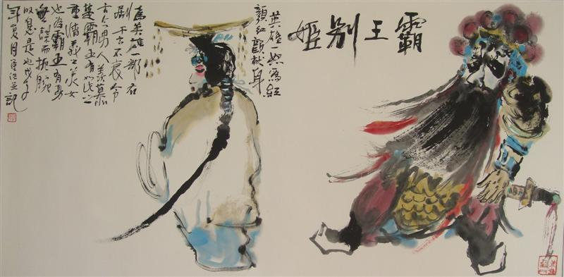

          
            
**2016.12.09**

以前上学时，鸿门宴是很早学的一篇古文，也是学的第一篇史记文章。

当时老师曾经评级过，太史公司马迁偏爱项羽，把他写进了帝王本纪。

到了今天，完整读过项羽本纪之后，发现整个本纪就是在黑项羽。

衣锦夜行这个成语，听说很久，原来也是出自项羽。
>鸿门宴后，项羽引兵进咸阳，杀了秦王子婴和秦贵族八百多人，并一把大火焚毁了阿房宫。然后，他带着大批财宝和妇女，归乡炫耀。项羽说：“富贵不归故乡，如衣锦夜行，谁知之者。”衣锦归乡的典故即出于此。

面对着大好局面，项羽竟然放弃关中，回到四战之地的彭城，着实令人惋惜。

而这种“富贵要归乡”的心理，就已经给日后“四面楚歌”时心里崩溃和“无颜面对江东父老”买下了伏笔。

封面

不知道有没有心理学家分析过项羽性格的形成原因，这种强烈的被认同感是如何产生的？

亡国贵族之后，由舒服养大，从小就要学万人敌，见到秦始皇要取而代之。

最后不禁想起鲁智深大闹五台山时，挑酒小哥的那句唱词：
>九里山前作战场，
牧童拾得旧刀枪。
顺风吹动乌江水，
好似虞姬别霸王。

***下期预告：周末活动***

**个人微信公众号，请搜索：摹喵居士（momiaojushi）**

**喜欢作者写写哪些话题，可以公众号留言**

          
        