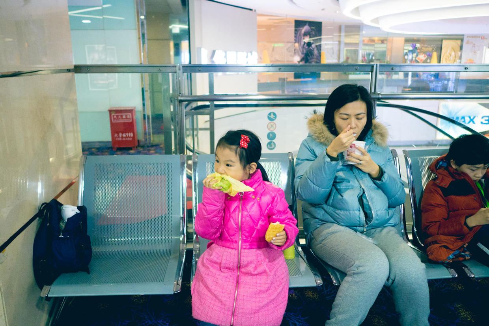
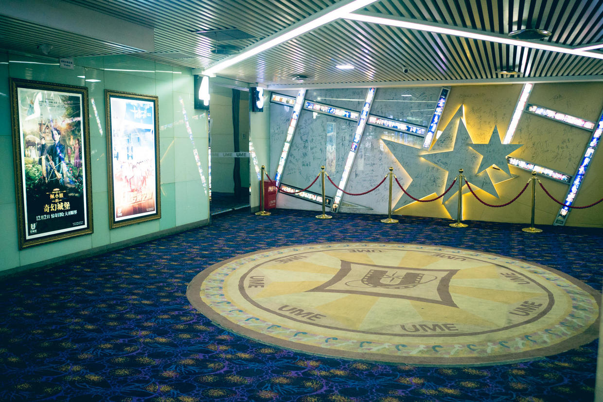
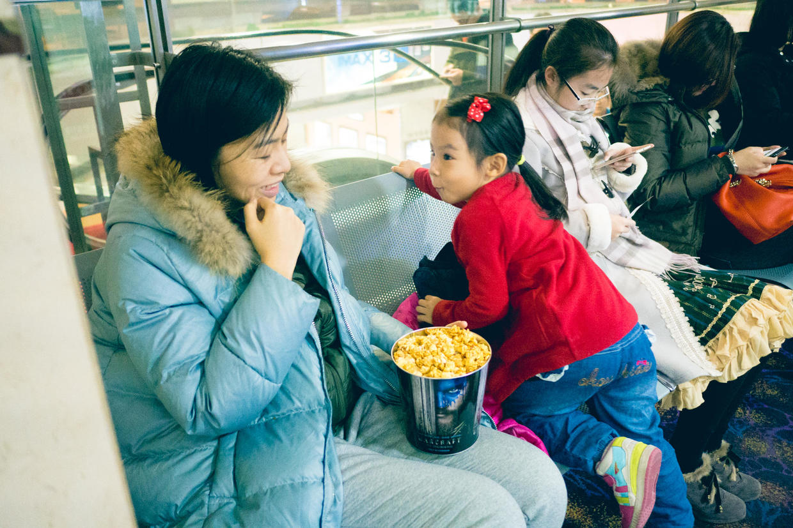
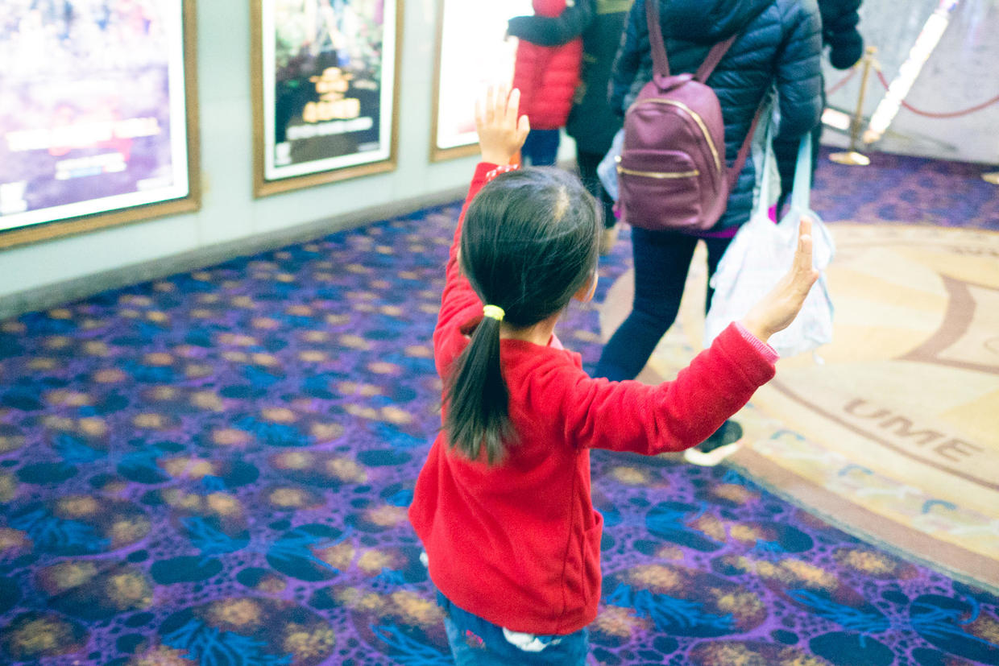
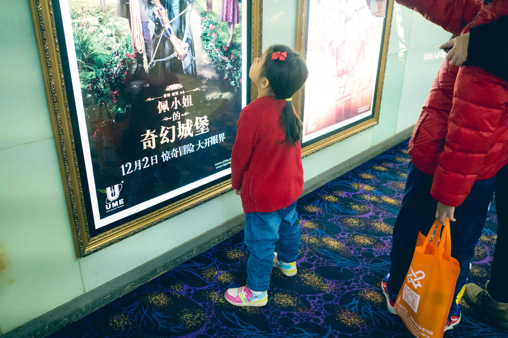
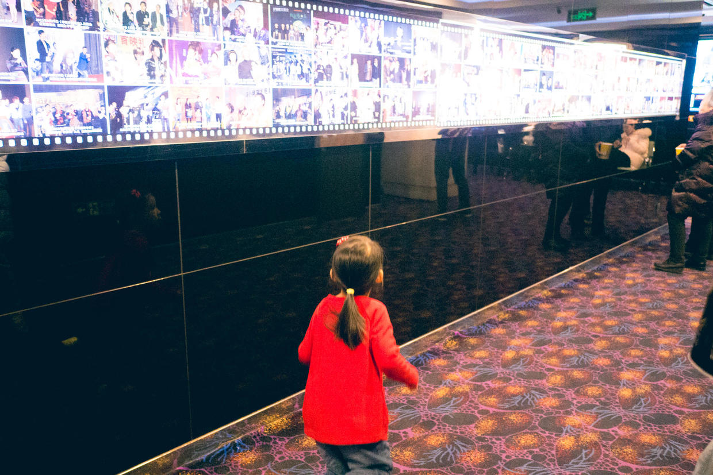
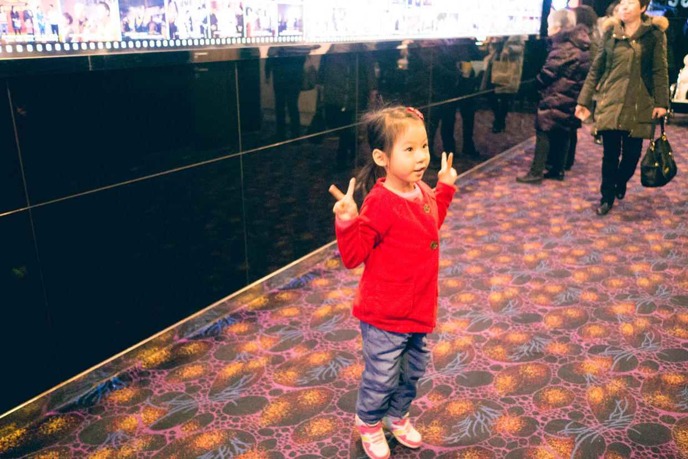
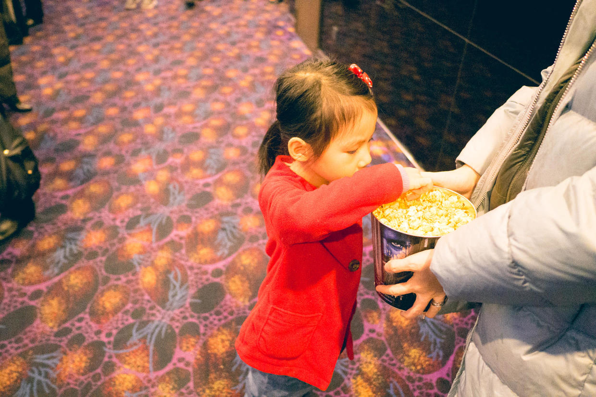

          
            
**2016.12.18**

周日一早，雾霾严重，今天是单号限行。

起床，穿衣服，直接出门打车，去华星电影院。

在麦当劳买了早餐，打包去电影院，取了3张《我在故宫修文物》的电影票。

之前有过《海底总动员2~多莉去哪儿》的经验后，左思右想，看来只有这类没有矛盾冲突的现实主义纪录片比较适合她。

在休息区，吃着早饭喝着粥。

来的比较早，没有什么人。

临开场了，买了爆米花。

自己一个人兴奋地飞来飞去。

看着电影海报。

电影临开场，设备出问题了，只能在外面继续等。

无聊时，学小兔子跳。

吃着爆米花。

看电影的全过程，倒是没哭，不过她觉得无聊，自己在位子上玩儿。

看来纪录片也完全不适合她。

***下期预告：看图说话***

**个人微信公众号，请搜索：摹喵居士（momiaojushi）**

**喜欢作者写写哪些话题，可以公众号留言**

          
        