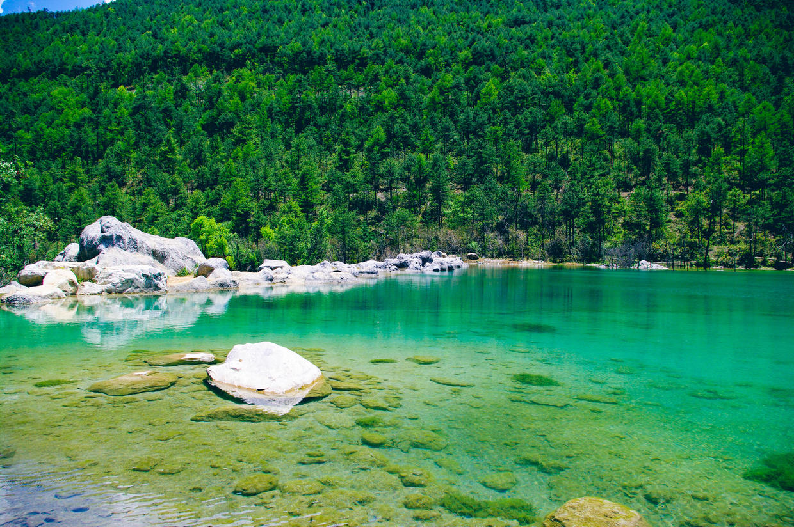
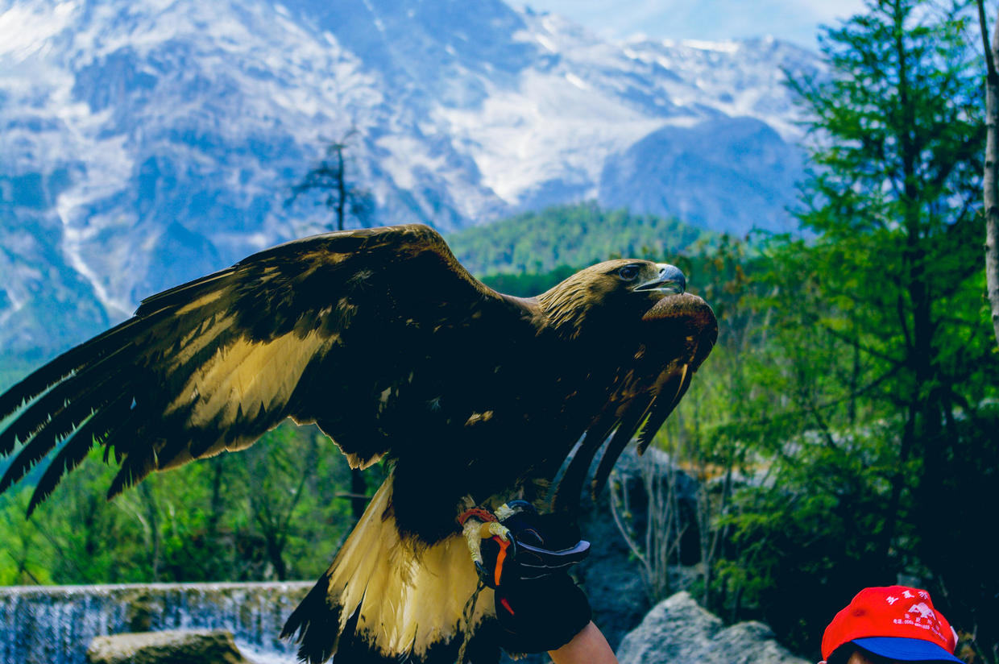
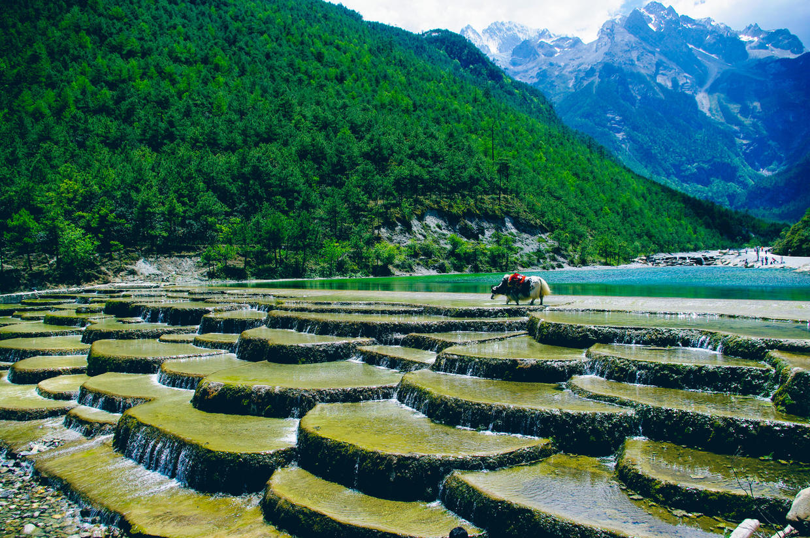
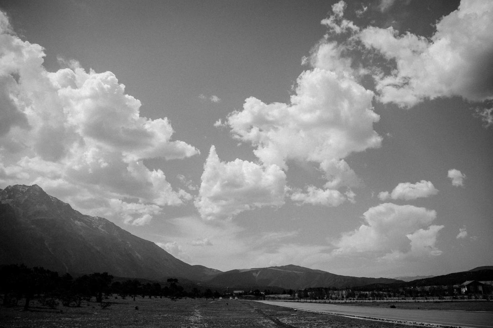
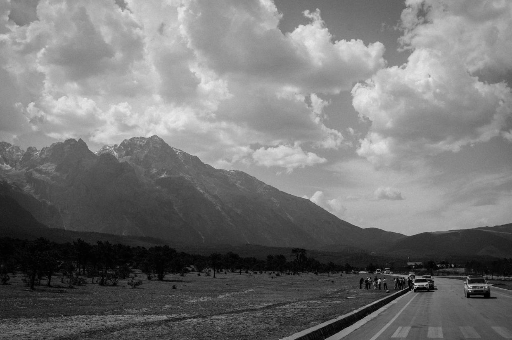
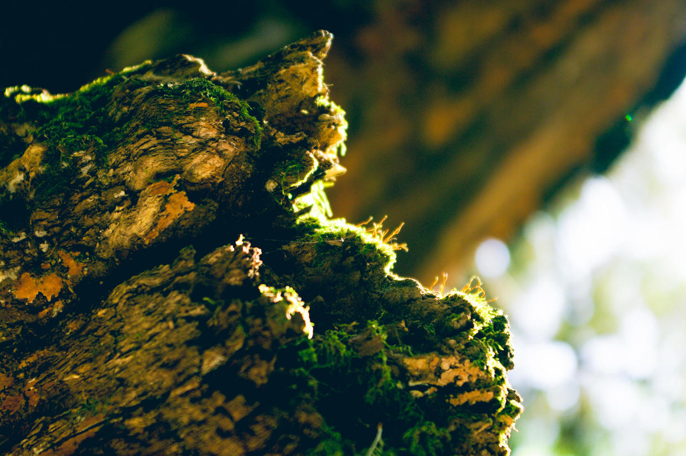

          
            
**2016.12.22**

继续回顾2008年丽江的蜜月之旅。

从玉龙雪山下来，1日游包车直接把我们一行来自五湖四海的人拉到了蓝月湖。

听说是当年新开发的景区，号称小九寨沟。

从景色上看，完全对得起这个称号，因为矿物质的原因，湖水呈现出奇怪的颜色。

这应该就是三国演义七擒孟获中提到的各种奇怪的泉水。

封面

雪山下，湖水边，老鹰陪着游人照相。

牦牛站在湖边等着游客。

虽然景色很好，但是规模上完全没法和九寨沟相比，大概10分钟就转完了。

不过精彩的风景都在通往束河古镇的路上了。

一望无尽的公路，群山和白云一直追随左右。

在风景最佳处，导游安排大家下车照相。

周围的树林也是处处充满了生机。

接着就到了束河古镇，据说那里现在就是一个大型“南锣鼓巷”。

***下期预告：哈利波特雨被诅咒的孩子第一幕***

**个人微信公众号，请搜索：摹喵居士（momiaojushi）**

**喜欢作者写写哪些话题，可以公众号留言**

          
        