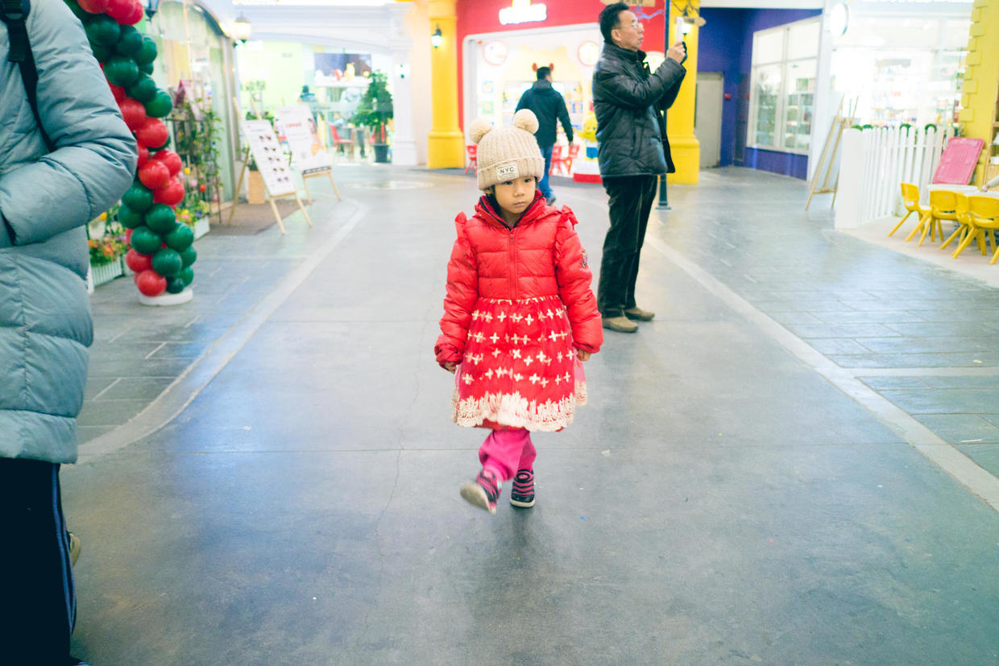
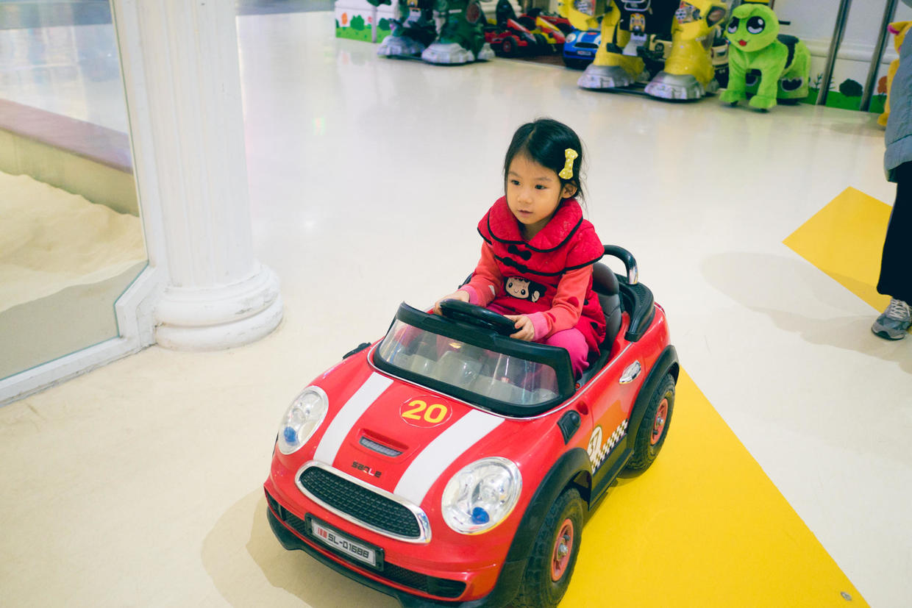
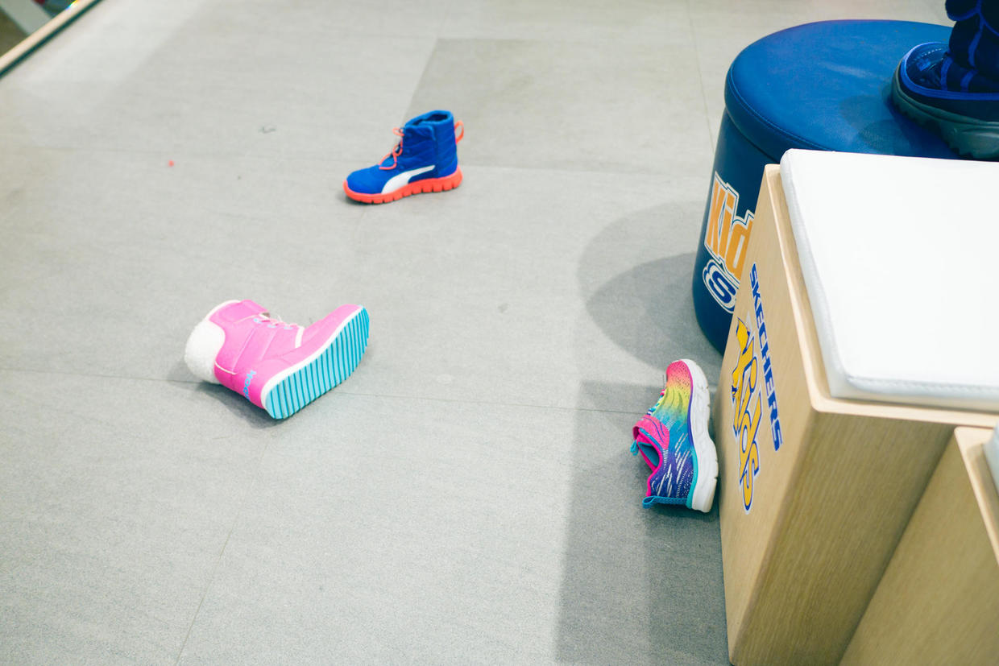
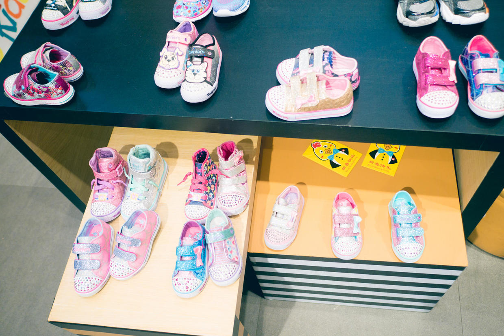
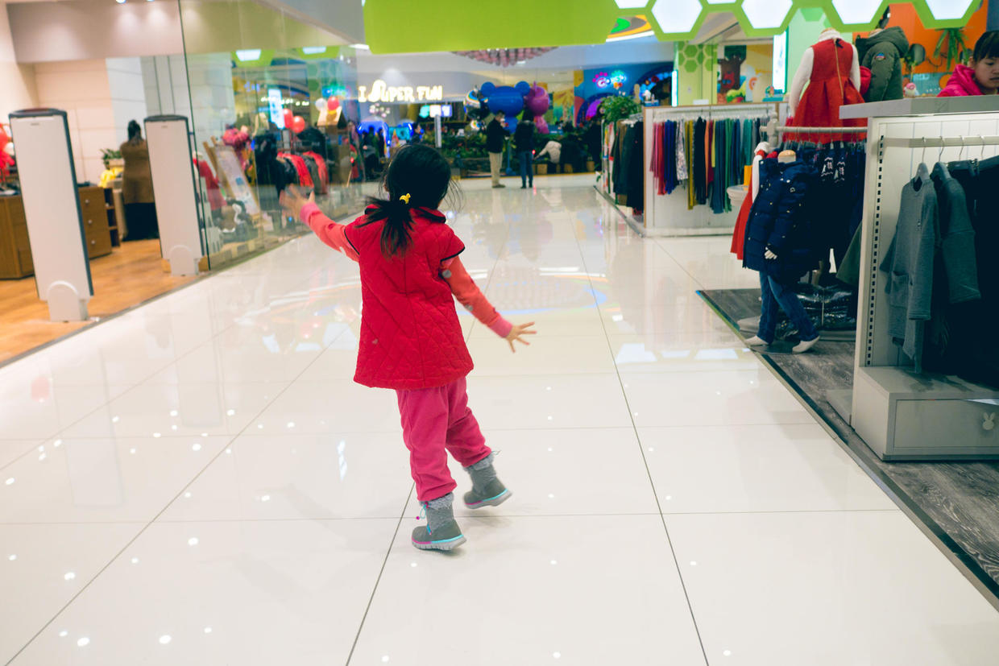
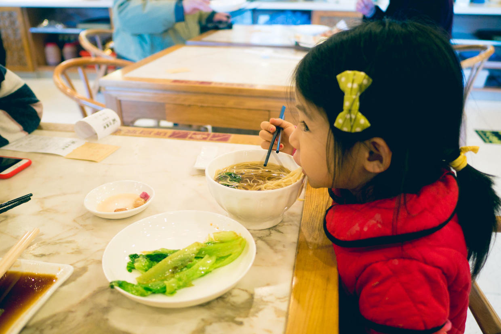

          
            
**2017.01.02**

元旦最后一天了，一早起床，雾霾终于散了，2017新年第一个蓝天到来了。

来到商场，今天的目标是买一双暖和的靴子，之前的全都小得没法穿了。

先开了会儿小汽车，自己不太会控制油门，还好有遥控器，可以大人在旁边遥控。

试了好几双靴子，不过她的精力都被别的鞋吸引走了。

一看到这些闪亮的鞋子就想买，等到开春，天气暖和再说了。

终于挑到合适的靴子，顿时就跑起来了。

中午吃上一碗阳春面和蚝油生菜。

元旦假期转眼过去了，明天开始工作啦。

***下期预告：我喜欢2016***

**个人微信公众号，请搜索：摹喵居士（momiaojushi）**

**喜欢作者写写哪些话题，可以公众号留言**

          
        