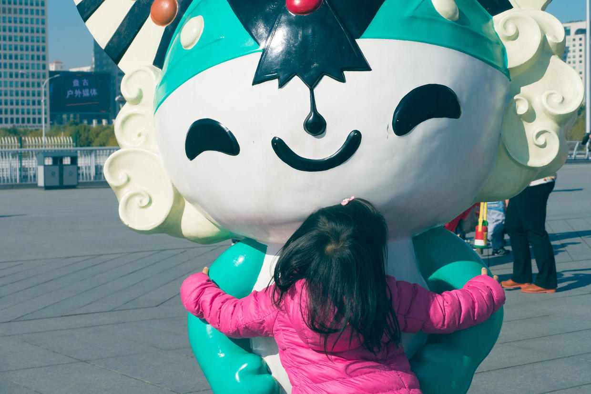

          
            
**2017.01.03**

在2016年最后一天晚上睡前，我们跟喵说，明天就是2017年的第一天了。

喵对我们说：
>我不想2017年，我喜欢2016年。

问她为什么，她告诉我们：
>我喜欢福娃。

原来是她喜欢2016年的奥运会，奥运会让她想起了福娃玩具。

福娃是喵最喜欢的一套玩具了，2008年，奶奶买了这一套福娃，一直尘封着，知道喵来到了，才焕发了活力。

上幼儿园以后，每次到奶奶家，都要和爷爷一起玩儿福娃游戏。

5个福娃是学生，喵是老师。

5个福娃的颜色、造型、名字、代表的寓意，喵都记得一清二楚。

喵对2016的留恋，更多的是对和爷爷奶奶在一起的欢乐时光的留恋。

到了2017年，大家还是会快乐地在一起。

***下期预告：北邮的小松林***

**个人微信公众号，请搜索：摹喵居士（momiaojushi）**

**喜欢作者写写哪些话题，可以公众号留言**

          
        