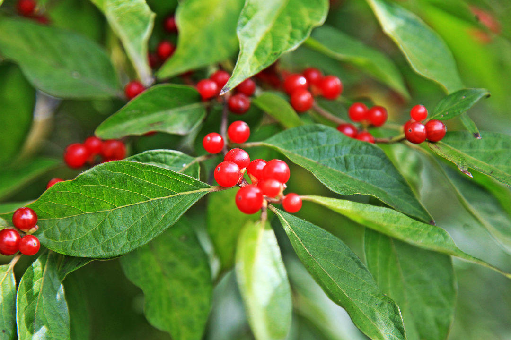

          
            
**2017.01.06**

前段时间，组里出去活动，晚上聚餐吃麻辣火锅。

说到吃辣，组里山东同学说到了他家乡的茱萸，味道很重，没辣椒的时代就是靠吃茱萸。

说到茱萸，大概就是这个样子。

茱萸其实挺陌生的，它的知名度完全是靠王维的《九月九日忆山东兄弟》
>独在异乡为异客，
每逢佳节倍思亲。
遥知兄弟登高处，
遍插茱萸少一人。

根据百科介绍：
>茱萸，又名“越椒”、“艾子”，是一种常绿带香的植物，具备杀虫消毒、逐寒祛风的功能。木本茱萸有吴茱萸、山茱萸和食茱萸之分，都是著名的中药。佩茱萸，汉族岁时风俗之一。在九月九日重阳节时爬山登高，臂上佩带插着茱萸的布袋（古时称“茱萸囊”）。

说到王维，这首诗是他十七岁在异地求学时所作，诗句里能感觉到他兄弟之间感情非常好。

几十年后，事实也印证了这兄弟之情。

安史之乱爆发，王维被安禄山胁迫做了官，等到唐肃宗平定安史之乱后，要杀王维。

肃宗手下做官的王维的弟弟王缙，为兄长求情，恳求削去自己一切官职，换兄长一命。

最终王维的命保住了，这才有了他日后的隐居和隐居后的作品《鹿柴》、《山居秋暝》等等。

***下期预告：周末活动***

**个人微信公众号，请搜索：摹喵居士（momiaojushi）**

**喜欢作者写写哪些话题，可以公众号留言**

          
        