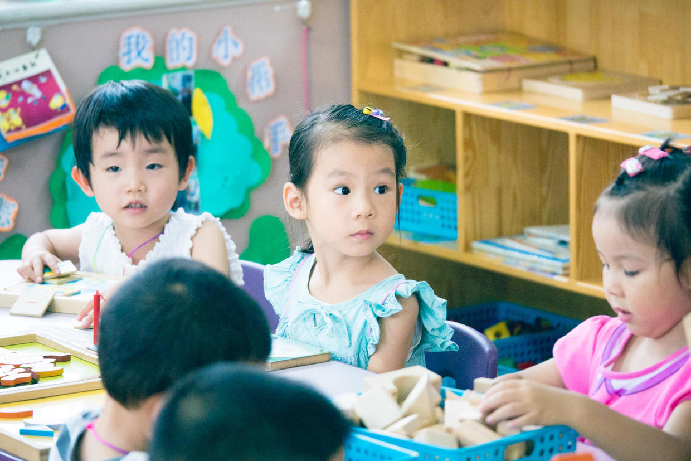

          
            
**2017.01.09**

**拍摄时间：2016.06.23**

**拍摄地点：幼儿园**

这张照片是2016年夏天幼儿园公开课上拍的。

那时喵已经在幼儿园里游刃有余了。

上课一开始，喵抽签拿到拼插区的卡片，挂在脖子上，来到拼插区和小朋友们一起玩儿拼插玩具。

时不常的，瞪大眼睛，看看其他区有什么新活动。

到了休息时间，大家重新抽签，更换新的活动区域。

每次休息，老师会带小朋友们去喝水、上厕所。

到了10点半，大家集体喝酸奶加餐，休息一会儿，排好队下楼进行体育活动。

操场上，老师早就准备好了器材，组织大家进行各种趣味运动。

最后10分钟是自由活动，小朋友们在操场上、滑梯上、平衡木上尽情地驰骋。

转眼间，2016年过去了，新的一年到来了。

***下期预告：Kipper***

**个人微信公众号，请搜索：摹喵居士（momiaojushi）**

**喜欢作者写写哪些话题，可以公众号留言**

          
        