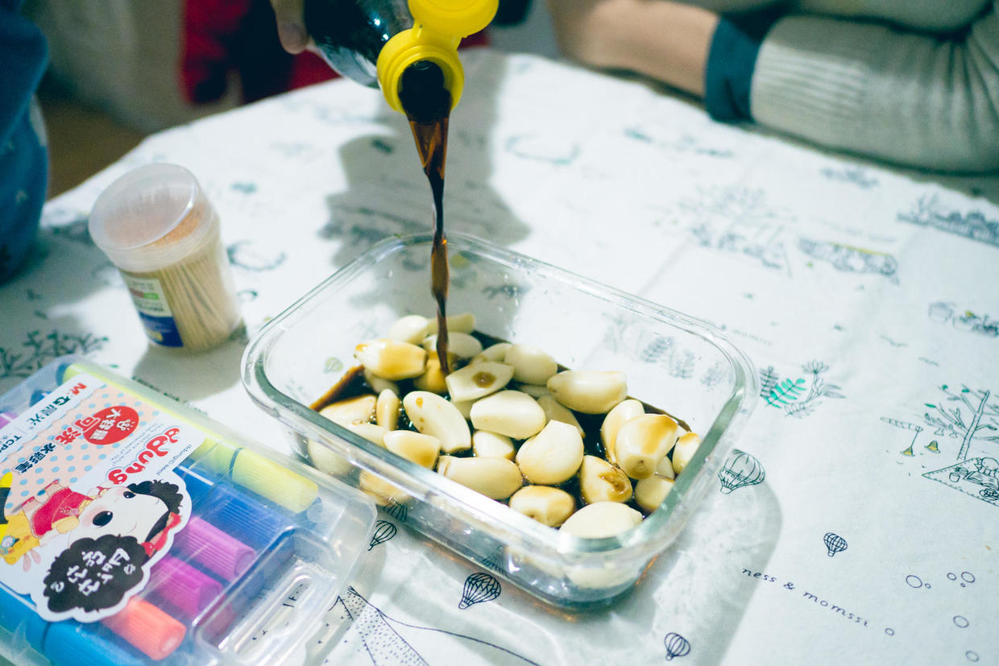

          
            
**2017.01.24**

腊八的那个周末，我们和喵一起开始学做腊八蒜。

准备了三头大蒜，把皮都剥干净。

把最干净，最新鲜的蒜留下。

准备好牙签。

用牙签，竖着把蒜扎穿。

把醋和蒜，混合在一起。

加一些糖，搅拌均匀。

这个过程非常简单，艾莎还在一边看着。

之后放进冰箱，等着蒜变颜色就好了。

大概两周之后，蒜就变蓝了。

周末吃饺子，打开盖子，甜甜的腊八醋味就窜出来了。

喵也蘸着醋吃饺子，边吃边说：
>有一点点辣我也能吃，有点辣味很好吃。

醋是很甜，不过蒜还是挺辣的，又酸又辣。

下次可以试试再多放点糖。

腊八蒜做好了，接下来就是收拾屋子，准备春联了。

春节的脚步越来越近啦。

***下期预告：北京游乐园***

**个人微信公众号，请搜索：摹喵居士（momiaojushi）**

**喜欢作者写写哪些话题，可以公众号留言**

          
        