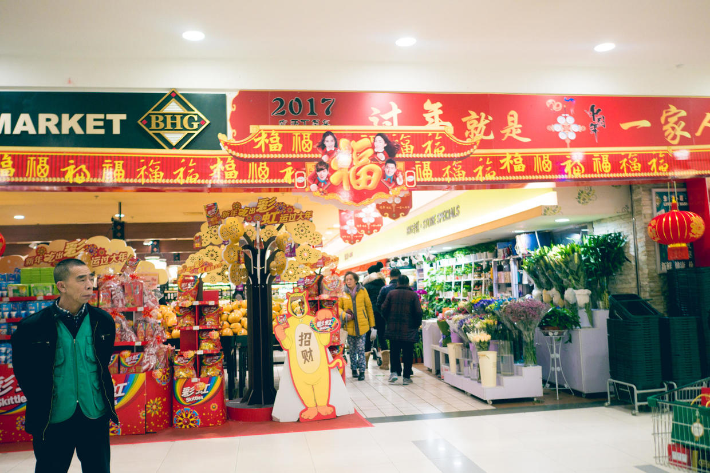
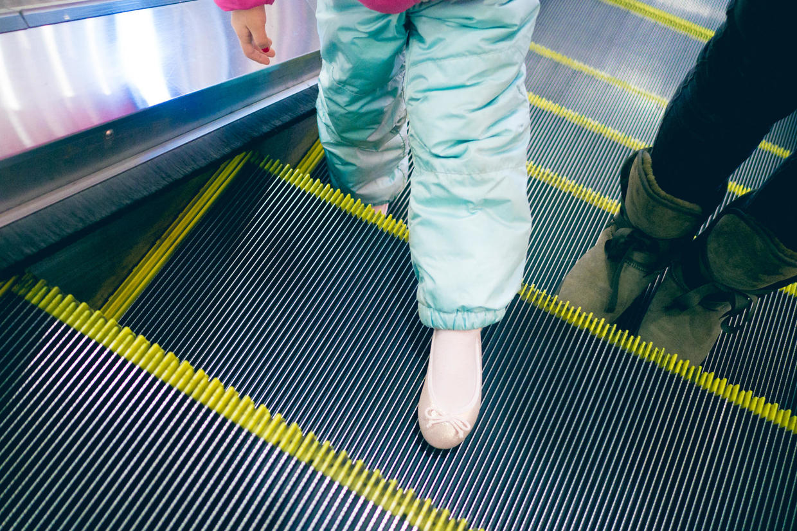

          
            
**2017.01.29**

初二啦，一晚上狂风怒吼，扫清了所有的雾霾和鞭炮硝烟。

一早起床，开心地吃上一顿汤圆，喝了一大杯奶。

大风天，出门去商场转转。

超市门口喜气洋洋，充满了节日气氛。

喵已经很高啦，自己能推购物车了。

封面

钻到照相牌后面，拍个照。

周边的菜摊都关了，只能在超市买菜了。

喵自己挑了一包娃娃菜。

坐在车里，帮我们拿东西。

玩儿起了假装自己要掉下去的把戏。

撕了一小块泡泡糖，让我吹泡泡。

看上了一双小皮鞋。

电梯上的小兔子，非常可爱。

作为春节礼物，买了这双小粉鞋，太薄了，现在还不能穿出去。

跟着商场的音乐跳起舞来。

中午去吃饭，自己扑腾扑腾地玩儿起来。

一定要点自己最喜欢的“Egg Fried Rice”。

每天讲书都要讲那本“Egg Fried Rice”，吃起来也特别带劲。

吃饱喝足回家，大风起来，放下帽子的眼镜，活像个小怪物。

下午还是睡觉休息时间，攒足精神。

明天准备去和悦妹、兜妹一起玩儿。

***下期预告：春节D5***

**个人微信公众号，请搜索：摹喵居士（momiaojushi）**

**喜欢作者写写哪些话题，可以公众号留言**

          
        