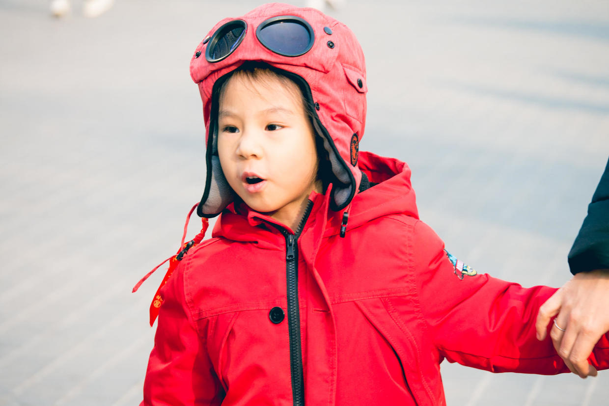
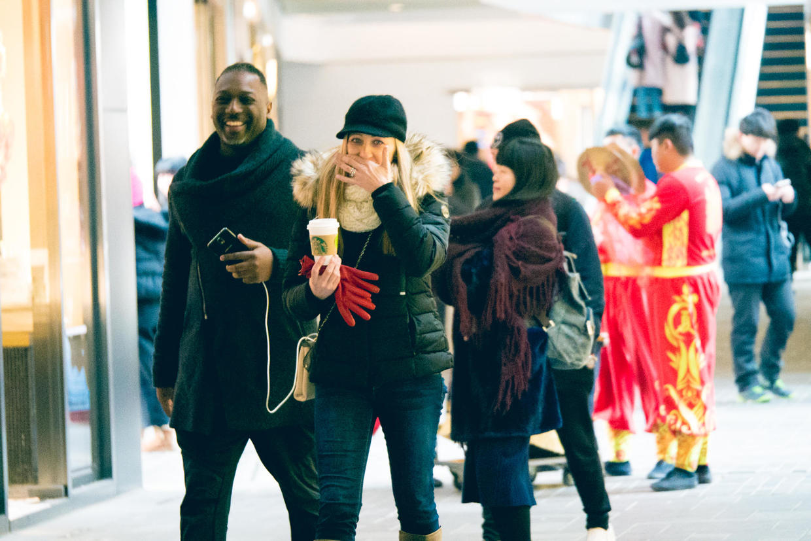
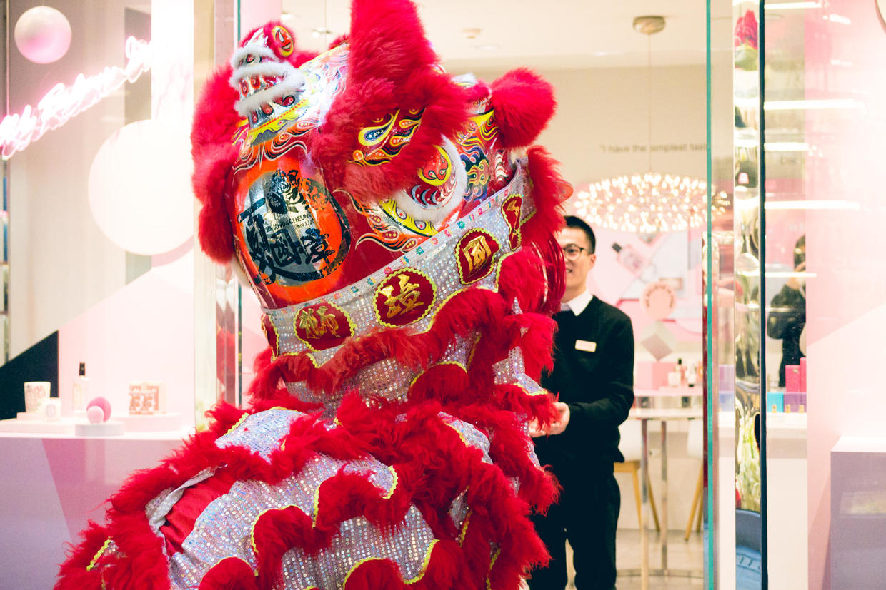
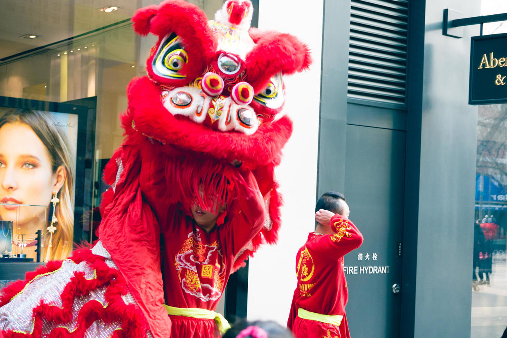
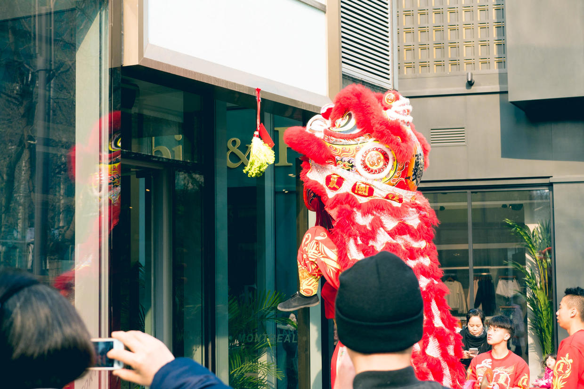
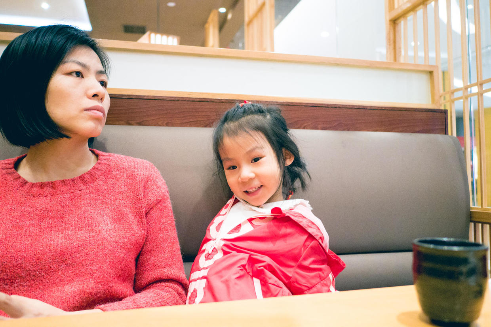
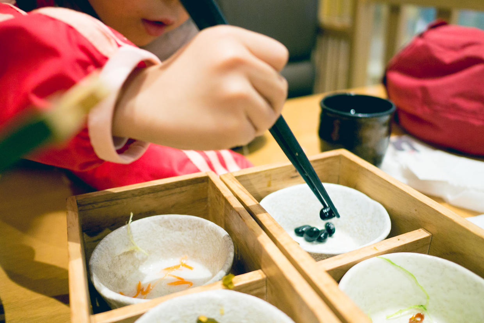
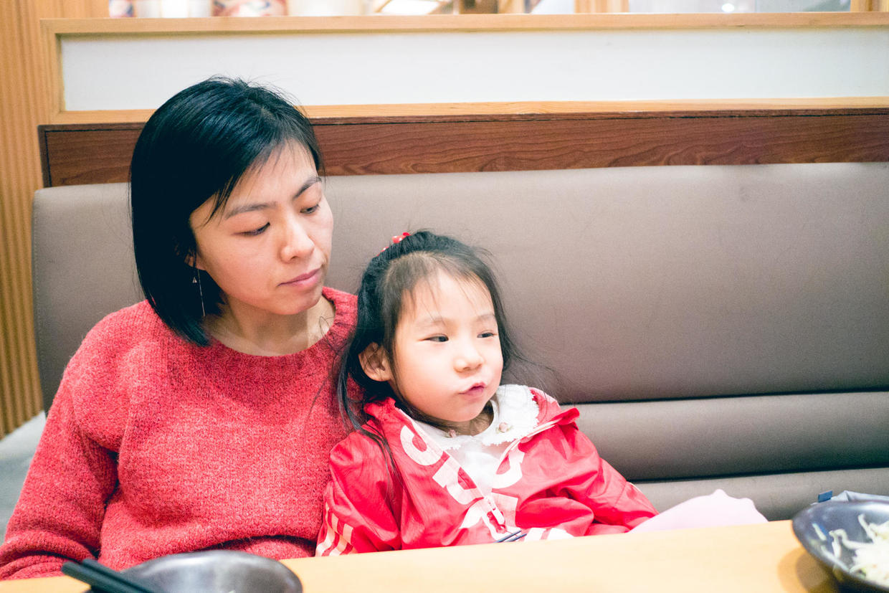

          
            
**2017.02.03**

初七啦，到了大家第一天上班的日子了。

春节前已经请好了假，所以能多休息2天。

早上起床，吃饭，空气质量开始缓慢下降。

计划开车去三里屯转转，幸好听了一耳朵交通台的一路畅通，才想起来今天限行。

到了三里屯，还没什么人，在街上走了走，晒了太阳。

看着对面的外国朋友们笑得合不拢嘴。

原来是三里屯搞了一个舞狮巡游活动。

到每家商户门口跳上一段，然后求红包。

喵立刻被大狮子吸引，跟着狮子和锣鼓队伍一路走。

封面

商户门口事先都挂好了生菜，大狮子要取下白菜，弄碎了撒一地。

中午去吃饭，喵一直穿着新衣服，美的不得了。

自己夹着小蜜豆吃。

吃饱喝足倚在妈妈身上。

中午回家睡个大觉。

晚上准备给姥姥姥爷视频一下，洗个澡。

然后开始学拼音，从昨晚突然主动要求妈妈教拼音，看起来特别有兴趣。

春节假期最后几天啦。

***下期预告：春节D10***

**个人微信公众号，请搜索：摹喵居士（momiaojushi）**

**喜欢作者写写哪些话题，可以公众号留言**

          
        