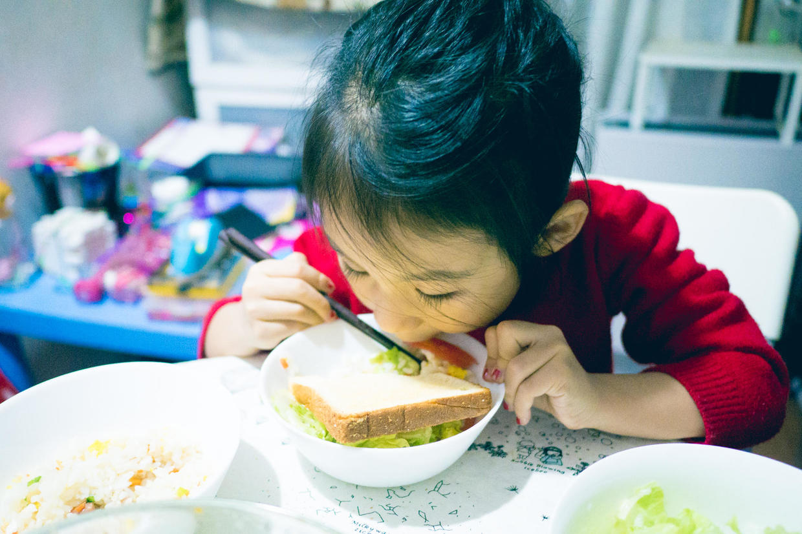
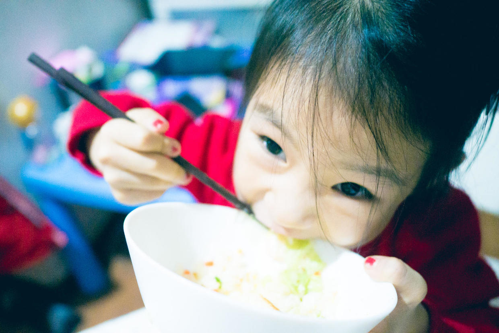
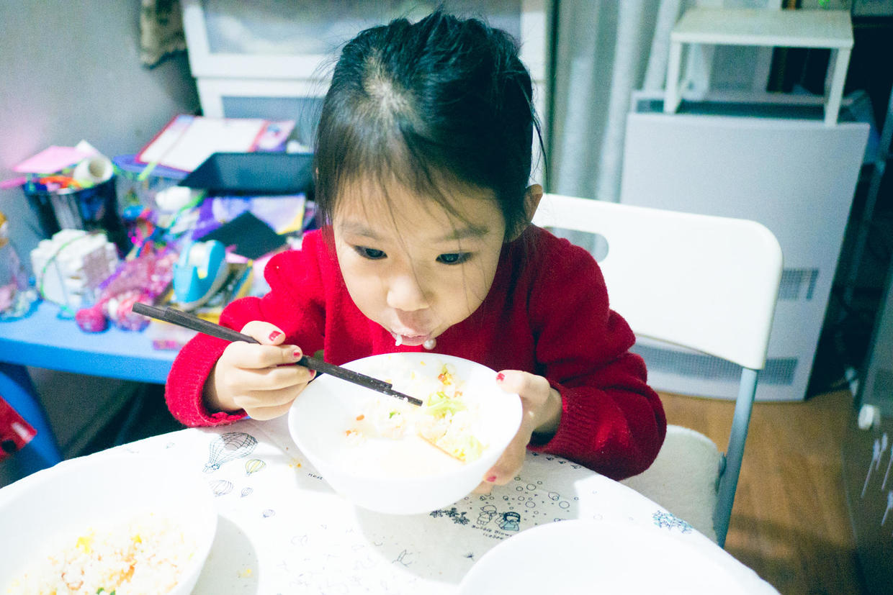
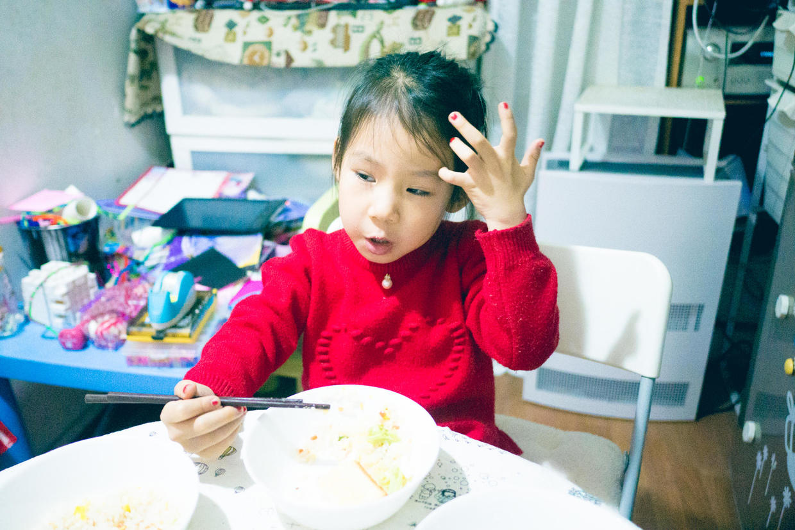

          
            
**2017.02.07**

过了元旦，幼儿园开始放寒假。

喵基本就休息了，每天送去奶奶家。

天气不好，奶奶基本每天带她去游泳。

后来找到一位自己喜欢的女教练，开始学游泳了。

在这1个月的游泳锻炼下，喵吃饭明显有了进步。

春节去姥姥姥爷家，吃得特别好，姥姥姥爷都大大地夸奖了一番。

回到家基本每顿饭都吃得很好。

这天晚上，去买春节礼物，回家有点晚，喵也饿了，吃得更是起劲。

蔬菜、炒米饭，还主动要求加一片烤面包。

烤面包和菜都吃干净了，还要再加点炒米饭。

端起碗来，对我们说到：
>爸爸妈妈，最好的一幕就要发现了。

自己抱着碗，呼噜呼噜地开始吃。

封面

吃得很用心，但是也不会狼吞虎咽，中间还要整理一下自己的头发。

我们看得目瞪口态，从没见过她这样用力地吃饭。

吃饭终于像爸爸啦。另外，我们应该这样说：
>最好的一幕就要发生了。

***下期预告：哈利波特与被诅咒的孩子4***

**个人微信公众号，请搜索：摹喵居士（momiaojushi）**

**喜欢作者写写哪些话题，可以公众号留言**

          
        