          
            
**2017.02.11**

最近喵开始要求自己梳辫子了。

平时早上起床，穿好衣服，自己坐在床上开始很有耐心地梳辫子。

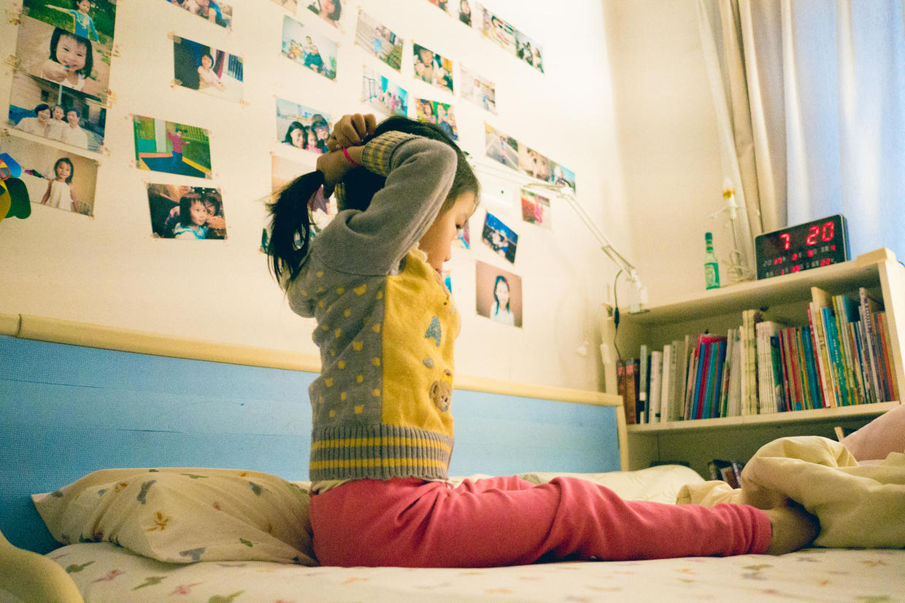

梳的小丸子头。

今天一早起床，好多喵不用的东西送给了爸爸的同事。

同事阿姨来拿的时候，喵帮忙拎着一袋衣服送上了车。

送完东西，准备去奶奶家，带上了自己的大帽子。

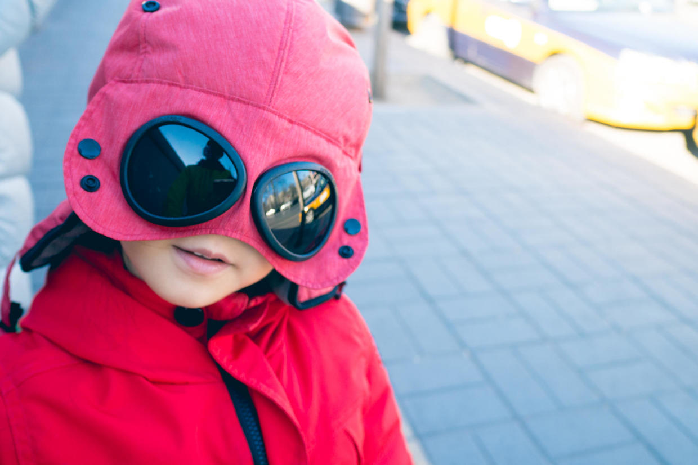

天气非常好，没有大风的蓝天实在难得。

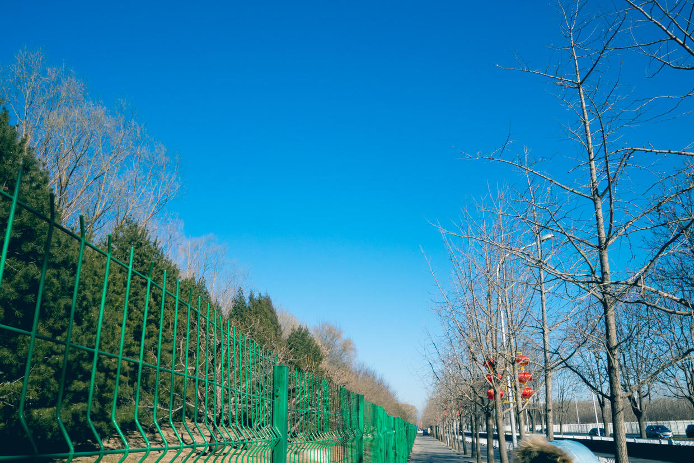

走去地铁站的路上累了，抱着妈妈大腿。

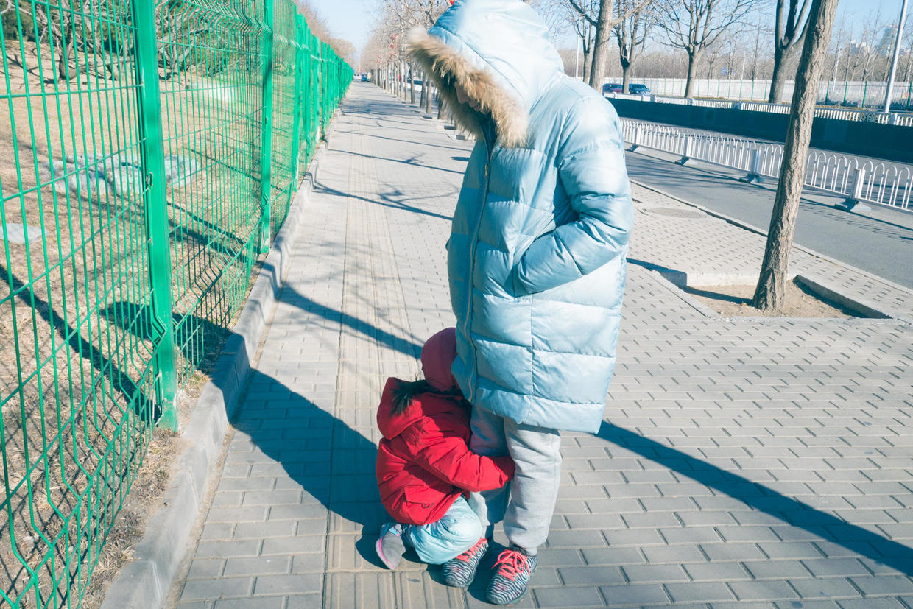

地铁上一摘帽子，头发都爆炸了。

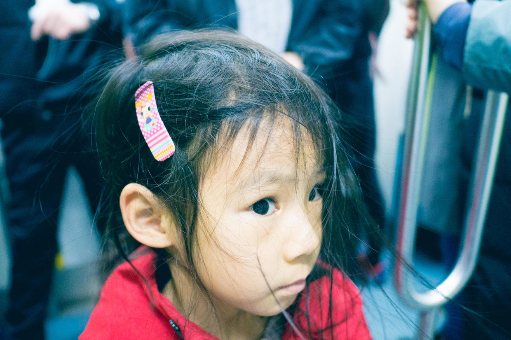

下了地铁一路走去奶奶家。

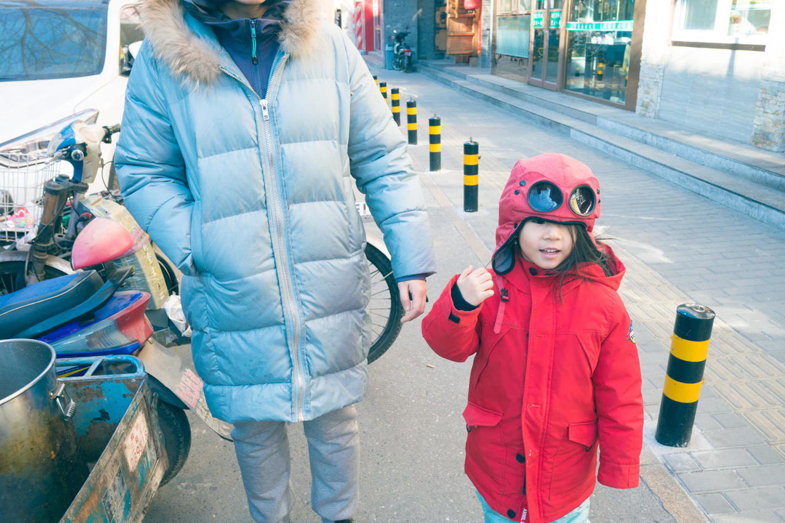

和奶奶一起练习打排球。

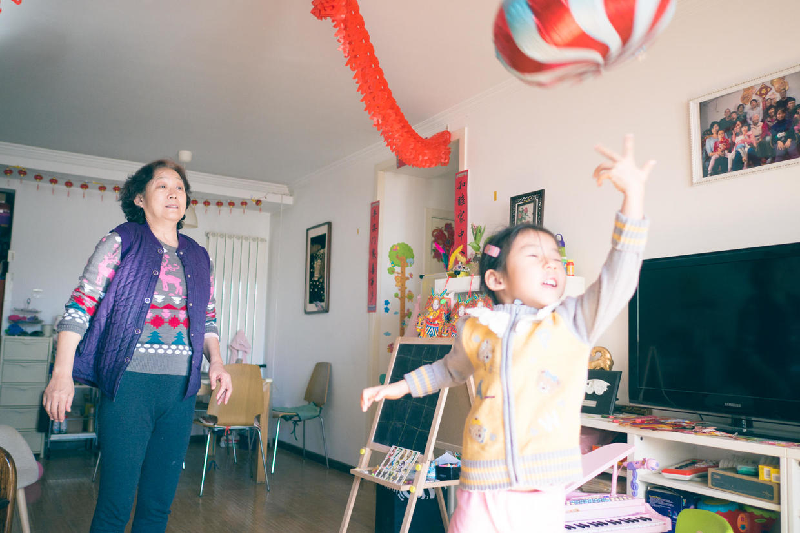

一起按照奶奶给的菜谱做菜。

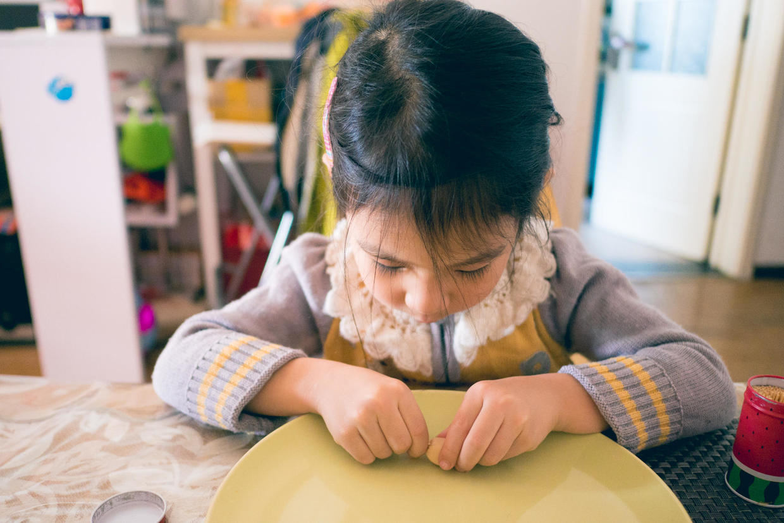

把肉肠做成小爱心的形状。

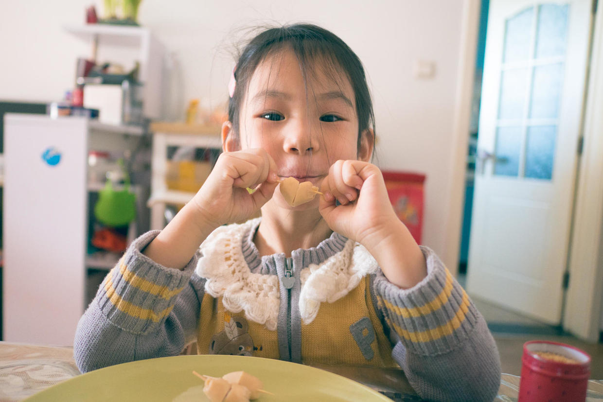

封面

边做边吃，很得意。

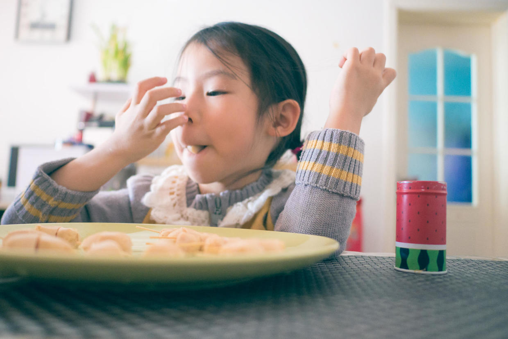

爱心肠和爱心西红柿。

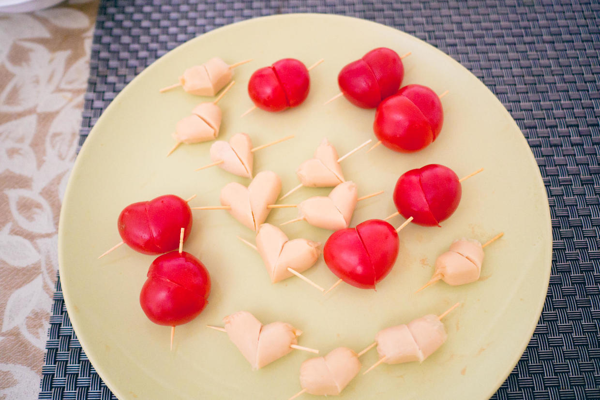

烤过之后更香。

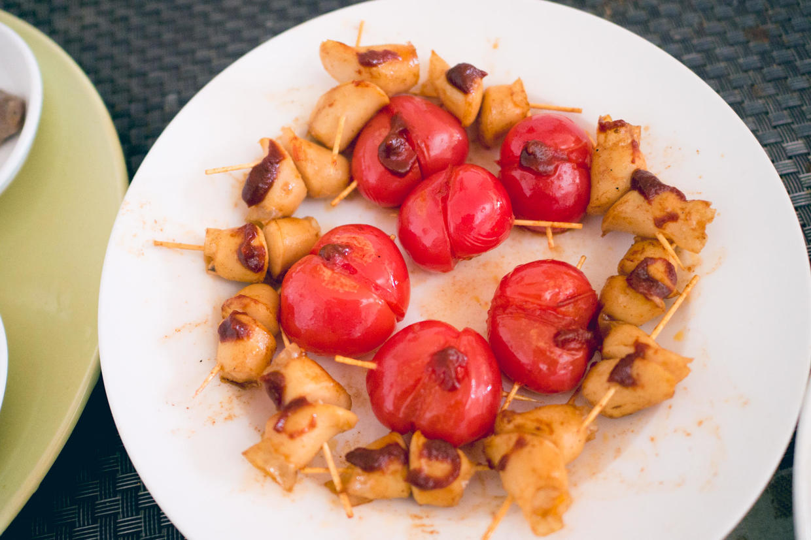

午饭就是白菜豆腐、烤牛肉、烤肠、烤西红柿、蚝油生菜。

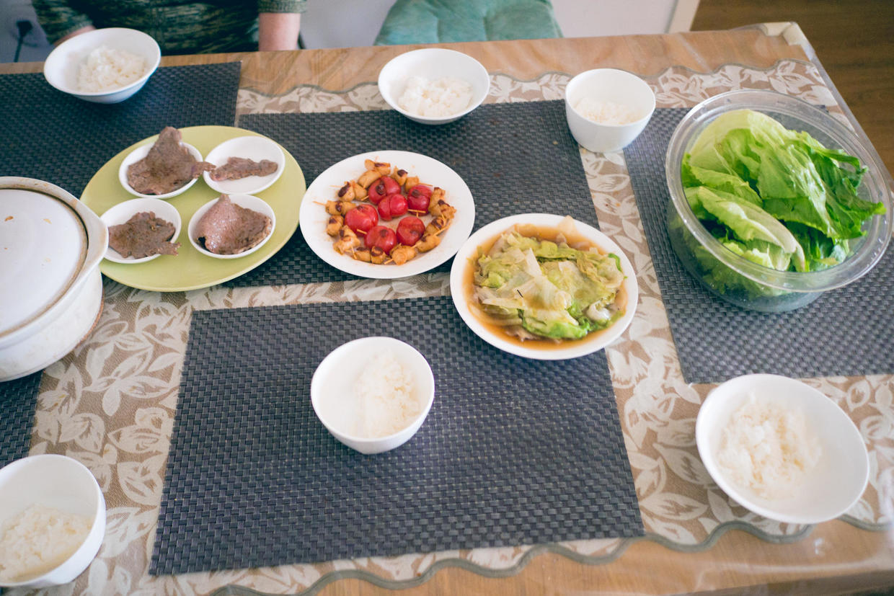

丰盛的一餐之后，回家睡个午觉，下午去游乐场玩儿。

***下期预告：周末活动***

**个人微信公众号，请搜索：摹喵居士（momiaojushi）**

**喜欢作者写写哪些话题，可以公众号留言**

          
        