          
            
**2017.02.25**

到了周六，天气竟然难得的好。

早上起床，吃喵妈的烤面包片。

出门，天空非常蓝，稍微有点风。

向翠微出发，在十字路口很开心。

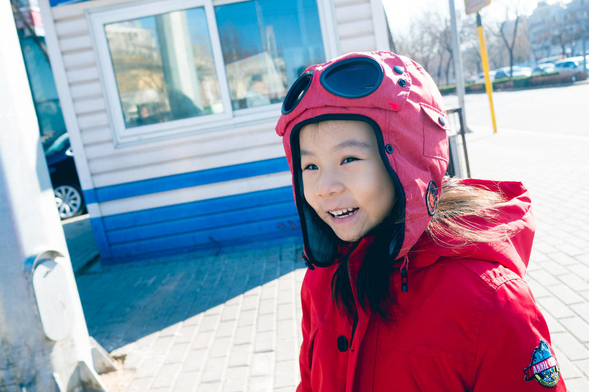

到商场里面，轻装上阵，向游乐场进发。

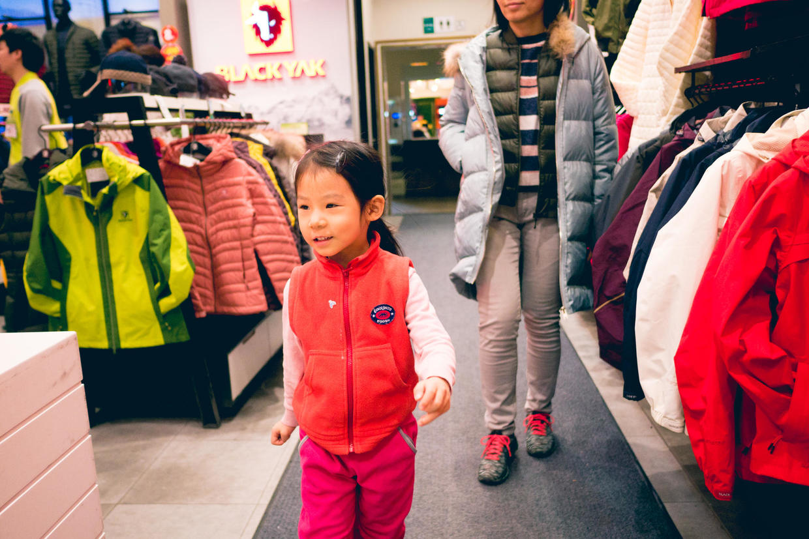

今天是第一波到的，里面还没有人，喵迅速占领了大管道。

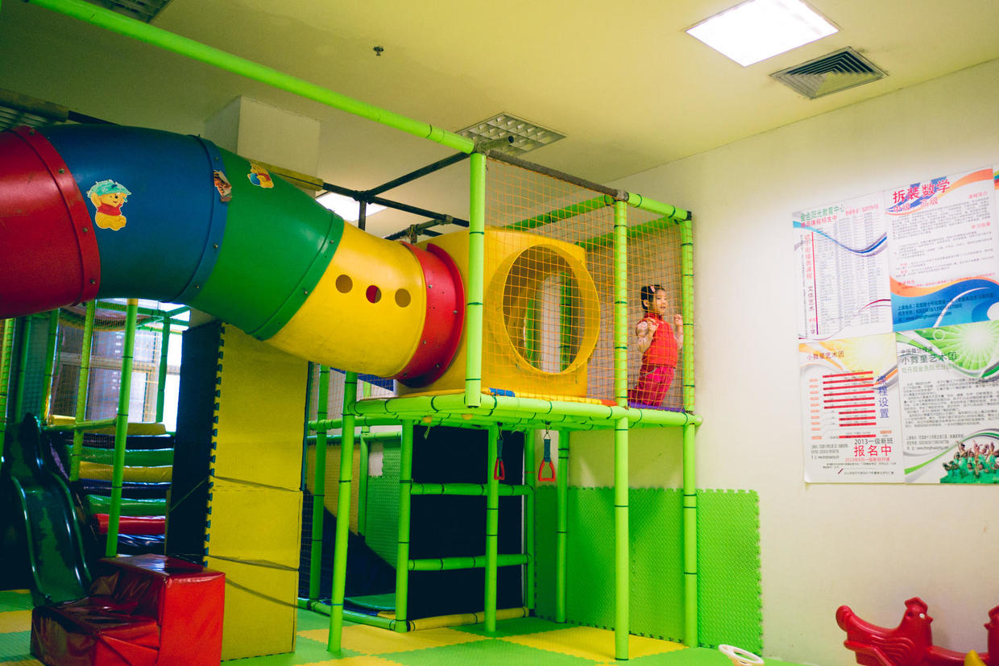

玩儿蹦床，还不忘了自己梳一下辫子。

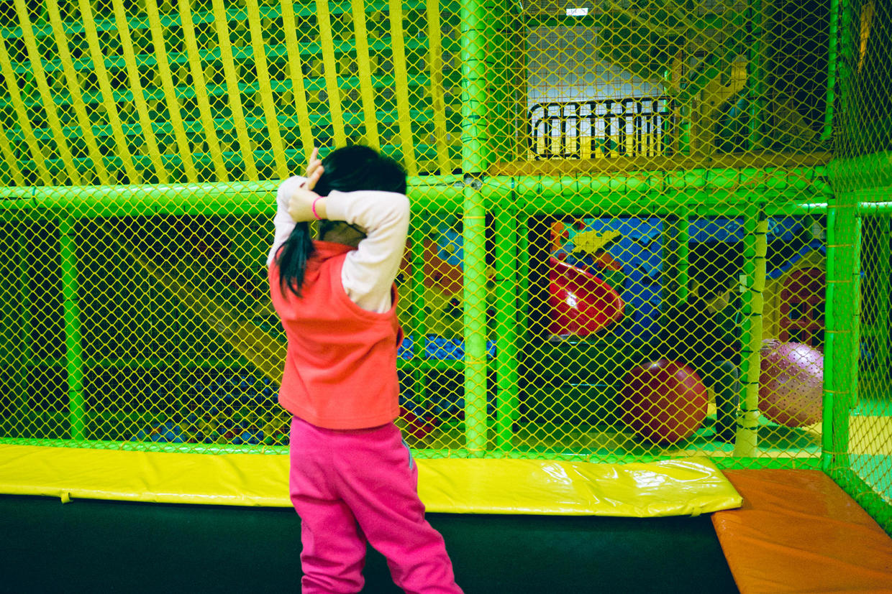

跳得比以前高了很多。

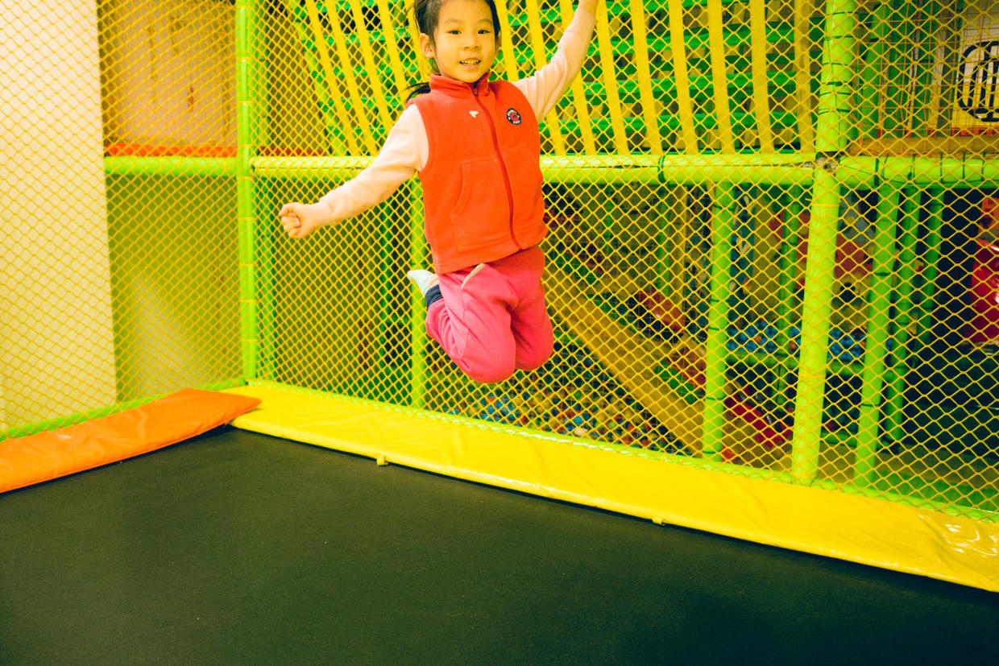

下来拍大球，推球四处跑。

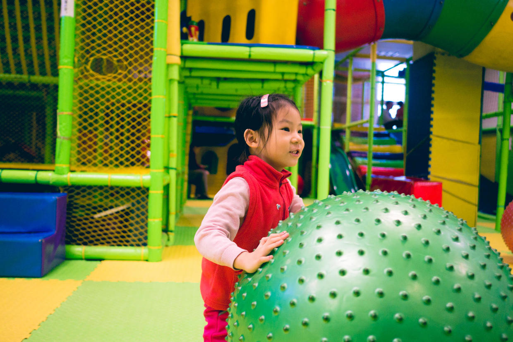

连续可以拍好几十个。

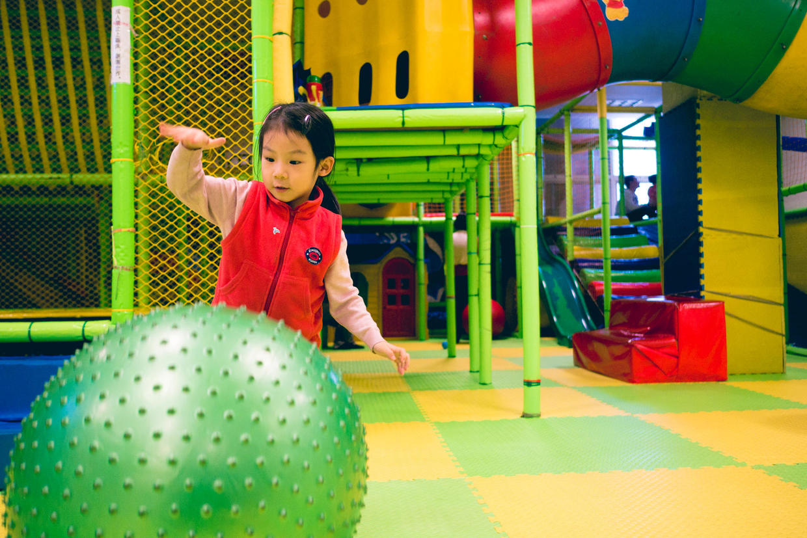

玩儿好了，中午去吃饭。

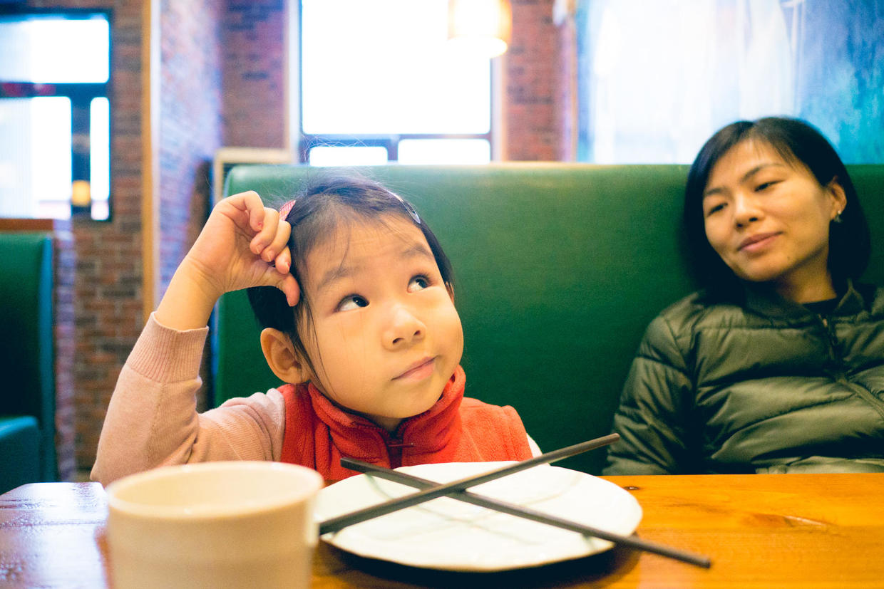

吃过饭，准备去上钢琴课。

路上先去公园玩儿会儿秋千，帽子都歪了。

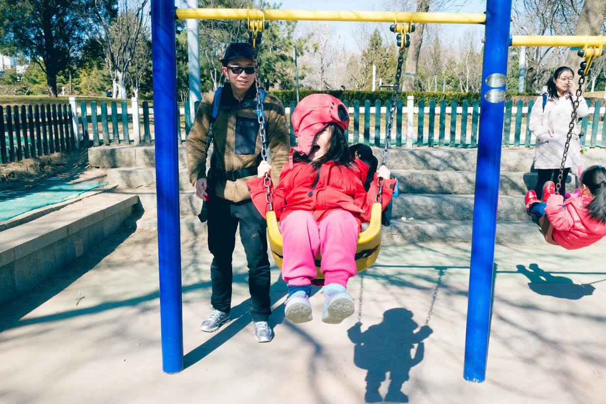

封面

自己悠起来，特别的开心。

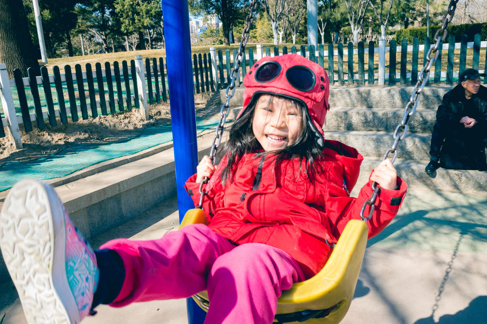

到了教室，老师已经来了，开始上课。

复习了一下上次讲的，今天开始学2分和4分音符，还有D、B。

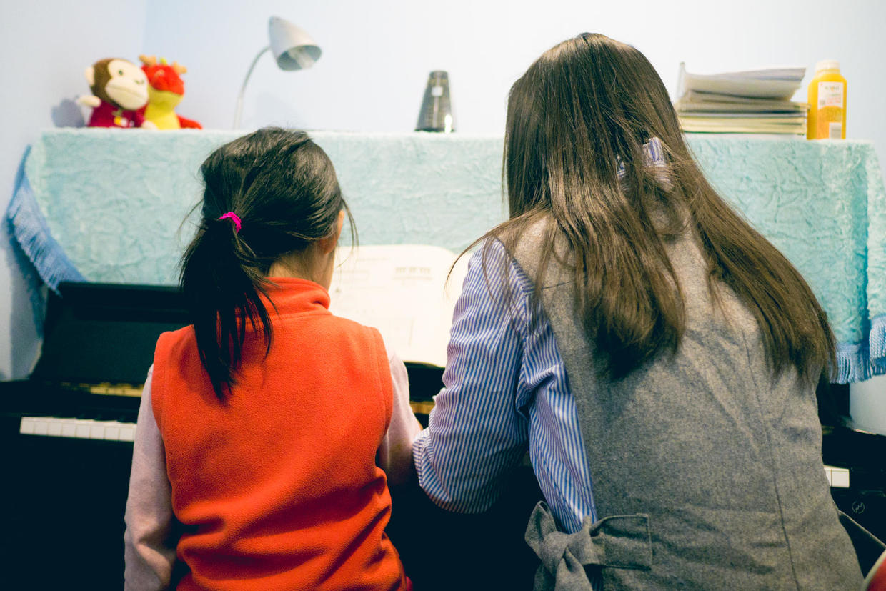

教室环境非常漂亮。

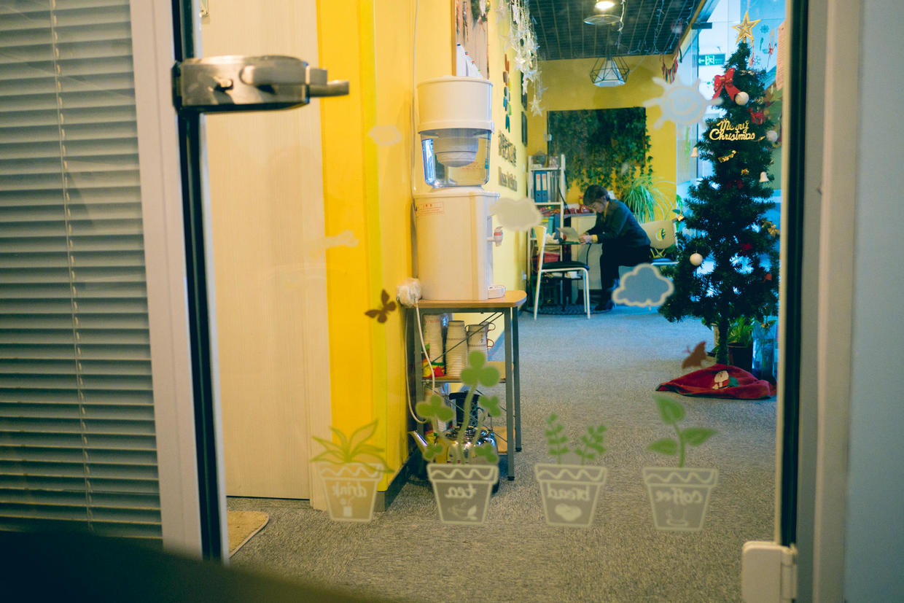

下了课，得到了老师的鼓励，去吃大M奖励一下。

到了家，休息休息。

明天可以自由活动了。

下周开始，周六就要早上舞蹈课和下午钢琴课贯穿了。

***下期预告：周末活动***

**个人微信公众号，请搜索：摹喵居士（momiaojushi）**

**喜欢作者写写哪些话题，可以公众号留言**

          
        