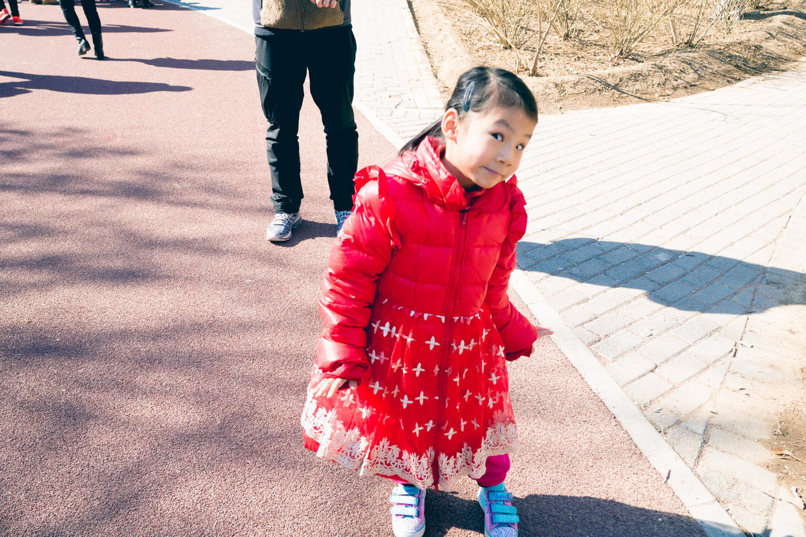

          
            
**2017.02.26**

周日一早起来，蓝天依然，气温也迅速上升。

听预报说，周一又要开始雾霾，赶紧抓住蓝天的尾巴，好好去晒晒太阳。

吃过早饭，出发去奥森。

去晚了，车停得特别远。

路上阴影里有块冰，开心地滑起来了。

来到奥森的跑道，立刻进入了跑步模式。

还要求蹲踞式起跑。

很开心，跑得比我们快。

跑成了一条线。

超过了妈妈。

一路上天蓝得让人忍不住放下相机。

喵还是专注地跑着步。

封面

突然发现路边的售货机里有傅园慧。

教妈妈，自己在幼儿园学会的甩手游戏。

发现了公共电话，手机时代出生的小朋友，也体会一下传统的电话。

跑累了，趴在椅子上休息休息。

突然发现了小溪，聚了一群孩子玩儿水。

在南园走了一个大圈，回去的路上累了，只好高高了。

中午吃了一大碗米饭、肉和菜。

回家很快睡上了大觉。

紧张的周末结束了，下周就是舞蹈和钢琴的连上，心里还真有点忐忑。

***下期预告：看图说话***

**个人微信公众号，请搜索：摹喵居士（momiaojushi）**

**喜欢作者写写哪些话题，可以公众号留言**

          
        