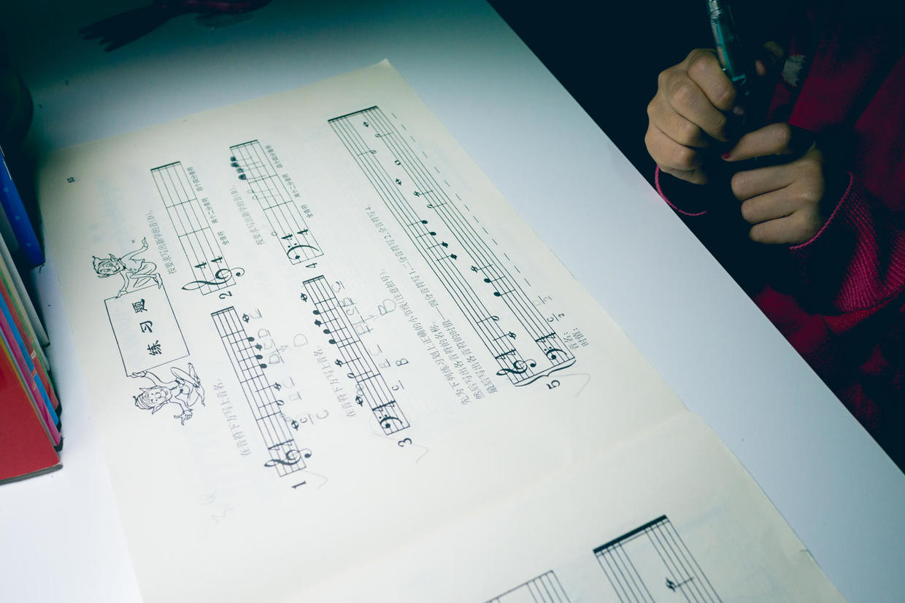

          
            
**2017.03.14**

连续上了几周钢琴课，我们也在不停调整者辅导喵钢琴的方法。

从上周的《玛丽有只小羔羊》开始，一只手要弹3个音。

一上来就这么弹，已经很困难了。

于是，根据老师课堂上的方法，我们开始和喵一起先练习唱谱。

很有意思的是，喵通常第一行谱子都能很快唱下来，而到了第二行就开始各种地反应不过来。

我和她一起唱几遍，然后由她自己再唱几遍。

每个音符的拍子也要数出来。

有时候，有的小节音符唱对了，但是音高却不对。

看着她认真的小脸，看起来小脑子在飞速地运转。

不要着急，不要失去乐趣。

练了挺长时间了，今天可以先到这里。

第二天，再练几遍，往往就又突破了，她的小脑子突然就想明白了。

谱子唱下来，再慢慢开始练习弹奏。

关键是，不要失去乐趣。

***下期预告：滑冰夜场***

**个人微信公众号，请搜索：摹喵居士（momiaojushi）**

          
        