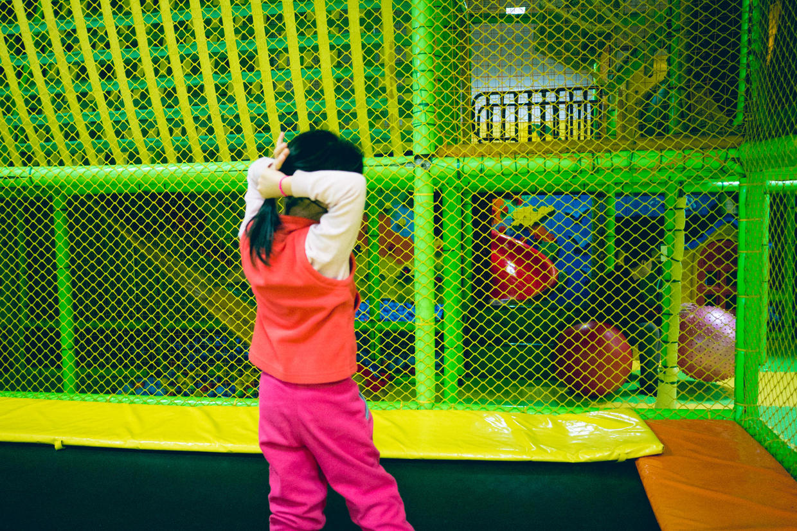

          
            
**2017.03.21**

现在每天早上叫喵起床，已经不像一年前那么费劲了。

赖一会儿床，然后会缓缓起来，开始穿衣服。

穿好衣服，就要自己出头发。

把辫绳穿到手腕上，两只手的手背开始往后打散自己的头发。

反复几次后，开始双手把头发梳好。

之后，一只手攥紧头发，把辫绳拽上去，另一只手帮忙开始绕圈。

一开始只能弄2匝，现在手已经足够有劲弄3匝了。

每次梳头都要等很久，严重地考验我的耐心。

但是，想到她总爱炫耀自己的新本领，于是就多一些耐心，再等她一会儿。

果然，自己梳好头，别好了卡子。

一转头，笑魇如花地对我喊：
>爸爸，你看我的头花漂亮吗？

我说：
>真漂亮啊，自己弄得真棒。

多一些耐心，再等一会儿，会能看到非常美的风景。

***下期预告：滑冰在夜场***

**个人微信公众号，请搜索：摹喵居士（momiaojushi）**

          
        