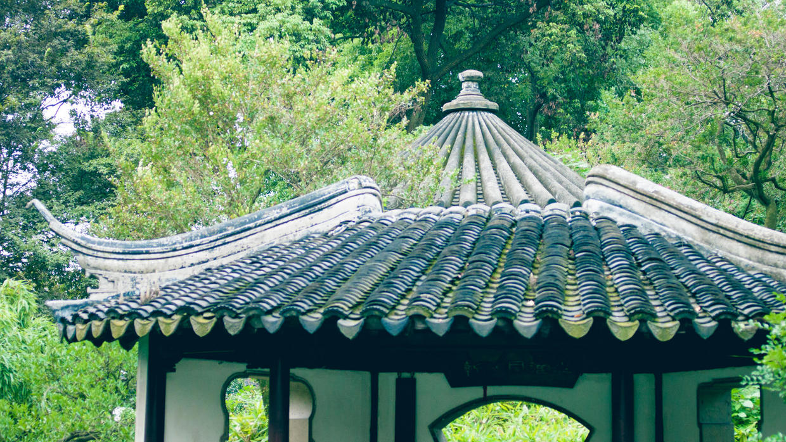

          
            
**2017.03.24**

本篇继续回忆一下2010年的杭州、苏州、无锡之旅。

出了狮子林，来到了大名鼎鼎的拙政园。

跟着各个旅游团，听着解说介绍亭台楼阁榭这些建筑间细微的差别。
>亭：在古时候是供行人休息的地方。“亭者，停也。人所停集也。”
台：是最古老的园林建筑形式之一，早期的台是一种高耸的夯土建筑，古代的宫殿多建于台之上。古典园林中的台后来演变成厅堂前的露天平台，即月台。
楼阁：由于一般多为体量较大的高层建筑，不仅是游人登高放远的佳处，同时也是园林最为突出的景观。多在临水之地建楼，取凭高远眺，极目无穷之妙。
轩：多为高而敞的建筑，但体量不大。轩的形式类型也较多，有的做得奇特，也有的平淡无奇，如同宽的廊。在园林建筑中，轩这种形式也像亭一样，是一种点缀性的建筑。
榭：水边建筑，人们在此倚栏赏景。“……榭者，藉也。藉景而成者也。或水边，或花畔，制亦随态。”(《园冶》)榭，凭藉景而设，除了水边，有的也设于花间。榭不但多设与水边，而且多设于水之南岸，视线向北而观景。

随处都能看到这种飞檐的亭。

稻香村，主人实现田园梦的地方。

还要配上菊花，采菊东篱下，悠然见南山。

很经典的借景，远处的宝塔。

一池水，绿得耀眼。

端端正正的房子。

每间都有自己的名字。

缺了一角的“静”。

亭台交错。

鲜绿的爬山虎。

荷花池。

园子内的借景。

竹子钻出了墙壁。

围着荷花池的游廊。

满地的菊花。

假山上的枝蔓。

出了园林，接下来，就要去同里水乡了。

未完待续。

***下期预告：周末活动***

**个人微信公众号，请搜索：摹喵居士（momiaojushi）**

          
        