          
            
**2017.03.26**

周日了，天气非常好，晴空万里，风虽然有些大，但是太阳比较足。

喵好好睡了个懒觉，快8点才起床。

吃饱喝足，先去宜家领了生日蛋糕券，吃了一小角蛋糕。

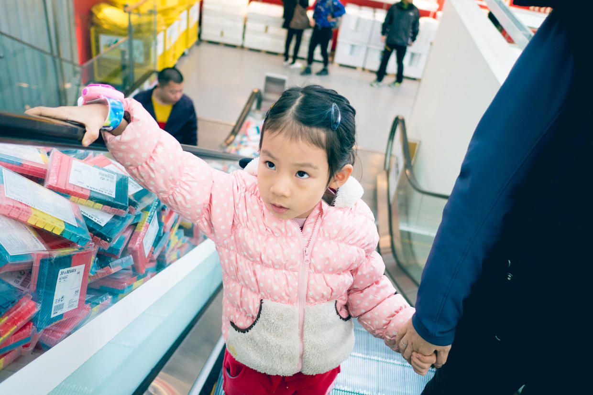

坐在宜家展品边上傻笑。

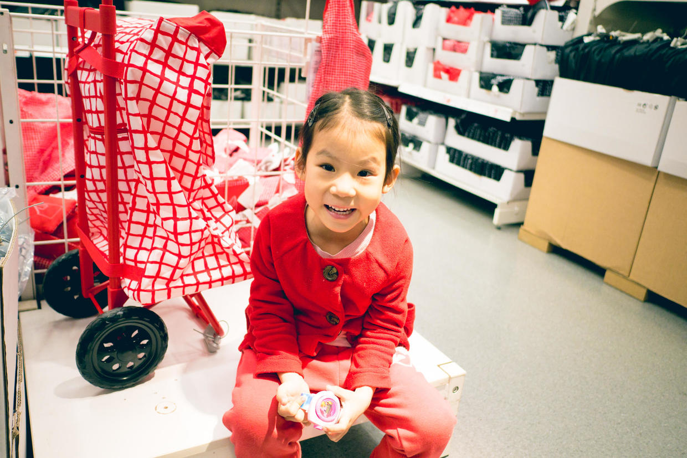

跳起了小鸡和母鸡的舞蹈。

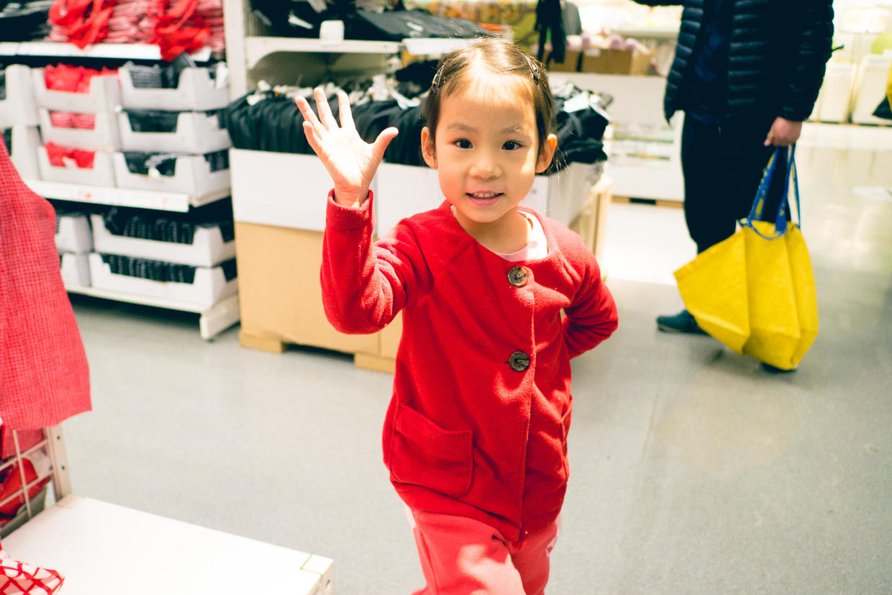

宜家的拼图已经不在话下了。

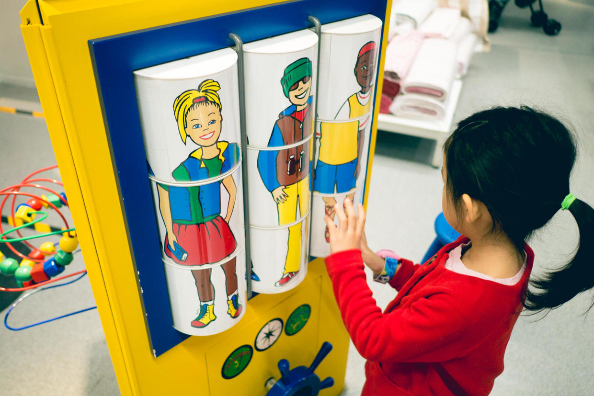

接着，就赶赴关婧阿姨的新婚答谢宴。

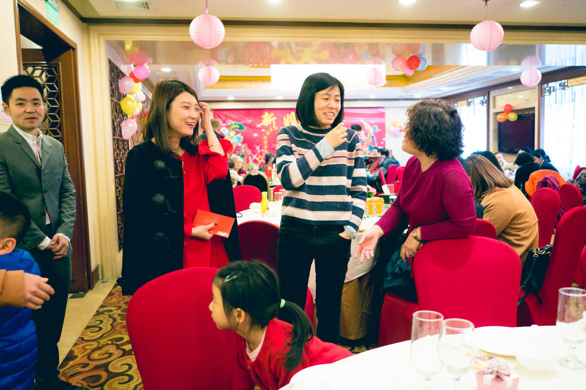

当年同一个寝室的老同学，再聚首。

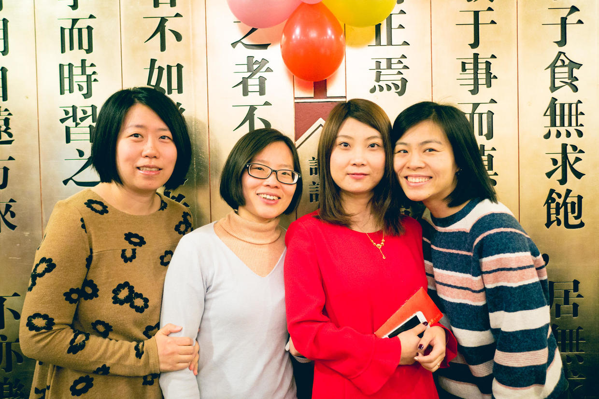

喵开始专心地玩儿巧克力。

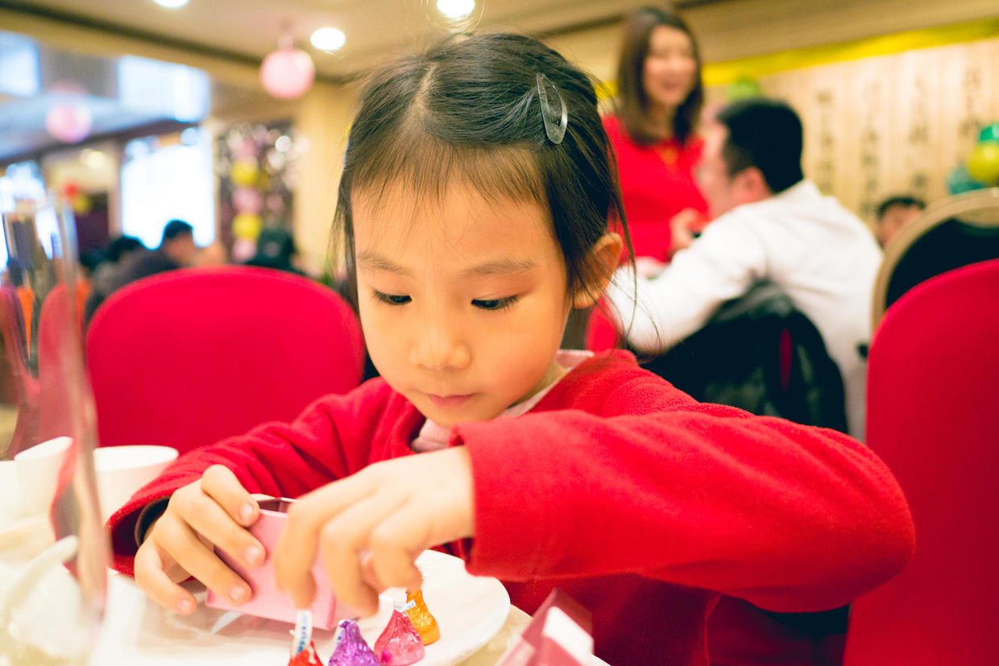

乐乐哥哥和爸爸。

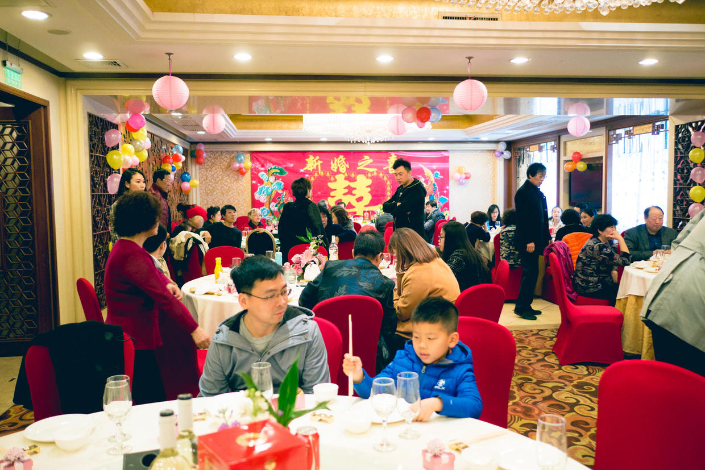

轩轩弟弟也来了。

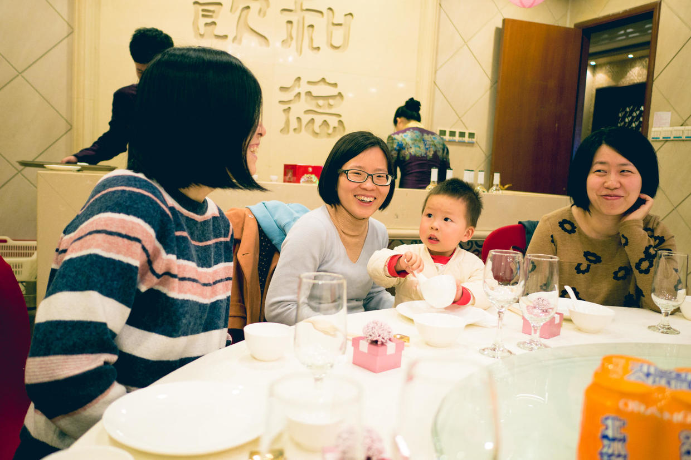

答谢宴现场非常热闹，来了很多亲友。

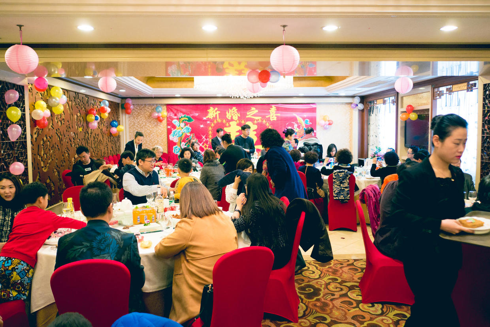

家长讲话后，喵起立鼓掌。

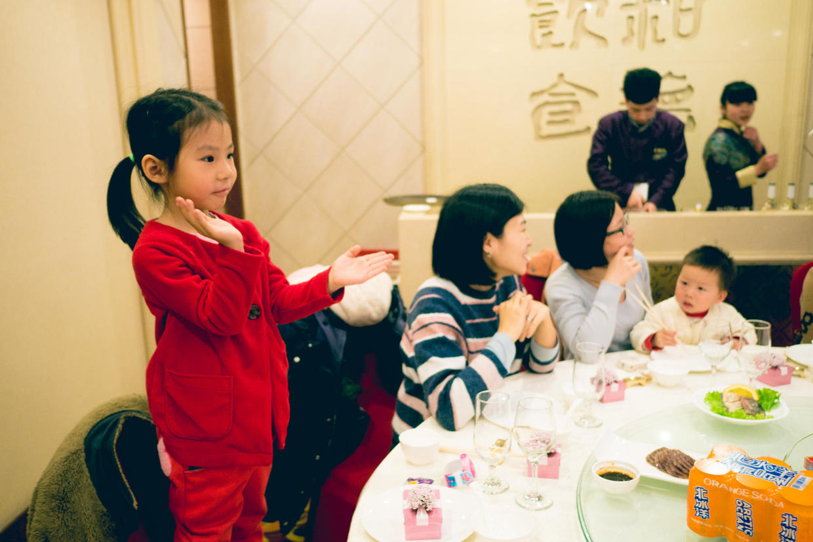

封面

新郎新娘前来敬酒。

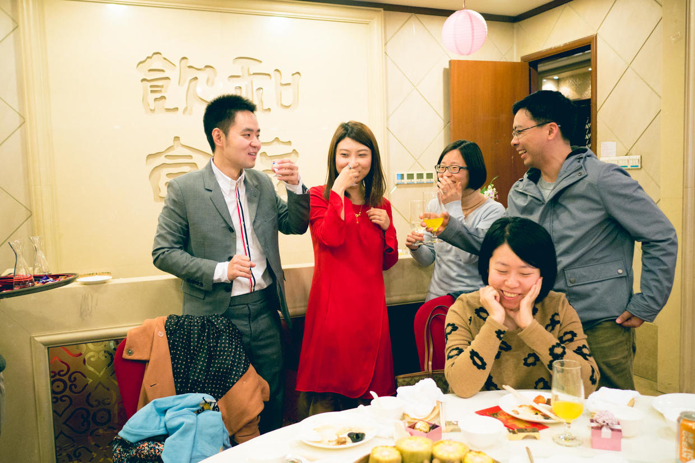

开心地向新郎介绍自己的老同学们。

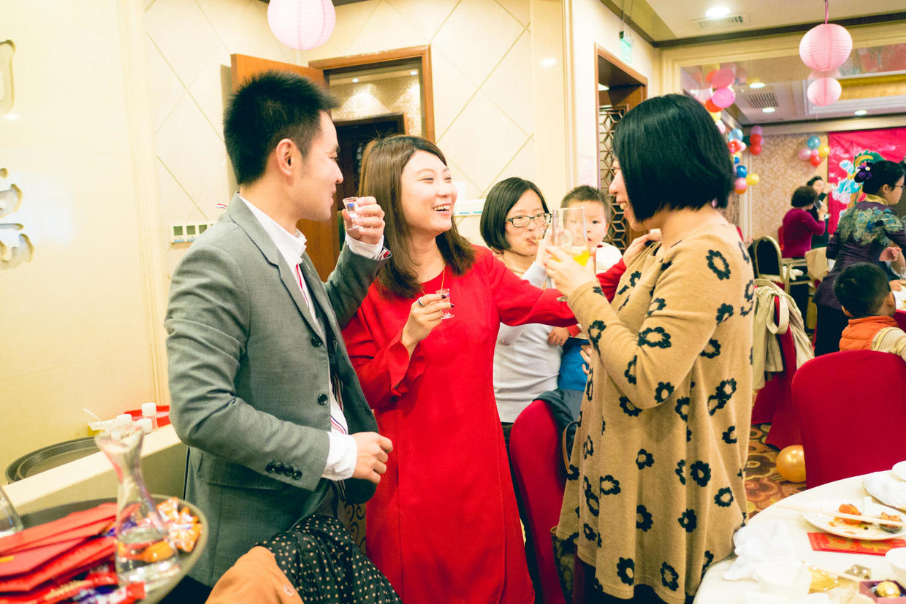

喵带着轩轩弟弟玩儿得特别开心。

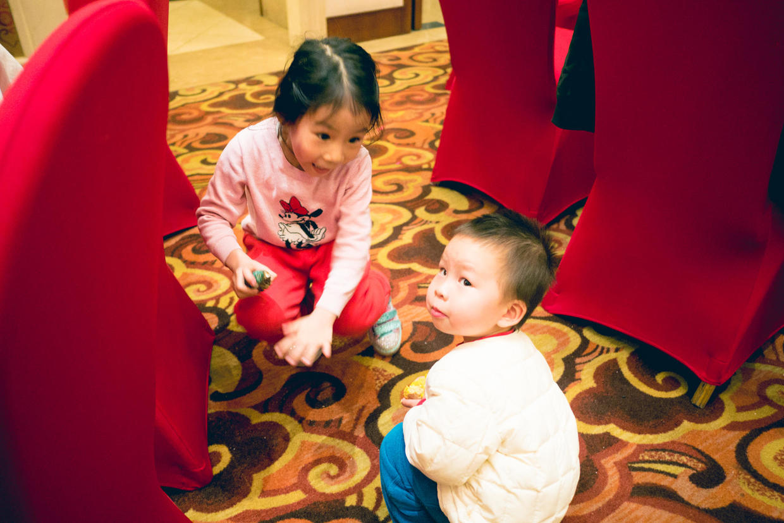

新婚之喜。

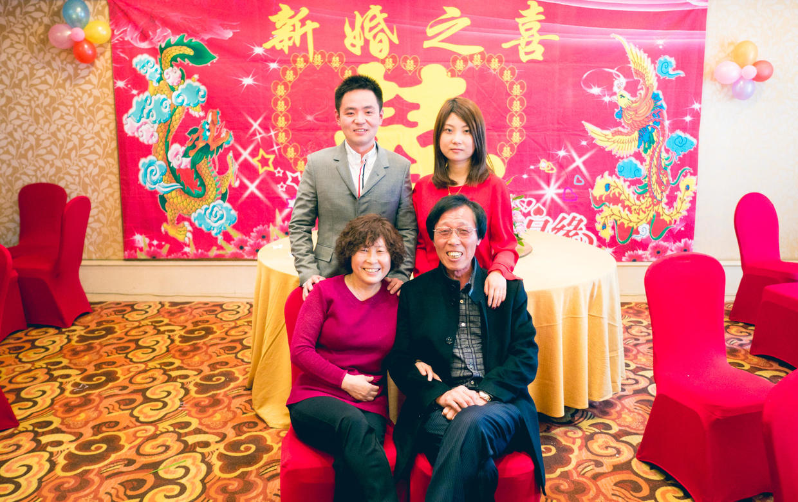

关婧是我的初中、高中和大学同学，也是我和喵妈的媒人。

祝新婚快乐，百年好合，身体健康，阖家幸福。

***下期预告：看图说话***

**个人微信公众号，请搜索：摹喵居士（momiaojushi）**

          
        