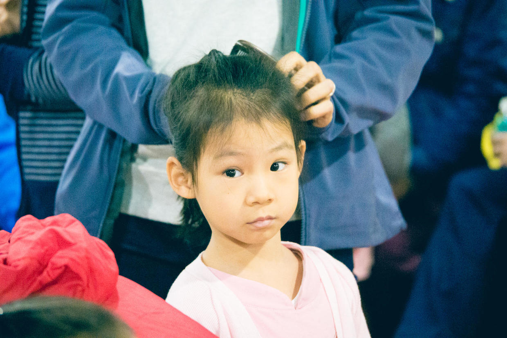
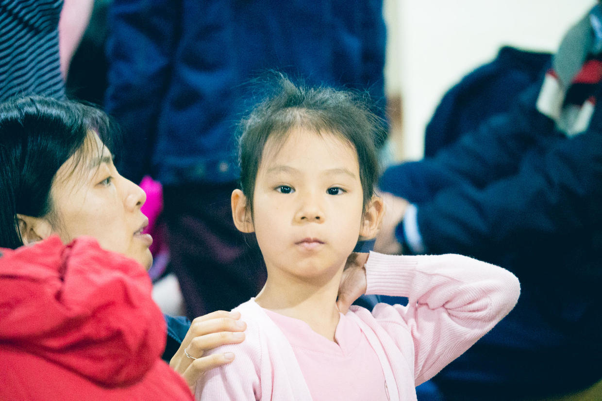
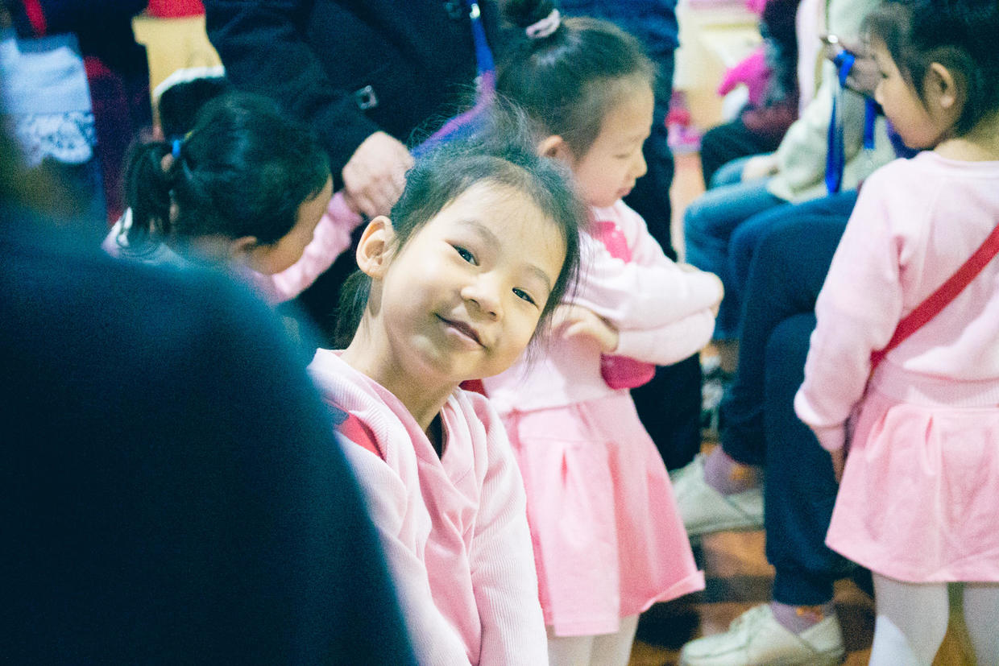
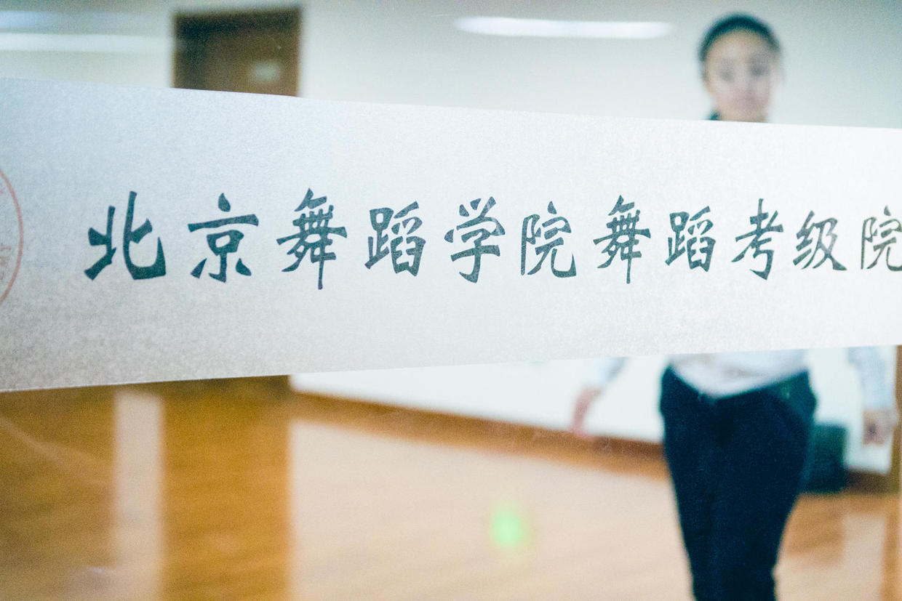
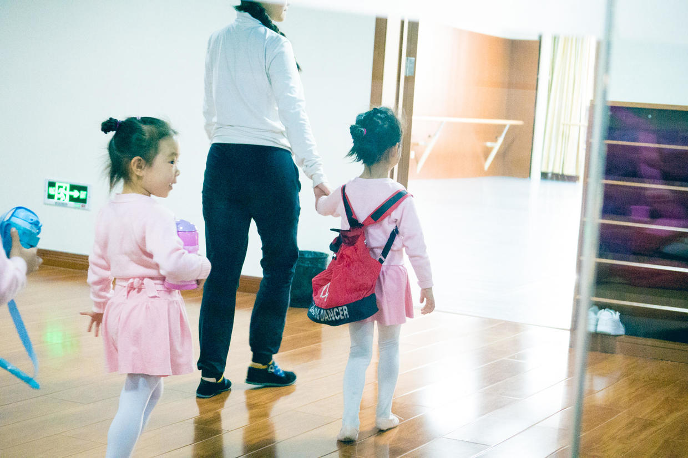
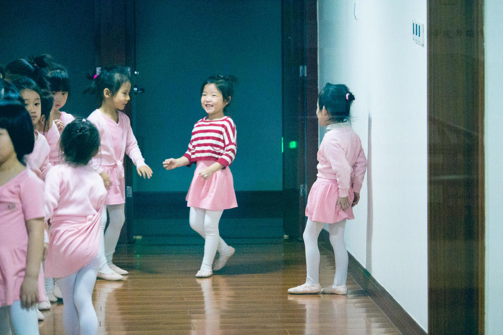
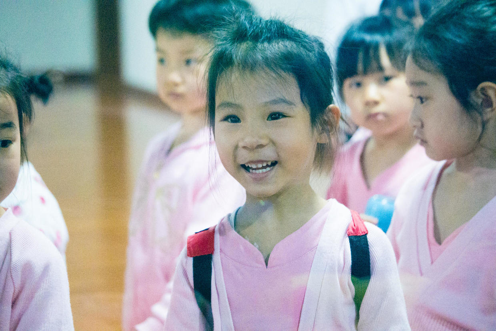
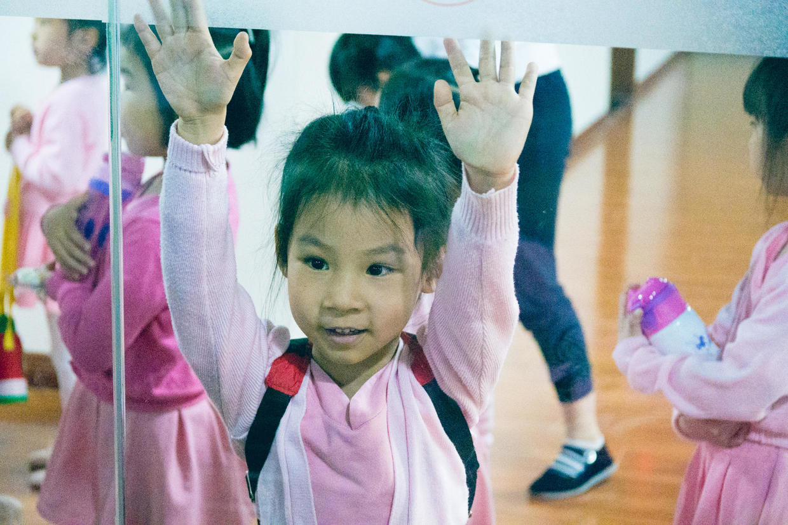

          
            
**2017.04.03**

清明节小长假第2天了，一早起床，空气质量急转直下。

吃过早饭，开车去上舞蹈课。

到了教室，开始梳头，忘带卡子，只好尽量用皮筋绷紧点了。

喵妈很认真地给喵检查发型。

从三亚回来，一头的汗，头发都拉不开栓了。

封面

背着舞蹈包，开始排队了。

老师过来领排队的孩子们进教室。

大家排着队，进入明亮干净的教室。

课间休息，去卫生间，同学们开心地玩耍。

下课啦，开心地跑出来。

排好队，家长们按顺序领孩子。

中午回家吃意面，很得意地告诉我们，老师把她领到前面，给大家演示动作。

下午好好睡个大觉，休息休息。

空气质量已经260了，看了也出不去了。

可以好好在家练琴了。

准备一下明天的钢琴课，去三亚玩儿了好几天，一路上喵都在用小手在桌子上弹琴。

对钢琴的兴趣，真是令我震惊啊。

***下期预告：清明活动***

**个人微信公众号，请搜索：摹喵居士（momiaojushi）**

          
        