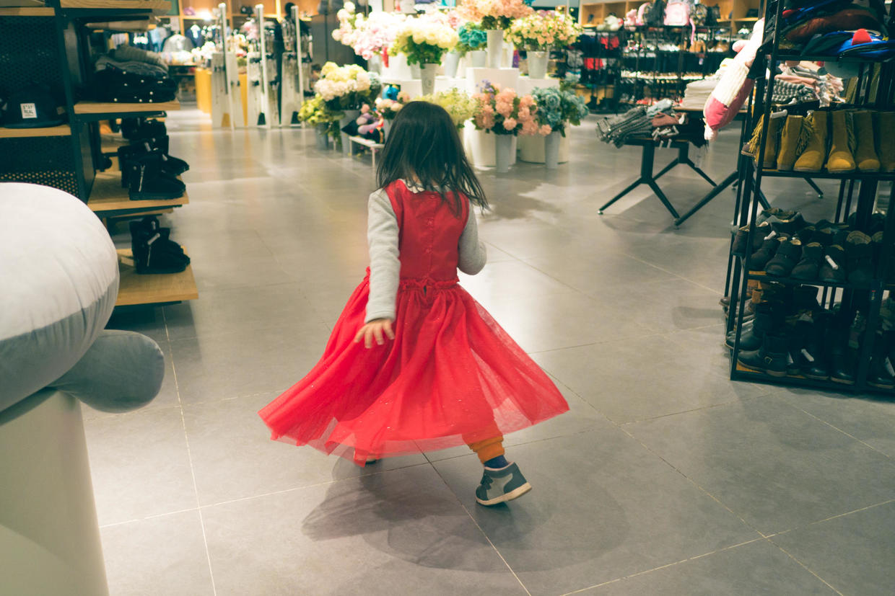

          
            
**2017.04.10**

**拍摄时间：2015.12.13**

**拍摄地点：商场**

这张照片是喵3岁多的时候，去商场拍的。

当时是年底里，去商场采购。

到了H&amp;M，喵一眼就看中了这跳大红裙子。

在反复恳求下，我们也觉得裙子不错，正好过元旦和春节都可以穿一穿。

一条挺厚实的裙子，冬天室内穿也暖和。

于是买下之后，立刻就穿上美起来了。

出了H&amp;M，进了旁边的一个家具店，里面空间比较大，人很少。

喵挑了个大空地，在一大群花的面前，开始起舞了。

跟着商场里的音乐，一圈一圈地转起来，看着自己的红纱裙飘起，这正是这条裙子最吸引她的地方。

这条裙子后来又跟着喵去了很多地方，春天去颐和园爬佛香阁，也是穿着这条裙子，热得一身大汗。

今年发出来再准备穿时，已经明显感觉有点紧了。

一年年的成长，从衣服的变小上，最能看出来。

***下期预告：三亚之行***

**个人微信公众号，请搜索：摹喵居士（momiaojushi）**

          
        