          
            
**2017.04.14**

本篇承接[425.拍照片19~同里古镇1](https://link.jianshu.com?t=https://mp.weixin.qq.com/s?__biz=MzA4NzEzMjMzNw==&amp;mid=2651113323&amp;idx=1&amp;sn=5512d6a17d47ac33587c3d19e750547c&amp;chksm=8bce76b5bcb9ffa3326791a2a4e6dba4e5912fabc13994c5749ed761afe791ff2098df2fb90c#rd)，继续回忆一下2010年的杭州、苏州、无锡之旅。

继续在同里古镇游荡。

进到花园，看着池塘里的锦鲤欣欣向荣。

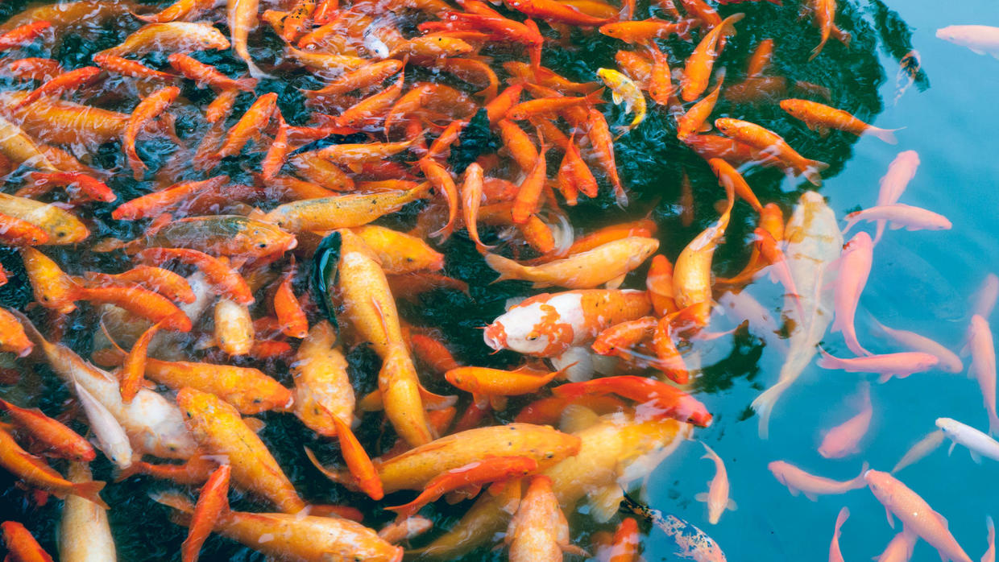

大小锦鲤竞相争食。

绿色的植物各有不同的姿态，墙壁几乎全被覆盖。

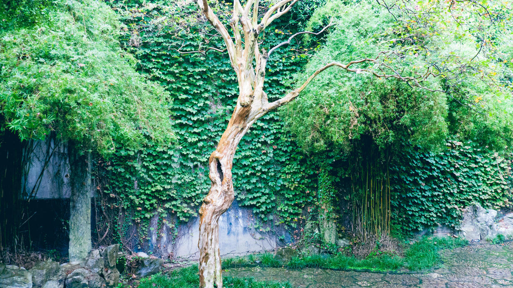

满墙的爬山虎之间，突然钻出了一丛竹子。

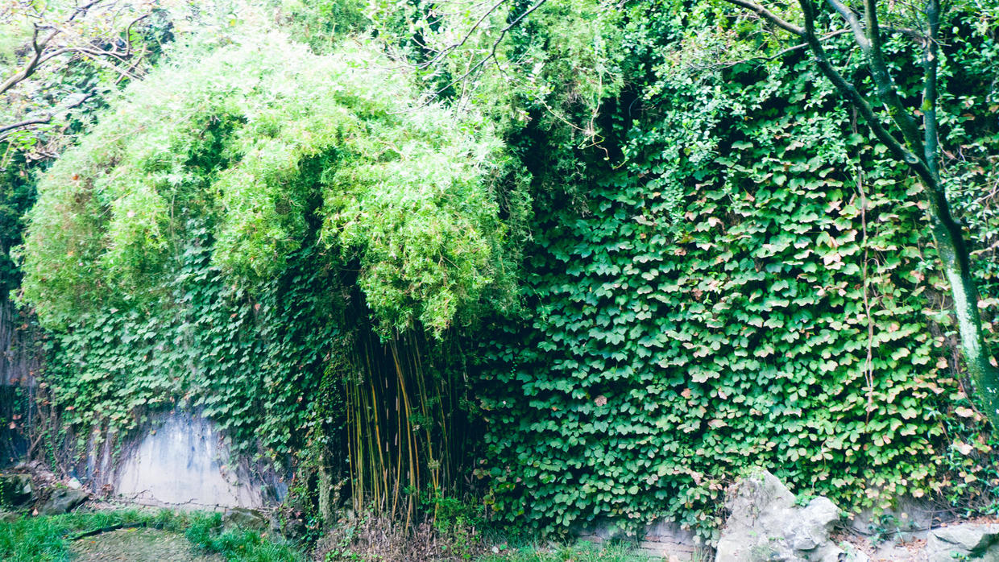

新的爬山虎，还在继续占领着墙壁。

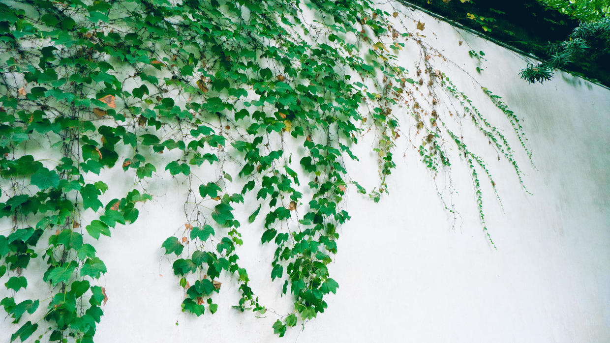

又是一阵小雨，冲刷过绿叶。

所有的建筑，都掩映在郁郁葱葱之间。

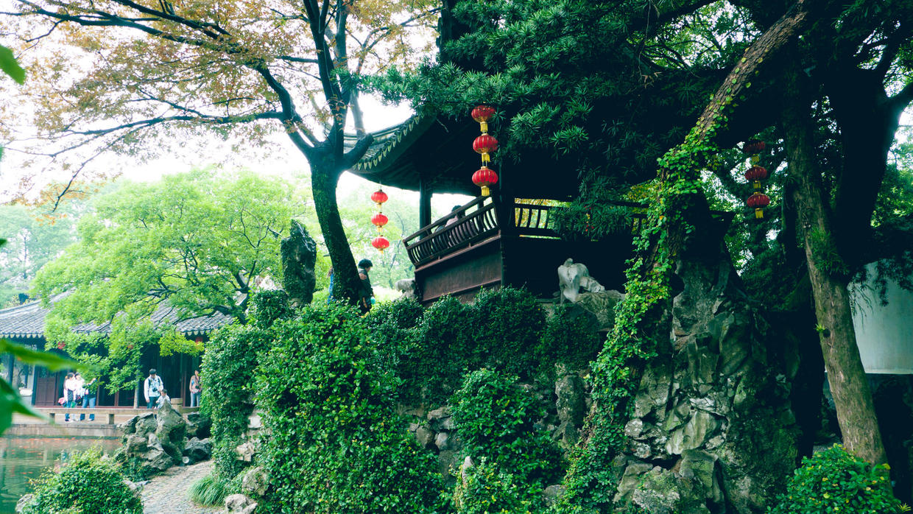

房檐边的叶子已经微微泛黄。

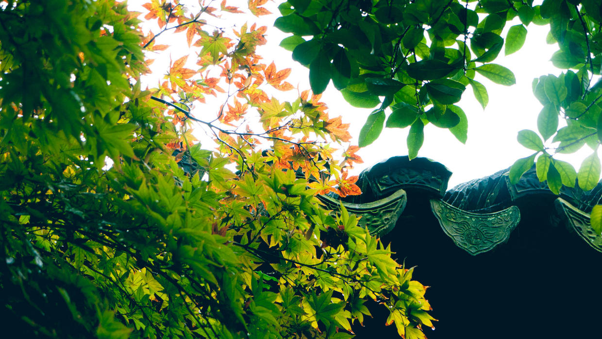

好大的一丛竹子，叶子都已经垂到地面。

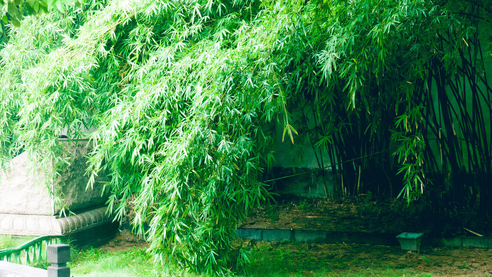

好一个四海升平，没有写出将入相。

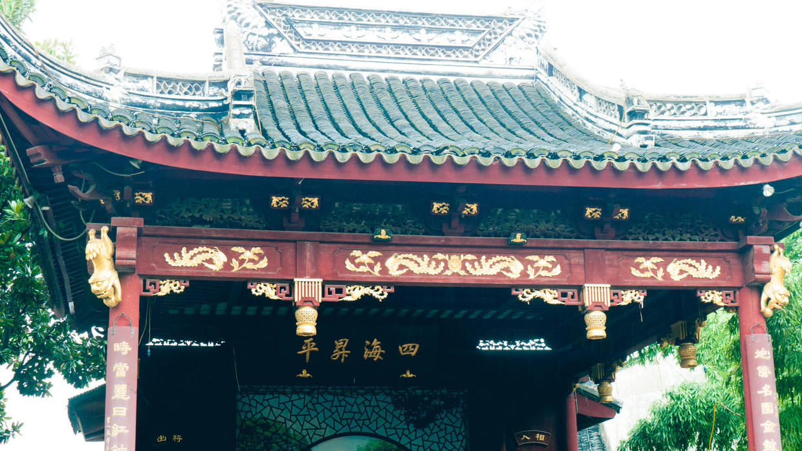

接下来开始坐船游览水乡。

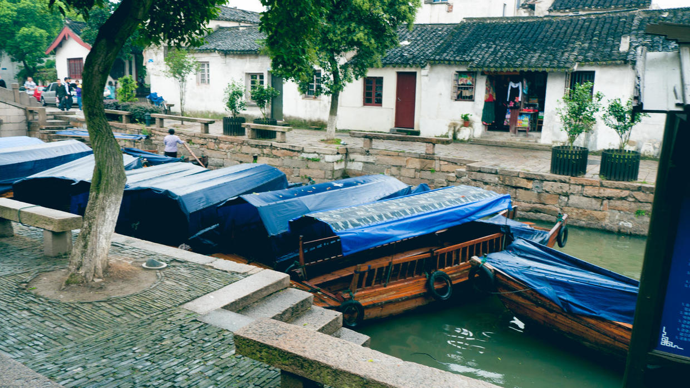

小船要穿过一座座低矮的石桥。

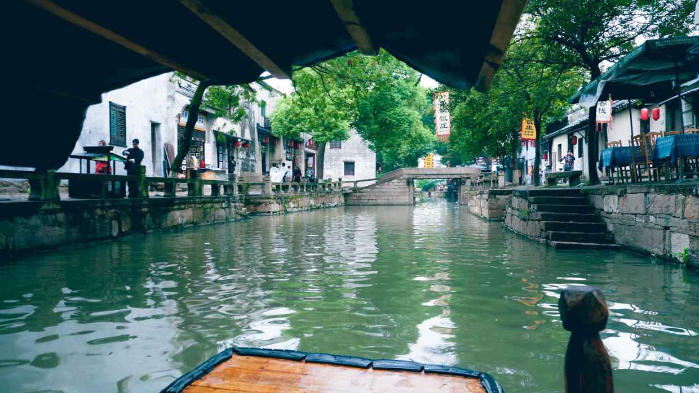

按边上有正在淘米的老奶奶。

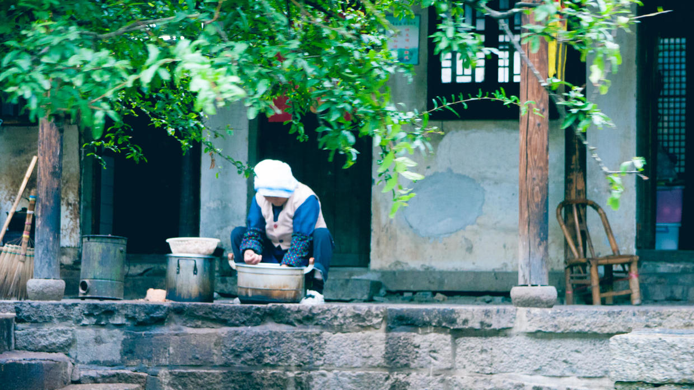

岸边也装点着各式盆景。

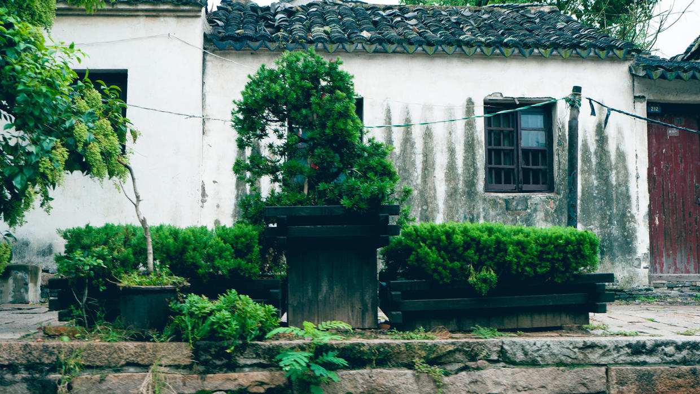

经过泰安桥，据说小镇上有上百座石桥。

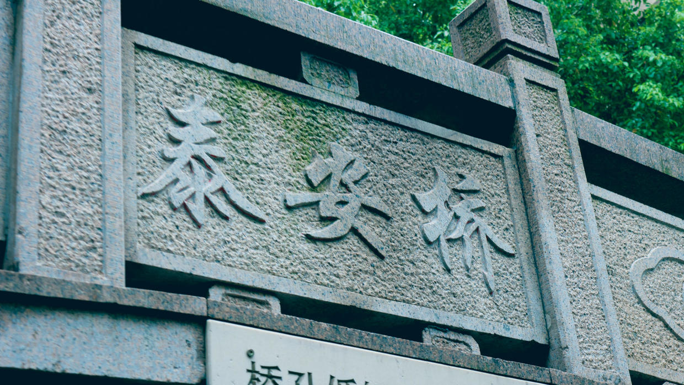

捕鱼的鸬鹚在船上休息。

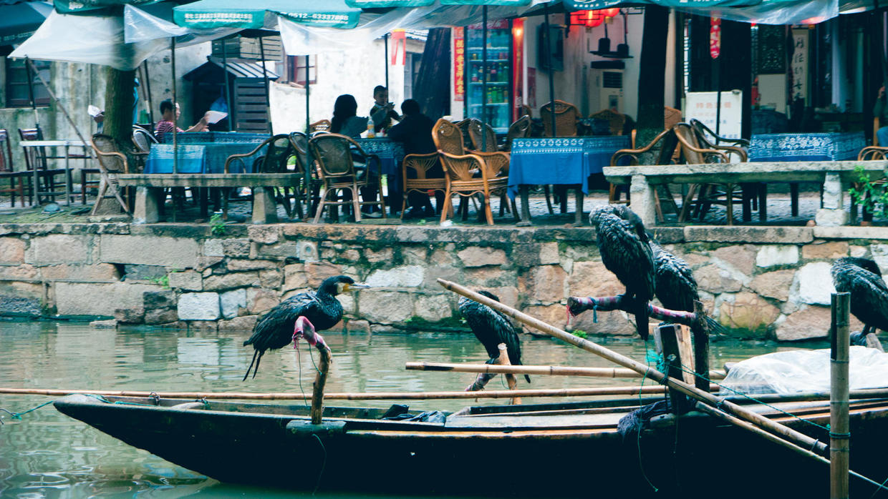

未完待续。

***下期预告：周末活动***

**个人微信公众号，请搜索：摹喵居士（momiaojushi）**

          
        