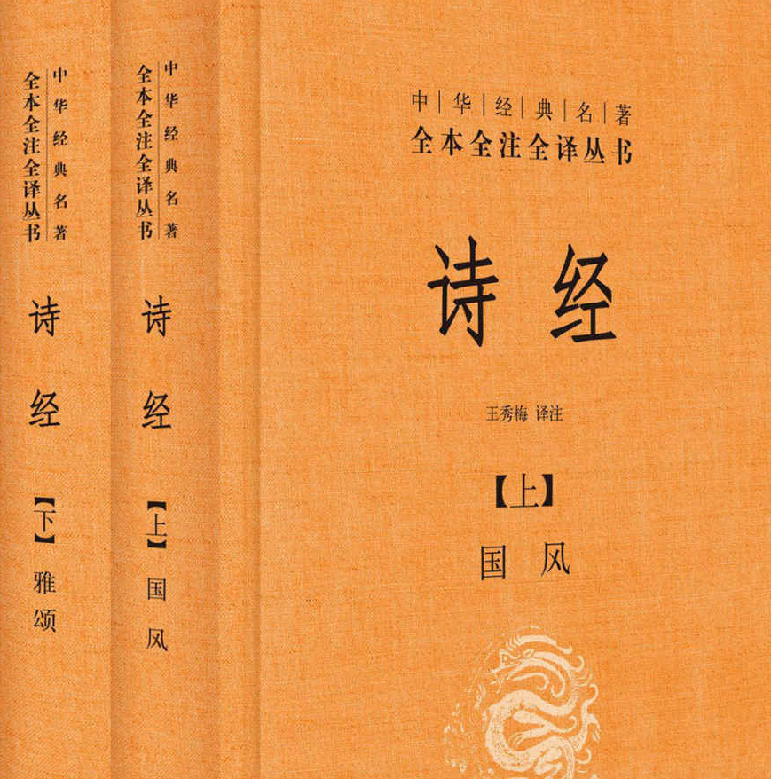

          
            
**2017.04.20**

图片来自亚马逊

《诗经》是《风》、《雅》、《颂》
《风》主要是周代各地民间歌谣
《雅》是周人所谓的正声雅乐，又分《小雅》和《大雅》
《颂》是朝廷和贵族宗庙祭祀乐歌，又分《周颂》、《鲁颂》、《商颂》
《诗经》的艺术手法有赋比兴。
赋：直接抒写和铺述
比：比喻
兴：先言他物以引起所咏之词
诗为什么要称作风？风，风也，教也。风以动之，教以化之

桃之夭夭，灼灼其华，子之于归，宜其室家。
夭夭：茂盛，生机勃勃的样子。

赳赳武夫

翘翘错薪，言刈其楚。
地理杂草很高打柴还要割掉荆条。

维鹊有巢，维鸠居之。

未见君子，忧心忡忡。

《柏舟》，写贤人忧馋畏饥而又难离乱境
汎彼柏舟，亦泛汎其流。耿耿不寐，如有隐忧。微我无酒，以敖以游

《击鼓》
远征异国，思归的士兵的思乡之歌。
生死契阔，与子成说。执子之手，与子偕老。

《墙有茨》，揭露卫国统治者荒淫乱伦
墙有茨，不可埽也。中冓之言，不可道也，所可道也，言之丑也。

《载驰》，我行其野，芃芃其麦。麦子很茂盛。

《淇澳》，赞美卫国君子
瞻彼淇奥。绿竹猗猗。有匪君子，如切如磋，如琢如磨。瑟兮僴兮，赫兮咺兮。有匪君子，终不可谖兮。
《论语》里提到，子贡的意思是，富而好礼者，就是如切如磋的君子。
子贡曰：“贫而无谄，富而无骄，何如？”子曰：“可也，未若贫而乐，富而好礼者也。”子贡曰：“《诗》云如切如磋，如琢如磨，其斯之谓与！”子曰：“赐也，始可与言《诗》已矣，告诸往而知来者”

《木瓜》，男女青年互赠礼物表达爱情
投我以木桃，报之以琼瑶。匪报也，永以为好也。

《黍离》
彼稷之苗，行迈靡靡，中心摇摇。知我者，谓我心忧，不知我者，谓我何求。悠悠苍天，此何人哉？

《君子于役》
君子于役，不知其期，曷至哉？鸡栖于塒，日之夕矣，羊牛下来。君子于役，如之何勿思。

《采葛》
彼采萧兮，一日不见，如三秋兮。

《大车》
毂则异室，死则同穴，谓予不信，有如皦日。

《羔裘》
羔裘豹饰，孔武有力。彼其之子，邦之司直。

《子矜》
青青子衿，悠悠我心。纵我不往，子宁不嗣音？

《野有蔓草》
野有蔓草，零露瀼瀼，有美一人，婉如清扬，邂逅相遇，与子偕臧。

《硕鼠》
硕鼠硕鼠，无食我黍，三岁贯女，莫我肯顾。

《绸缪》
绸缪束薪，三星在天。今夕何夕，见此良人？子兮子兮，如此良人何？

《蒹葭》
蒹葭苍苍，白露为霜，所谓伊人，在水一方，溯洄从之，道阻且长，溯游从之，宛在水中央。

《无衣》
岂曰无衣？与子同袍，王于兴师，修我戈矛。与子同仇。
岂曰无衣？与子同泽。王于兴师，修我戈戟。与子偕作。
岂曰无衣？与子同裳。王于兴师，修我甲兵。与子偕行。

《七月》
七月流火，九月授衣

《鹿鸣》
呦呦鹿鸣，食野之苹。我有嘉宾，鼓瑟吹笙、吹笙鼓簧，承筐是将。人之好我，示我周行。

《常棣》
常棣之华，鄂不韡韡，凡今之人，莫如兄弟。
妻子好合，如鼓瑟琴，兄弟既翕，和乐且湛。
宜而室家，乐尔妻帑，是究是图，亶其然乎。

《鹤鸣》
鹤鸣于九皋，声闻于野。鱼潜在渊，或在于渚。乐彼之园，爰有树檀，其下维萚，他山之石，可以为错。
鹤鸣于九皋，声闻于天。鱼在于渚，或潜在渊。乐彼之园，爰有树檀，其下维毂。他山之石，可以攻玉

《白驹》
皎皎白驹，食我场苗。挚之维之，以永今朝。所谓伊人，于焉逍遥。

《巧言》
荏染柔木，君子树之。往来行言，心焉数之。蛇蛇硕言，出自口矣。巧言如簧，颜之厚矣。

《北山》
溥天之下，莫非王土；率土之滨，莫非王臣。大夫不均，我从事独贤。

《楚茨》
济济跄跄，挈尔牛羊，以往烝尝。或剥或亨，或肆或将。祝祭于祊，祀事孔明。先祖是皇，神保是飨，孝孙有庆，报以介福，万寿无疆。

《车舝》
高山仰止，景行行止。四牡騑騑，六辔如琴。觏尔新婚，以慰我心。

《桑柔》
瞻彼中林，甡甡其鹿。朋友已谮，不胥以谷。人亦有言：进退维谷。

《玄鸟》
邦畿千里，维民所止。

***下期预告：同里古镇3***

**个人微信公众号，请搜索：摹喵居士（momiaojushi）**

          
        