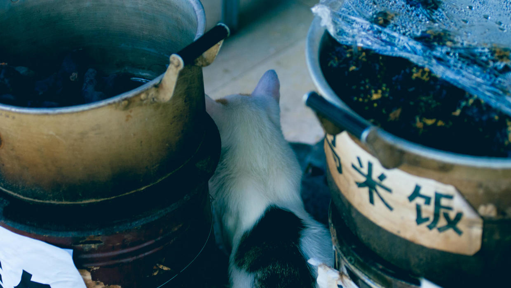
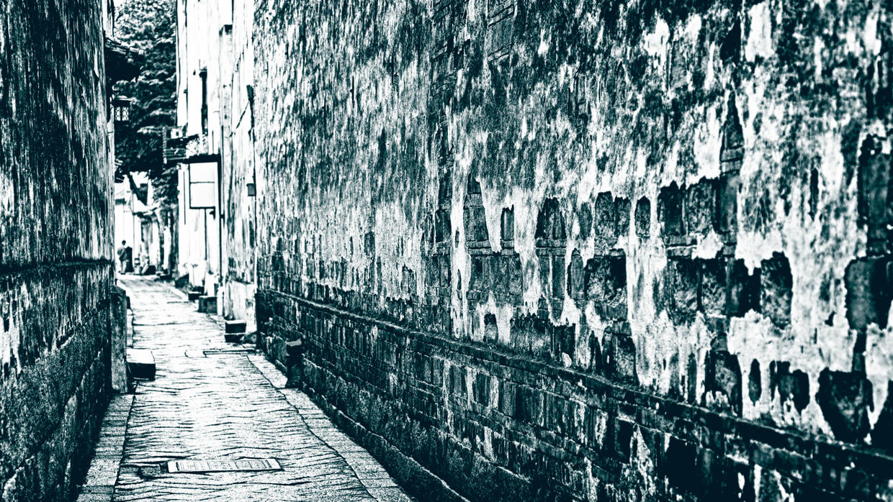
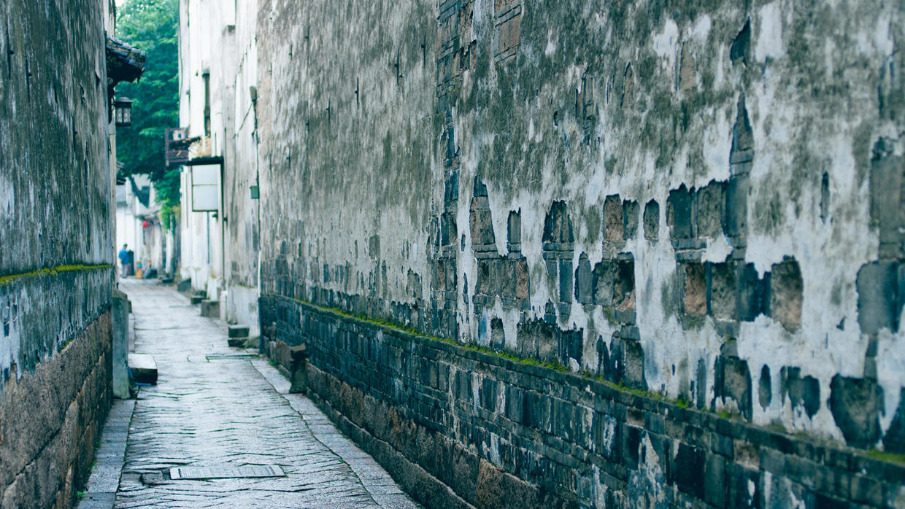
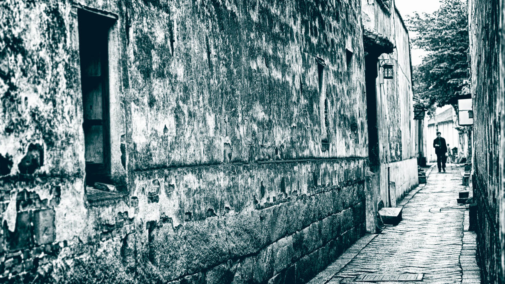
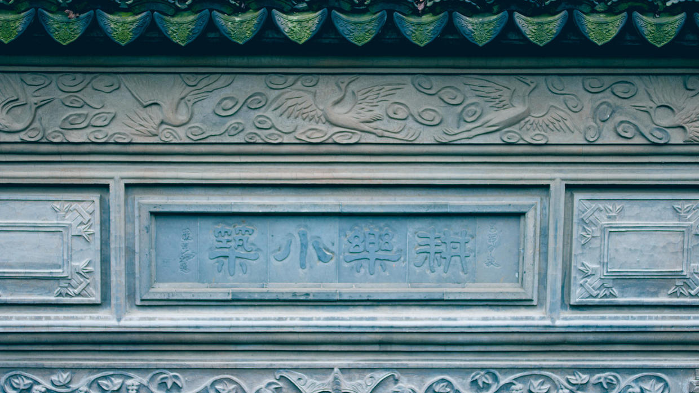
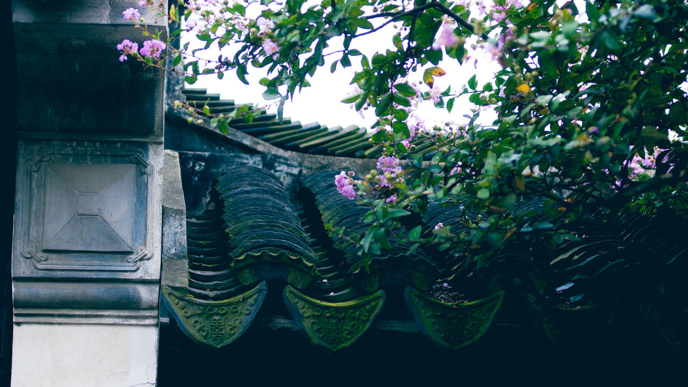
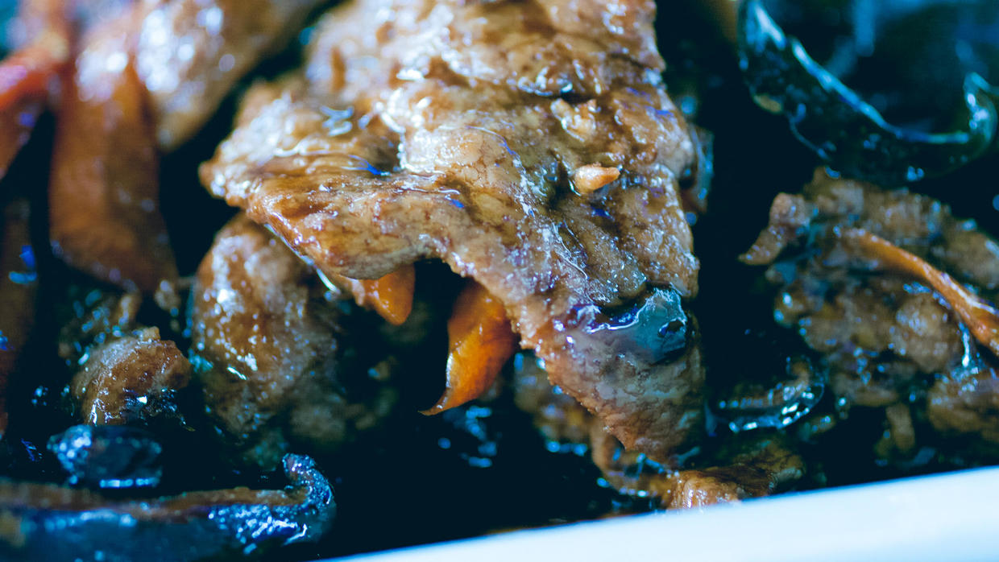
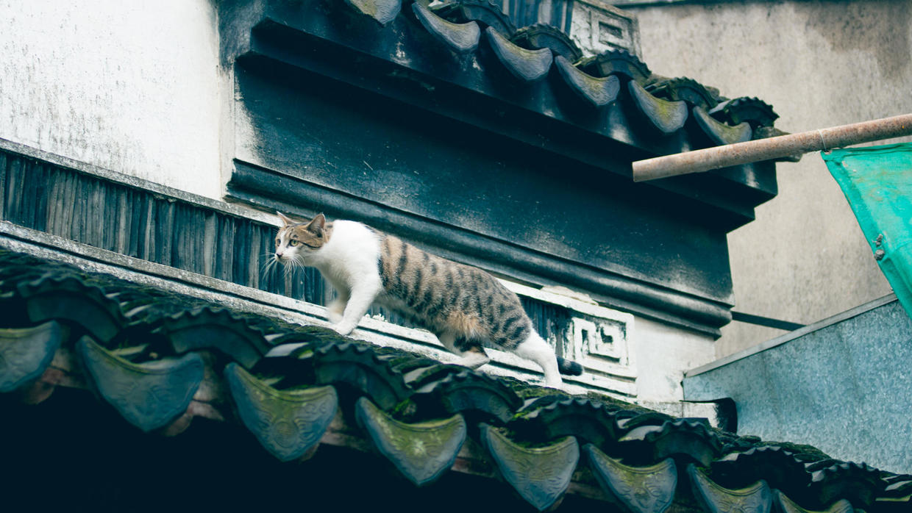
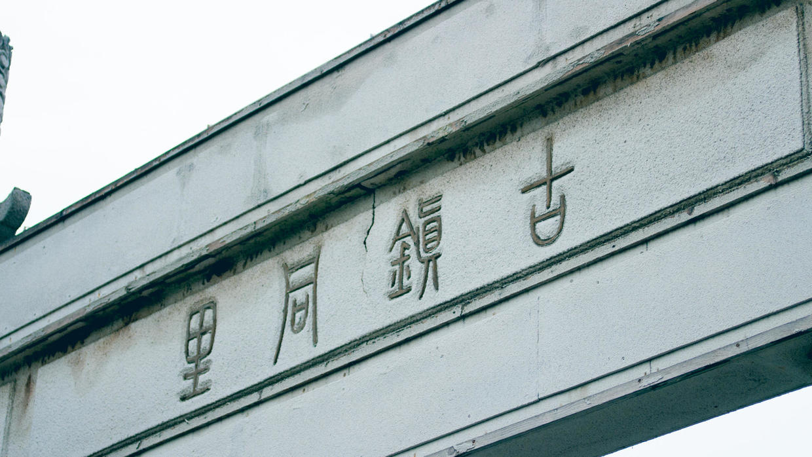

          
            
**2017.04.21**

本篇继续回忆一下2010年的杭州、苏州、无锡之旅。

继续逛同里古镇。

登上岸，小猫在大锅美食周围盘桓。

窄窄的小巷子，墙灰都已经片片剥落。

沿着砖缝，爬着长长一条青苔。

完全没有失去生活气息，不时地有居民穿过小巷子。

耕乐小筑，很是风雅。想起了姑苏慕容家的燕子坞、听香水榭、琴韵小筑。

花枝已经爬上房檐，青苔也铺满了房瓦。

下面就是雨后的微距了。

2串水珠，小心翼翼地排列在叶片中。

水珠挤压在叶片上，映出了叶片的纹路。

加大了对比度，可以清晰的看到反光的影像。

这是正常的样子。

转成黑白后，非常的通透。

叶尖一大一小2个晶莹剔透的水珠。

午饭是过着糖浆的炒肉。

房檐就是小猫的非洲草原。

告别同里古镇。

接下来就要奔赴无锡了。

未完待续。

***下期预告：周末活动***

**个人微信公众号，请搜索：摹喵居士（momiaojushi）**

          
        