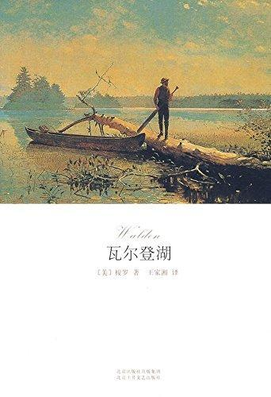

          
            
**2017.04.27**

这本书，其实就是海子的《面朝大海，春暖花开》的加长版。

其实说起来，海子当时一直在读《瓦尔登湖》，所以估计灵感来自于此。

整体读下来，感觉很酸葡萄。

作为不同类型作品涉猎一下还行，但是书本身毫无意思。

下面是一些书摘：
>我看见 ，年轻人 ，我的同胞 ，他们的不幸恰恰在于继承了农庄 、房屋 、谷仓 、牲畜和农具 。因为这些东西得来轻松 ，摆脱却很难 。也许 ，让他们生在无人的草原上 ，由一只狼作为他们的母亲 ，大概更好一些 。

开始絮叨，觉得其他人都被自己的土地和房子困住了
>从此 ，人类成为坚硬之物 ，历经千辛万苦 ，证明我们来自何方 。
从此人心坚忍 ，可以忍受痛苦 ，证明我们的躯体 ，本来就是岩石 。

开始歌颂人性
>通过这两年的生活 ，我知道 ，就算是在这个纬度 ，要想取得一些必需的食品也不是太难 ；人可以像动物那样吃得简单 ，也照样可以身体健康 ，精力充沛 。

鼓吹一切都靠自己，所以想吃复杂也没戏，只能自我安慰
>顺便说一下 ，我根本不需要花钱去买什么窗帘 ，因为除了太阳和月亮之外 ，我根本没有必要把什么窥视者的目光挡在外面 ，我甚至希望它们能进来看一下 。

好找返璞归真，不需要窗帘，不是因为买不起，是因为太阳和月亮有益
>在第一个星期 ，不管我什么时候注视这个小湖 ，我都觉得这是一个被山围绕的湖 ，湖底比别的湖面要高很多 ，旭日东升的时候 ，我看见小湖退去夜幕一样的薄雾 ，慢慢地 ，小湖展现出它那波光闪闪 、平静光洁的湖面 ，而雾就像幽灵一般悄悄地向四处退去 ，最后退进森林 ，如同夜晚的秘密宗教集会 ，悄悄地聚散 ；露水则挂在树梢 、山的两侧 ，一直到晚上都还没有消散 。

描写得很生动，可以学着模仿一下
这一部分，作者鼓吹了半天自由，亲力亲为地在瓦尔登湖边伐木，改了自己的木屋。
>那些无法阅读古典原著的人 ，人类历史知识肯定是有欠缺的

读书很重要
>伟大诗人的作品尚未得到世人的真正解读 ，因为只有伟大的诗人才能了解它们 。

>文盲有两种类型 ，一种是根本不认识字 ，一种是只会读些儿童书籍和弱智的书籍

觉得不识字和看弱智书一样
>假如有必要 ，我们可以少建造一座桥梁 ，多走一些路 ，但是 ，我们至少要在四周黑暗 、愚昧的深渊中 ，建造一座桥梁 。

>因为我的生活和普尔印第安人一样 ，据说他们的 “昨天 、今天和明天都是一个词 ，如果表达昨天 ，他们就用手指向前面 ，如果想表达明天 ，他们就用手指向后面 ，而表达今天 ，他们就将手指向头上 ，他们就这样表达不同的意思 ” 。

挺有意思，手势作为语言的一部分
>火车头冒出的蒸汽就像一面旗帜 ，形成金色和银色的烟圈 ，迎风飘舞 ，仿佛是一朵朵飘浮在天空上的毛制的云朵 ，散射着光芒 ，似乎是一个云游的神仙 。这位喷吐云雾的家伙 ，很快就会把洒满夕阳余晖的天空当成火车的罩衣 。我听到这匹铁马如雷一般的呼喊 ，群山回响着它那沉重的脚步声 ，大地都为之震撼 ，它的鼻孔喷射着烟火 ，我不清楚新神话中的飞马或火龙是什么样的 ，似乎地球上现在终于出现了一个有资格居住的种族 。

>在阳光灿烂的下午 ，夜莺在我的头顶飞舞 ——有时我一整天都是这么劳作的 ——它如同一颗落进我眼睛里的尘土 ，又如同落进天眼的尘土 ，动不动就会突然向下攻击 ，发出尖利的叫声 ，直冲云霄 ，似乎把天空撕成了碎片 ，但是事实上天完好无缺 。

描写空中的鸟，挺妙
>是的 ，伐木工把岸边的树木全砍光了 ，爱尔兰人在岸边搭起了肮脏的小屋 ，铁路进入它的边界 ，卖冰的人还到这里来取过一次冰 ，但是湖泊依旧 ，湖水和我年轻时见过的湖水还是一样 ，只是我们自己发生了变化 。

瓦尔登湖卖冰，在《生活简史》里提到过
>我发觉 ，如果长时间做体力工作 ，我就必须增加饮食 ，这就是我始终严肃地反对劳动的原因 。

又开始鄙视劳动
>后来我离开了森林 ，理由和搬进森林的理由相同 。我认为我可能还需要尝试几种生活方式 ，不应该继续在那里浪费时间了 。

赶紧离开吧

***下期预告：初到无锡***

**个人微信公众号，请搜索：摹喵居士（momiaojushi）**

          
        