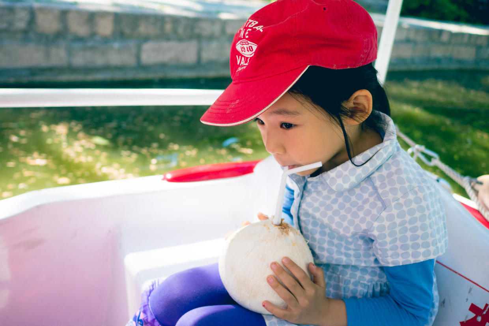
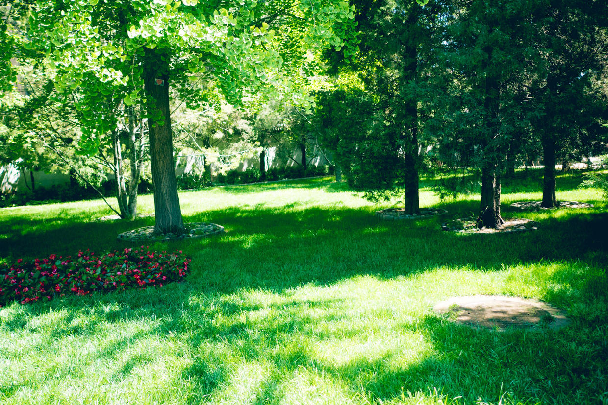

          
            
**2017.05.07**

周日，风停了，可以开心地出游了。

吃过早饭，趁着凉快赶紧出发。

朝阳公园停车，骑车到团结湖东门。

公园已经免费了。

进门去码头，趁着早，租一条船。

开着电瓶船，周围都已经是高楼大厦了。

碧波荡漾的湖面，非常漂亮。

喵也来学学开船，上次来的时候才2岁，抱着方向盘不撒手。

接着喝椰汁。

开船来了兴致，就是力量太小。

开到游廊附近，有很多金鱼。

从湖面望过去，高耸入云的大楼上，闪着点点的电弧光。

一群大白鹅游了过来。

游廊里游人的欢笑声和唱戏的声音不断。

孩子们掰着大馒头去喂鱼。

下了船，坐旋转秋千，下来的时候喵妈的表情就没这么轻松了，不过喵倒是一点事都没有。

路边的鲜花非常艳丽。

学生们在写生。

我们又到了游廊这个窗户，几乎每年都会来这个位置照张相。

绿地的斑驳树影。

又到了这个我小时候常玩儿的攀登架了。

喵也勉为其难地爬了两脚。

今天太阳非常的足。

还好公园里有高大的绿树环绕。

走在林荫道上，倒是非常凉快。

团结湖公园，作为童年记忆力最重要的一部分，每次来，都会非常开心。

走到哪里，都会有熟悉的记忆扑面而来。

希望晚上能做个回到小时候的梦。

***下期预告：看图说话***

**个人微信公众号，请搜索：摹喵居士（momiaojushi）**

          
        