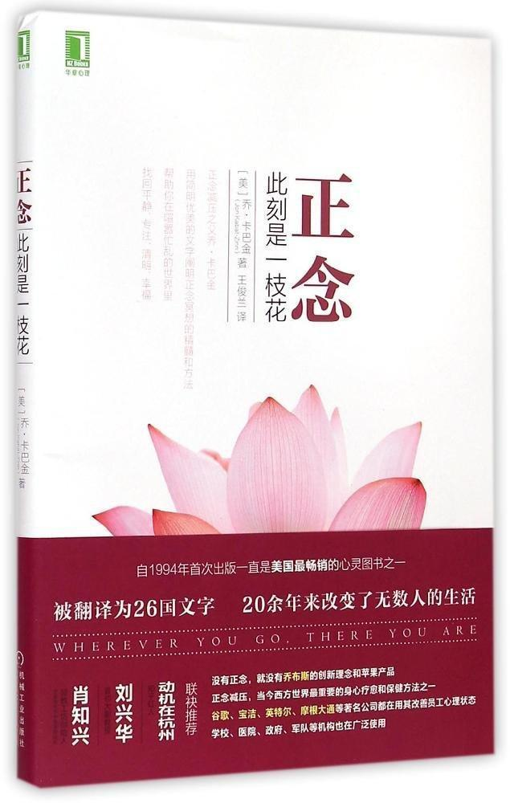

          
            
**2017.05.24**

来自亚马逊

真本书还是值得一读，开阔一下眼界。作者并没有宣扬伪科学和虚无主义，相反强调了关注自己和身边环境。

其实和曾国藩的早起、自省有异曲同工之妙。

以下是一些书摘：
>推荐序
卡巴金想做的 ，是一种参与式的医学 。他认为 ，疾病的治疗可以由医生主导 ，身心的疗愈却无法假他人之手 ，必须通过治疗者自身的全情投入来实现 。
卡巴金在麻省医院地下室接待的第一批病人 ，都有很严重的身体疾病 ：皮肤病 、心脏病 、慢性疼痛甚至癌症 。卡巴金从未试图给病人虚幻的希望 。他只是教他们 ，怎么和疾病 、疼痛相处 ，怎么在过去和未来的间隙 ，投入当下 ，怎么把从练习中获得的态度和体验 ，融入生活 。

身和心是相互作用，靠心，帮助医治身体
>正念减压 （ M i n d f u l n e s s B a s e d S t r e s s R e d u c t i o n ， M B S R ）
他说正念的要义 ，是让一切自然地展开 。

>正如卡巴金老师所说 ： “生命只在刹那间展开 ，若无法全心与这些刹那同在 ，我们将错失生命中最宝贵的事物 ，而且会意识不到自身成长和蜕变中的丰富性和深邃性 。 ”
在这苦乐交融的人生中 ，怎么珍惜当下 ，怎么删繁就简 ，怎么与自己相处 ，怎么投入地生活

>引言
无论何事发生在你身上 ，它已然发生 。关键在于 ，你如何应对 。换句话说 ， “此刻该当如何 ？ ”
你手头的这本书讲的是如何从这种幻梦中清醒 ，这种幻梦往往会演变成梦魇 ，甚至不知道自己正身处幻梦中 。这就是佛教中所谓的 “不觉 ” ，或曰 “不悟 ” 。知道自己的不觉 ，就是所谓的 “开悟 ” 。要想从这种幻梦中觉醒 ，你要做的是冥想 ，是系统地培养清明心境和对当下的觉醒意识 。这种
觉醒与我们所称的 “智慧 ”相伴相生 ，而所谓智慧 ，就是更深刻地洞见因和果 ，洞见万事万物间的相互联系 ，这样我们才不会深陷在自己创造的虚妄现实中 。要想摆脱这种虚妄 ，我们需要专注于当下 。当下才是我们赖以生存 、成长 、感受及蜕变的唯一时刻 。我们需要更清醒地认识并警惕过去和未来的拖拽 ，避免陷入它们编织的虚幻梦境 ，而忘了我们的真实生活 。

觉醒和开悟，感觉自己当下
>说到冥想 ，重要的是冥想只关乎做你自己 ，有一定的自我意识 。它关乎意识到无论你喜欢与否 ，你正在路上 ，正在人生的路上 。
正念首先关注的是专注和自觉

冥想要关注自己
>第一章 此刻，繁花盛开
正念是一个很简单的概念 。它的力量存在于修习和运用中 。
正念意味着以一种特殊的方式集中注意力 ：有意识地 、不予评判地专注当下 。这种专注使我们对当下的现实更自觉 、更清明 、更接纳 。
它的关键在于欣赏当下 ，在于小心地 、敏锐地持续关注当下 ，从而与之建立密切联系 。它与视生命为理所当然的存在截然相反 。

什么是正念
>冥想要关注自己当我们真正以开放的方式来集中注意力 ，不受制于个人的喜恶 ，不为个人看法和偏见左右 ，摆脱个人的臆断和期望 ，这个时候 ，新的希望才会出现 ，我们才会有机会将自己从蒙昧的桎梏中解放出来 。

为什么要集中注意力
>我宁愿仅仅把正念当作清明生活的艺术
最重要的是做你自己 ，不要试图违背自己的本性 。
它仅仅是一种修习方式 ，通过系统的自我观察 、自我探索以及有意识的行为使你更全面地把握自我 。

只是一种修习方式，不是答案
>冥想意味着学习如何从这洪流中脱身 ，坐在思想之河的岸边 ，聆听它的声音 ，从中学习 ，然后让它的力量指引而不是奴役我们 。
与自己相处 … …满怀兴趣地在日常生活中观察自己 ，意在理解而不是评判 ，完全接受浮现出的一切 ，因为这些都是客观存在的 ；通过以上做法鼓励深藏于内心的东西浮现出来 ，并利用它们带来的能量丰富你的人生 ，丰富你的意识 。这是一种伟大的觉醒活动 ，它了悟了生命和心灵的本质 ，并以此消除障碍 ，释放能量 。智慧带我们走向自由 ，敏锐的专注力则是智慧之母 。
冥想也不仅仅是坐在那里那么简单 。它要我们停一停 ，感受当下 ，如此而已 。
要想停下手中所做的一切 ，其中一个良策是暂时切换为 “存在 ”模式 。将自己想象为超脱于时光之外的旁观者 。观察当下 ，不作任何干预 。会发生什么 ？你感受如何 ？你看到了什么 ？又听到了什么 ？

冥想不是简单的呆坐
>试一试在一天中 ，不时抽时间停下来 ，坐下 ，感受自己的呼吸 。你可以抽 5分钟 ，或甚至几秒 。摒弃一切 ，充分拥抱当下 ，包括你的感受和认知 。不要试图改变什么 ，只需呼吸 ，无拘无束 ；呼吸 ，顺其自然 ；放下那种想让此刻有所不同的念头 ；在心里 ，在脑中 ，任由这一刻保持它的本原状态 ，任由自己保持本原状态 。然后 ，一切就绪时 ，沿着自己的内心指引的方向 ，清醒而坚定地 ，前进 。
在所有有目的而系统化的人类活动中 ，只有冥想从本质上而言不是要提升自己 ，也不是为了带来任何结果 ，而仅仅是为了意识到你当下的所在 。也许冥想的价值正在于此吧
将冥想看作一种行为也是不太准确的 。更确切来讲 ，它是一种 “存在 ” 。当我们理解了 “当下即是 ”的含义后 ，我们就能放下过去和未来 ，感悟当下 。

冥想只求感受，不求结果
>毫无疑问 ，你需要时时看到自己的进步才能坚持下去 。但是冥想不同 。从冥想的角度来看 ，每一种心境都是特别的 ，每一个时刻都是特殊的 。
时时提醒自己 ：当下即是 。看看这句话是否放之四海而皆准 。提醒自己 ，接纳此刻并不意味着对当前发生的一切妥协 。仅仅意味着一种清醒的认知 ：一切正发生之事正在发生 。接纳并不会告诉你该做些什么 。后续之事以及你所选择的事 ，都源于你对当下的认知 。你也许会尝试将自己对 “当下即是 ”的深刻洞悉用行动表现出来 。它是否会影响到你对前进或回应方式的选择 ？你是否会默想 ，当下也许真的就是自己一生中最美好的时刻 ？如果真的有这种感想 ，这种感想对你来说意味着什么 ？

时刻关注当下
>掌握刹那的最佳方式是专注 ，这是修持正念的要诀所在 。正念意味着清醒 ，意味着知道自己在做什么 。
留意自己的呼吸这种做法能帮助你集中注意力 ，它好比一根锚索 ，使你专注当下 ，在你思绪游离时将你拉回到当下此刻 。呼吸法在这些方面实在是堪当重任 。它会是一个重要助手 ，使我们意识到自己的呼吸 ，由此我们知道自己身处当下 ，也因此 ，我们会对当下发生的一切全然了悟 。
要想在呼吸中培养正念 ，请全身心地感受它 ，感受呼入的气体进入你的身体 ，以及呼出的气体离开你的身体 。仅此而已 。只需感受呼吸 。呼吸 ，并且清醒地知道自己在呼吸 。这并不意味着要深呼吸或强迫自己去呼吸 ，亦不是努力去体验什么特殊的感觉 ，更不是去考虑自己的呼吸方式是否正确 。不是思索自己的呼吸 。仅仅是意识到气息的流入和流出而已 。
这种呼吸练习 ，一次无须太久 。利用呼吸 ，使我们的思绪回到当下此刻 ，这是瞬间就可以完成的事情 ，只需注意力集中 ，方向稍作转变即可 。但是 ，如果你能给自己多一点时间 ，将一个个的清醒时刻连点成线 ，连线成面 ，那就妙不可言了 。
试一试吸气 ，深深地吸入 ，呼气 ，缓缓地呼出 ；在这一刻 ，在这一吸一呼中 ，腾空大脑 ，放飞心灵 。摒除一切欲望和杂念 。思绪开始游离时 ，记得再回到呼吸上来 ；通过一次又一次的呼吸 ，将每一个觉悟的时刻连接起来 。在阅读本书的过程中 ，你不妨时时尝试一下 。

冥想的关键是呼吸
>卡比尔 [ 1 ] ：弟子 ，告诉我 ，什么是神 ？他是呼吸中的呼吸 。

呼吸很重要
>正念练习指的是全身心地投入到此刻当下 。
我们不是为了完善提高 ，也不是为了取得什么成就 。我们甚至也不是为了产生什么奇思妙想 。我们更不会强迫自己努力做到不妄加评判 、平静或放松 ，当然也不是为了发展自我意识或沉迷于自恋中 。相反 ，我们只是想邀约自己 ，全身心地与当下完全交融 ，竭尽所能 ，有意识地在此处此刻实现平和 、觉知及宁静 。

不追求任何事，才获得宁静
>当然 ，在持之以恒的修习以及朝
正确方向坚定而缓慢的努力中 ，平和 、觉知和宁静会渐渐实现自我发展 、自我深化 ，你会全身心沉浸在一片宁静中 ，你会只静静观察 ，不回应 、不评判 。认知 、洞见以及对宁静和快乐的深刻体验都会随之而来 。
正念的实质在于为了修习而修习以及拥抱到来的每一刻 ，无论这到来的一刻是快乐还是悲伤 、好还是坏 、尚可还是不堪 。然后 ，感受它 ，因为它就是当下 。带着这种态度 ，生活本身就成了一场修行 。然后 ，与其说我们从事修行 ，倒不如说修行成就了我们 ，或者可以说 ，生活成了我们的冥想导师 ，成了我们的引路人 。

要持之以恒的练习，才能达到
>假如真的决定要开始练习冥想 ，你不必跑去告知他人 ，也不必谈论你进行冥想的理由或它会给你带来何种益处 。事实上 ，这样做只会消耗你刚刚萌生的干劲和热情 ，并且使你的计划受挫 ，从而使你失去前进动力 。所以 ，练习就好 ，不用到处张扬 。每当你有强烈冲动 ，想要谈论冥想及其妙处或难度 、益处或无益 ，抑或试图说服他人相信冥想对他们的益处时 ，请将冥想看作更多的思考吧 ，请多进行些冥想修习 。这种冲动早晚会消逝 ，这对每个人都会更为有益 ——尤其对你 。

冥想自然而然不要刻意为之
>你无法遏制波涛 ，但你可以学会冲浪
人们通常认为 ，冥想是屏蔽外界压力或内心压力的一种手段 ，但是这种看法并不准确 。冥想既无法消除也无法屏蔽问题 ，而是更清楚地看待问题 ，以及有意识地从不同的视角看待我们与这些问题之间的关系 。
要设想正念的作用方式 ，其中一种方法是将自己的内心看作是湖面或者洋面 。水面上总有波纹 。有时候是惊涛骇浪 ，有时候则涟漪轻起 ，还有的时候细微到令人难以察觉 。水波因风而起 ，而风时有时无 ，时强时弱 ，方向也不确定 ，正如我们生活中的压力之 “风 ” ：它影响我们的生活 ，在我们心中激起浪花朵朵 。
我们可以通过冥想设法为我们的心灵找一个避风港 ，使之免受 “吹拂 ” 。
假以时日 ，我们内心中的许多骚乱可能就会由于缺乏持续的给养而渐渐平息 。但无论如何 ，我们的人生和心灵中风波总不可避免 ，既如此 ，就只管尽力而为吧 。冥想的本质就在于明了这一点 ，并与之和谐共处 。

他强任他强，清风拂山岗
>冥想并不是某种特定的感受 。它指的是体验你的感受方式 。它不是说要实现心灵的空灵或平静 ，虽然在冥想中我们确实能越来越平静 ，而且这种平静确实是可以通过系统化培育得来的 。冥想首先是让内心顺其自然 ，了解我们的内心此时此刻处于什么状态 。它并不是说我们一定要达到某种境界 ，而是说停留在自己目前所处的状态 。
在走路 、站立 、躺卧 、单腿独立 、跑步或洗澡的时候你都可以进行冥想修习 。但是要坚持修习 5分钟就需要有意为之了 。而要使之成为你生活中的一部分 ，这就需要一定的自制力
如果你有进行冥想修习的话 ，可以在日常修习中体悟此刻如花一样的美好 。
如果你清晨早起 ，试试到外面走走 ，看看星星 ，看看月亮 ，看看微露的晨曦 ，久久地 、有心地 、专注地看 。感受空气 ，感受清冷 ，感受温暖 ，久久地 、有心地 、专注地感受 。意识到 ，你周围的那个世界正在安睡 ；记住 ，在看那些星星时 ，你正穿过千万年的岁月回望 。过去就在此时此刻 。然后 ，找个地方坐下或者躺下 ，冥想 。在练习的时候 ，放下手头一切 ，切换入存在模式 ，只沉入到宁静与正念中 ，感悟在此刻一刻一刻地展开的时刻 ，确定 “此刻即是 ” ，不增 ，不减 。

冥想可以有各种形式，形式不重要，关键是放下一切
>无为不但可以从静中来 ，也可以从动中来 。为者内心中的静与外在的行为浑然一体 ，衔接流畅 ，一气呵成 。心到手到 ，轻松随意 ，无欲无求 ，顺其自然 ，然而一切最终却水到渠成 。无为而为是任何所为中的最高境界
无为仅仅意味着让一切顺其自然 ，使一切按其本来的方式发展 。要达到无为的境界 ，我们确实需要付出很多努力 ，但这是一种优雅 、通达 、挥洒自如的努力 ，是需要用一生时间来培养的 “无为之为 ” 。
唯一重要的就是蕴含在动作中的当下 。使这一刻活起来 、有意义 。不要使它在不知不觉中白白流走 。 ”

无为，才能为
>冥想就是练习无为 。我们的修习不是为了使事物完美或使做事方式实现完美 。相反 ，我们练习是为了理解并认识到 （使我们自己真切地接受 ）这个事实 ：事物本身已经足够完美 ，它们目前的样子已经十分完美 。只有这样 ，我们才能充分接纳当下 ，不将任何东西强加在当下 ，认识到当下的纯粹性 ，认识到当下中的勃勃生机 ——因为它可能孕育着下一刻 。
因为了解事物本质 ，对一切洞若观火 ，认识到我们的无知实际上超过所知 ，所以我们才能行动 、进取 、停顿 、把握机遇 。有些人用流水来形容这一切 ：在正念的河床上 ，一个时刻无声无息 、自然而然地融入下一时刻 。

冥想练习就是一种无为
>当心中的不耐和怒一点点升腾起来时 ，请仔细审视它们 。看看自己能否以一种不同的视角来看待它们 ，这种视角就是 ，认为万事万物皆因循自己的天时而动
但是在那一刻 ，你可以试试不要逆势而进 ，而是仔细聆听 。这各种势 ，它们告诉你了什么 ？它们正在跟你说什么 ？它们要你怎样做 ？如果细听无音 ，那就呼吸吧 ，让一切顺其自然 ，无欲无为 ，保持耐心 ，继续倾听 。如果它们有对你说些什么 ，那就照做 ，清醒地做 。然后 ，停下来 ，耐心等 ，再倾听 。
顺其自然真正指的是选择清楚地意识到个人喜恶对我们产生的巨大影响 ，意识到蒙昧状态给我们带来的巨大影响
只有完全认识并承认自己深受羁绊 ，只有使自己认识到我们观察事物时佩戴了 “有色眼镜 ” ，我们才可能做到顺其自然 。这只有当我们完全沉浸安定在当下 ，对一切无欲求 、不执着 、不拒绝时 ，宁静 、洞见和智慧才会翩然而来 。这是一个经得起检验的命题 。你尽可一试 ，权当自娱 。

不耐烦和愤怒升腾时，审视自己，不逆势而行，顺其自然
>不去评价这种评判是好是坏 ，你会有什么感觉 ？你会感到真正的平静 ，真正的自由 。
冥想意味着培养出一种不予评判的态度 ，不对我们心中浮现的任何想法妄加评判 。没有这种态度 ，你就算不上在修习冥想 。这
在冥想中 ，我们奉行的原则是只观察身心中发生的一切 ，只承认它们的存在 ，不对其横加指责 ，亦不对之孜孜以求 ，同时 ，认识到我们的评判是不可避免的 ，意识到这些评判必然会限制我们对体验的思考 。

承认周围的一切
>放慢脚步就是其中重要一步 。
身心都放在我女儿身上而不是去接电话 ，不响应心中 “需要在此刻给某人打个电话 ”的冲动 ，不要一时冲动想要得到某个新东西 ，不要不由自主 、轻而易举地做了杂志 、电视或电影的俘虏 ，所有这些都能使我们的生活变得简单起来
此外 ，还可以静坐一晚什么都不干 ，或者可以独自去散散步 ，或者也可以跟孩子或妻子一起去散散步 ，或者还可以把柴火重新垛一垛或
者看看月亮 ，或者还可以在树下感受一下微风拂面 ，也或者还可以早点上床睡觉 。
为了让生活保持简单 ，我训练自己说 “不 ” ，我发现这种努力永远没有尽头 。这种努力就其本身而言就是一种艰苦然而值得的训练

什么都不做，有时也是需要痛苦训练的
>定力就是要全身心沉潜到平静和不受任何干扰的安宁中 。这种宁静令人神往甚至令人迷醉 。我们会很自然地发现自己在追求这种使人沉醉欣喜的宁静简单的心境 。

但是 ，如果没有正念对之进行补充和深化的话 ，无论多么强大而令人满意的定力都是不完整的 。

定力很重要，但是没有正念，定力用在花花世界上也是没有意义的
>所以 ，如果你能在怒火升腾起来时有意识地扩大怒的内涵 （无论是你的还是他人的怒 ） ，认识到其中一定存在某些比怒更强大更重要 、而在这个情绪激昂的关头被你遗忘的东西 ，那么你心中就能保留一份独立于怒之外的清醒 。这种清醒正念能看到怒 ，它知道这怒的深度 ，它比这怒大 ，所以它能像容器盛纳食物一样将这种怒容纳其中 。这种清醒帮助我们盛着怒 ，它帮助我们认识到它的害处大于益处 ，虽然这些害处并非出自我们的本意 。就这样 ，这种清醒正念帮助我们 “烹煮 ”怒 ， “消化 ”怒 ，从而使我们能够有效地对之加以利用 ，而且也许能使我们从对怒的惯性反应转变为有意识的回应 ，从而超越它 。

要保持独立于愤怒之外的清醒
>火边静坐

培养宁静的习惯
>和谐之美

大雁排着队，就是一种和谐的美
>黎明即醒

早起正念
>直接接触

亲自去做事，去体会
>做父母也是一种修习

要有智慧和耐心

**个人微信公众号，请搜索：摹喵居士（momiaojushi）**

          
        