          
            
**2017.05.26**

本篇继续回顾一下喵妈在2010年去香港出差时的照片。

难得拍了一些渔村的照片，完全看不出任何香港都市的痕迹。

这张好像是到西贡了，两条栈桥，繁忙的时候肯定是人来人往。

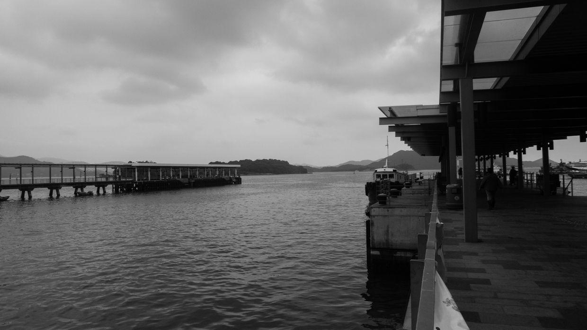

岸边的栈桥，停泊了很多游艇，竟然还有一幢大高楼，很突兀地矗立在那里。

远处的山上也布满了房屋

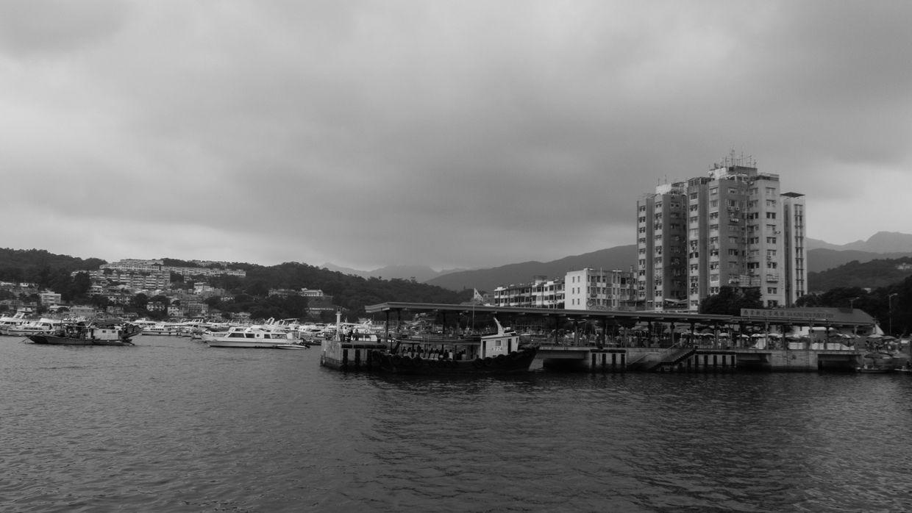

打渔的老夫妇，船上装满了各种海鲜。

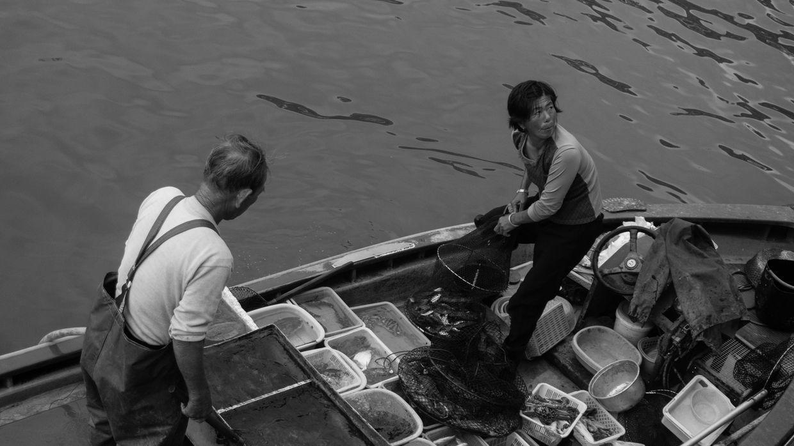

栈桥上来来往往的人们。

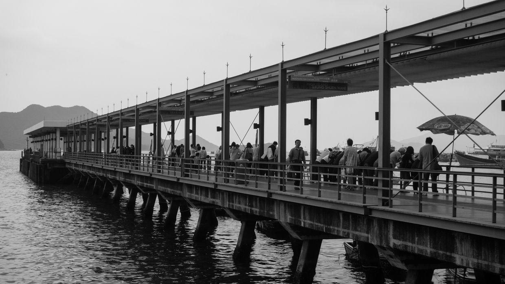

岸边停泊的各种渔船，看起来还有不少是木制的。

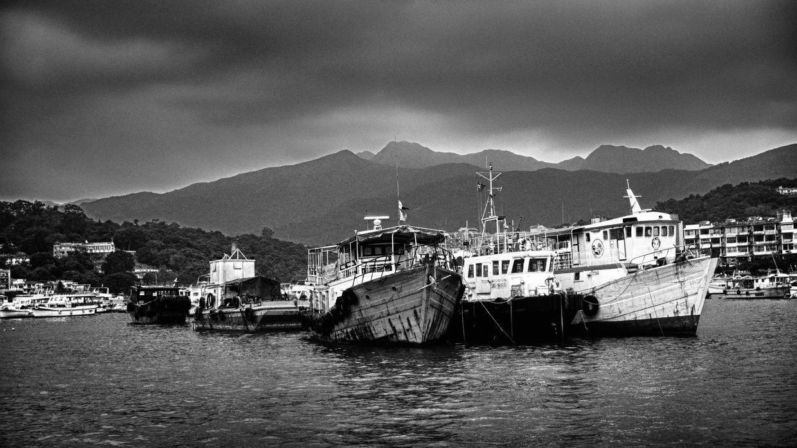

海岛，岩石上覆盖满了树木。

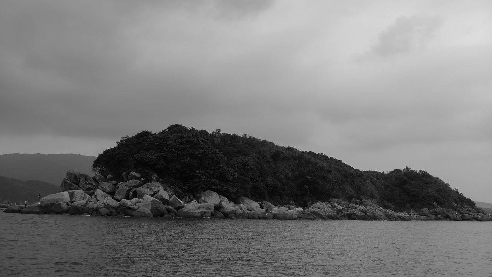

阴云密布的海面。

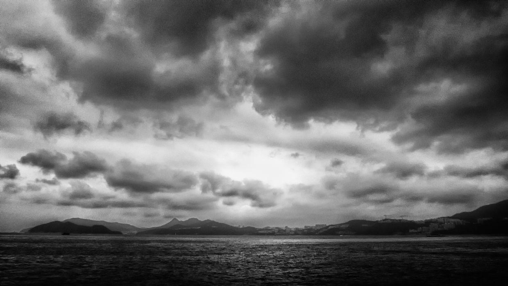

坐快艇出海，阴天出来也不晒，真是个好时间。

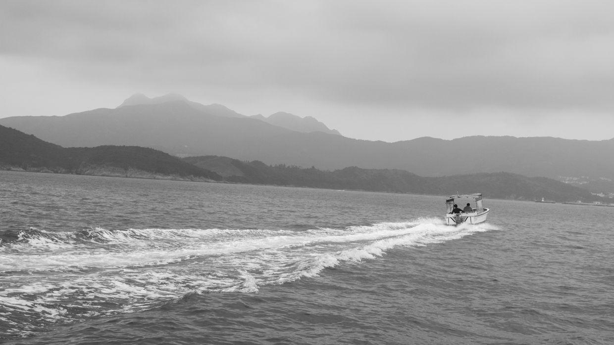

阴云下的海岛。

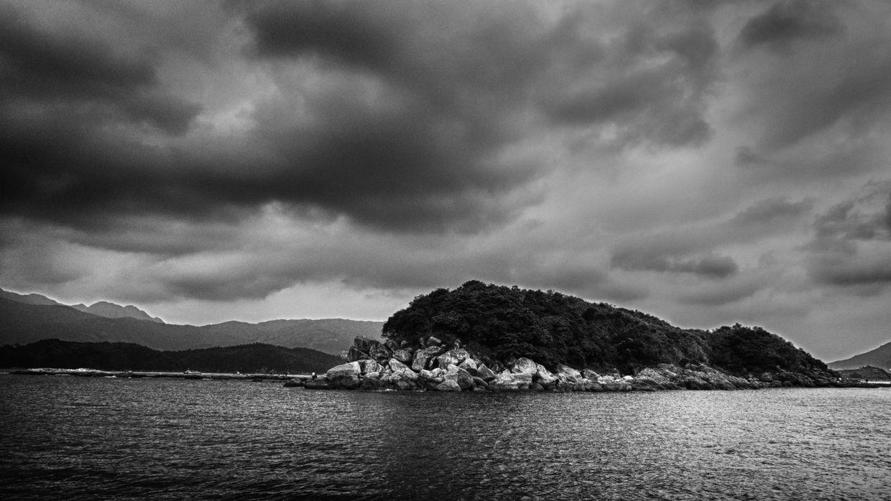

划橡皮艇的人。

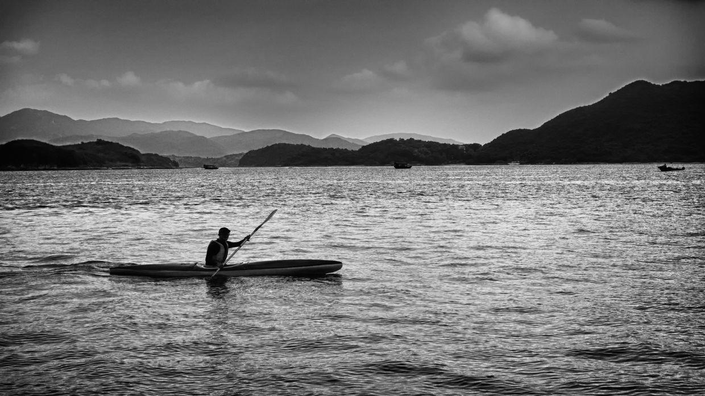

堤岸上的三层小楼，不知道海浪声会不会很吵。

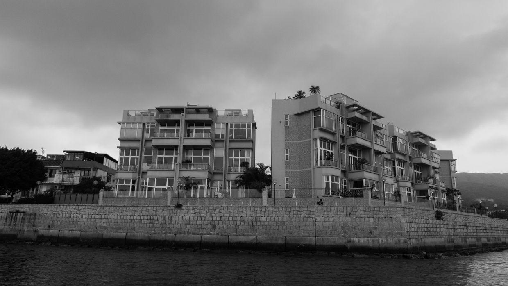

渔船，要下大雨，看来是不出海了。

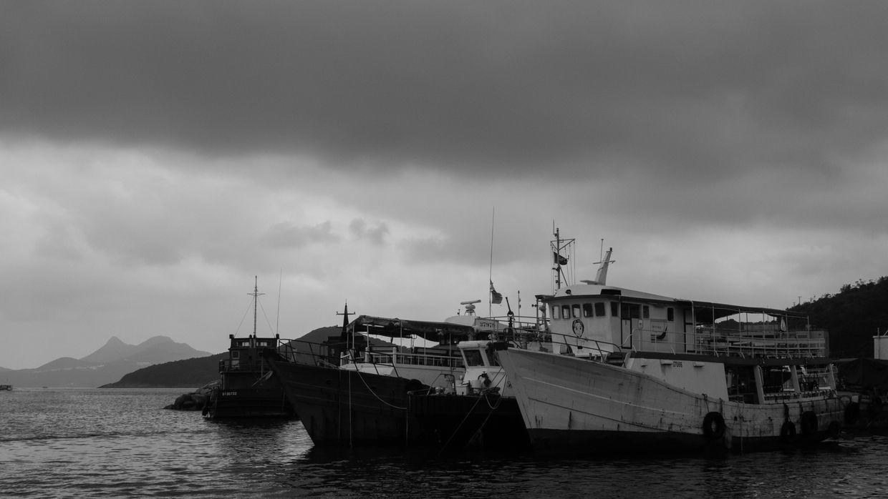

很有意思的石头“纸船”，和颐和园的石舫相比，倒是有一种童趣了。

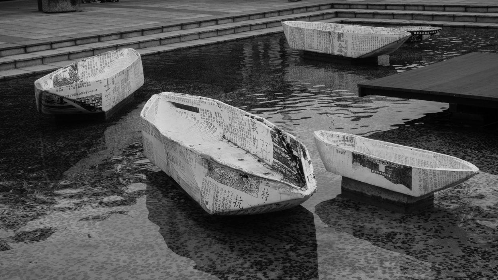

**个人微信公众号，请搜索：摹喵居士（momiaojushi）**

          
        