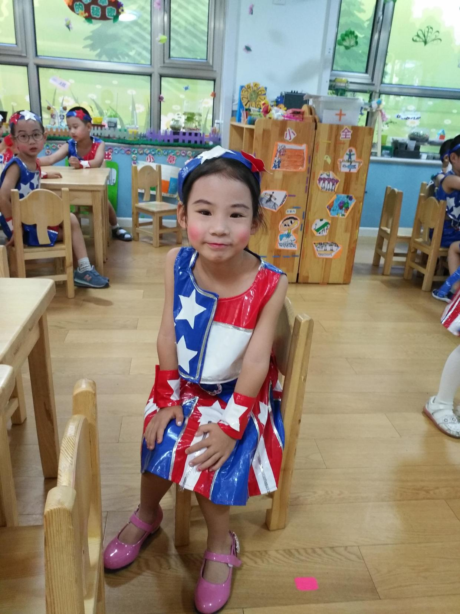
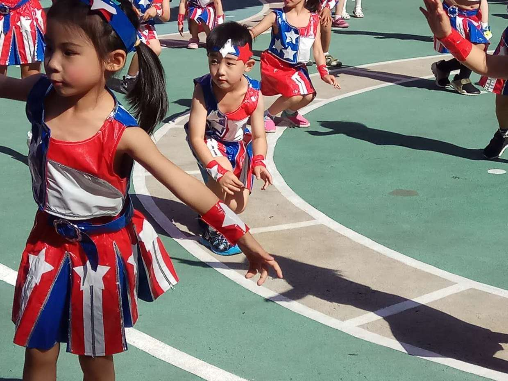
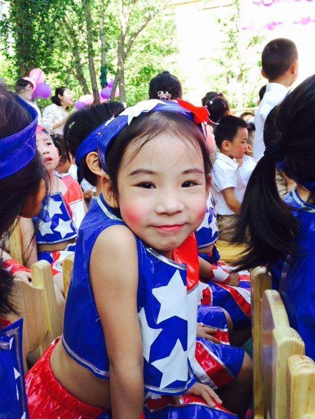
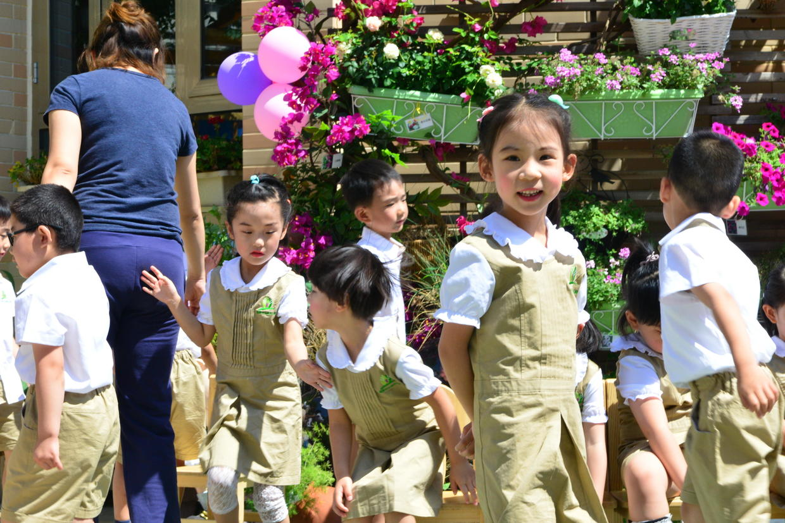
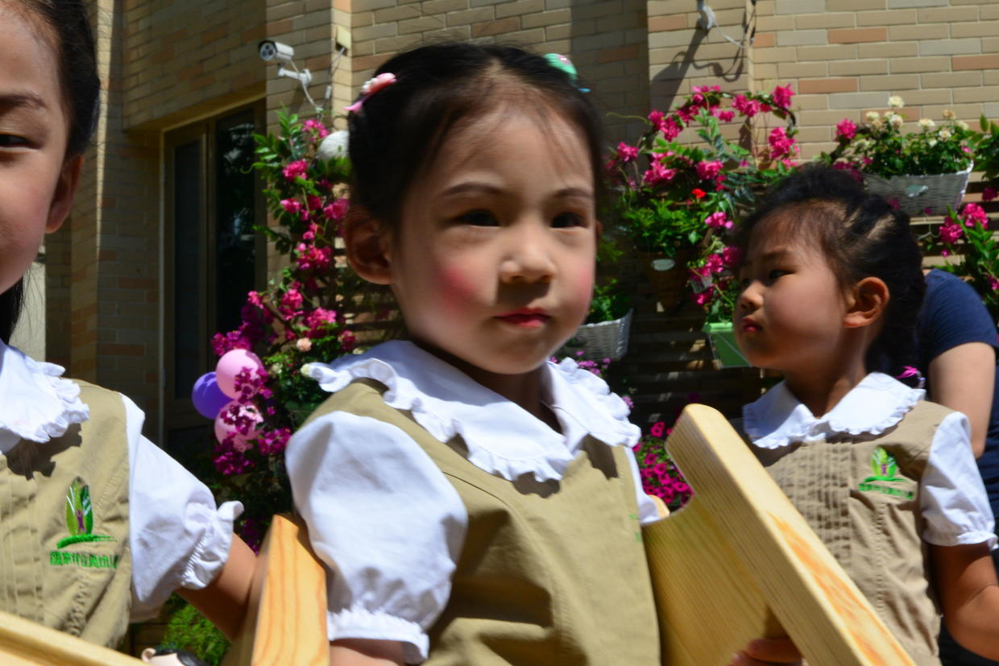

          
            
**2017.06.06**

上周，又到了一年一度的六一儿童节的演出。

之前每年幼儿园会邀请一位家长参加，但是由于家长实在太多，今年改成了孩子们自己表演。

于是前方传来的直播照片和视频，让不能到场的家长们也能看到孩子们的精彩表现。

喵的班里穿的是外星人舞蹈服，吐了红脸蛋和红嘴唇。

外星舞从学期开始时，老师就已经带着跳了，平时在家里也都让我们放着音乐跳着玩儿。

表演完节目，同学们坐在操场上，看其他班级的表演。

换回了幼儿园的园服。

表演结束，同学们一起把自己的椅子搬回教室。

回忆一下自己以前过的六一儿童节，大概也是这个样子。

在幼儿园里，老师同学们表演节目，自娱自乐。

下午半天，回家休息。

晚上我们到家，小人儿还特别留恋自己的红嘴唇，之后的几天总会想要涂口红。

快乐的童年，伴随着一个有一个儿童节。

**个人微信公众号，请搜索：摹喵居士（momiaojushi）**

          
        