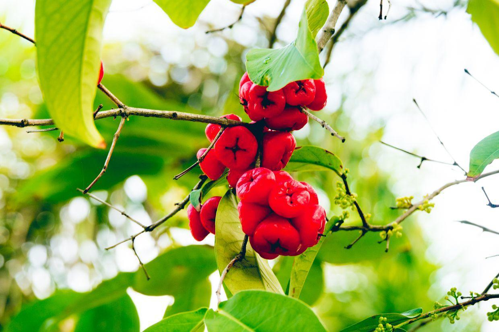
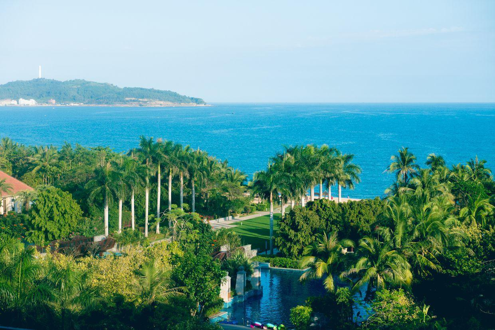

          
            
**2017.06.16**

本篇开始回顾一下今年四月份去三亚时，记录的一些风景。

到三亚酒店时，已经是晚上，睡了一觉，早上起床去跑步。

透过楼道的窗户向外一望，雨后的椰树，油亮油亮的。

远处太阳早已升起，只是雾气很大。

酒店内的各种竹子，布满了内庭。

去吃早餐，极高的大厅，非常敞亮。

中厅的喷水池。

在酒店各个角度，移步换景，高低错落的绿色植物，配上三角梅。

整个酒店就是个小型植物园。

一个一个大小游泳池，散落在树丛中间。

整个酒店大楼也被一圈泳池环绕。

巨大的中东椰枣树。

莲雾的果实。

睡莲，每天早上去沙滩时看着她打开，晚上回来时已经闭合。

沙滩上的巨大椰树。

海滩的游泳区。

巨大的遮阳伞。

树荫下的泳池，有躺椅可以休息，游泳也不晒。

从屋里眺望海边。

海上的一条渔船。

菠萝蜜。

酒店内的绿色植物，专门花了半天时间，一株株看了个遍。

**个人微信公众号，请搜索：摹喵居士（momiaojushi）**

          
        