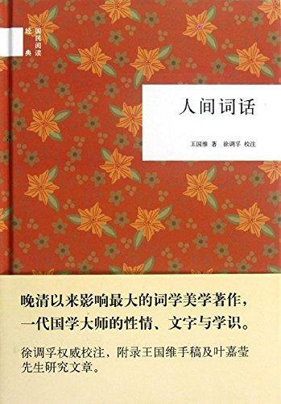

          
            
**2017.06.22**

大名鼎鼎的《人间词话》，不用多介绍了。

读《傅雷家书》时，反复看到里面提到，于是仔细读了读。

明白了傅雷的“赤子之心”是什么意思，和之前理解的完全相反。

傅雷说得对，没有宋词几百首的积累，是看不懂这本书的。

以下是一些书摘：
>人间词话
“泪眼问花花不语 ，乱红飞过秋千去 ” ( 1 ) ， “可堪孤馆闭春寒 ，杜鹃声里斜阳暮 ” ( 2 ) ，有我之境也 。 “采菊东篱下 ，悠然见南山 ” ( 3 ) ， “寒波澹澹起 ，白鸟悠悠下 ” ( 4 ) ，无我之境也 。

有我和无我
>“红杏枝头春意闹 ” ( 1 ) ；著一 “闹 ”字而境界全出 。 “云破月来花弄影 ” ( 2 ) ，著一 “弄 ”字而境界全出矣 。

境界
>境界有大小 ，不以是而分优劣 。 “细雨鱼儿出 ，微风燕子斜 ” ( 1 ) ，何遽不若 “落日照大旗 ，马鸣风萧萧 ” ( 2 ) 。 “宝帘闲挂小银钩 ” ( 3 ) ，何遽不若 “雾失楼台 ，月迷津渡 ” ( 4 )也 。

境界的大小
>词人者 ，不失其赤子之心者也 。故生于深宫之中 ，长于妇人之手 ，是后主为人君所短处 ，亦即为词人所长处 。

傅雷总提到的赤子之心
>《诗 ·蒹葭 》一篇 ( 1 ) ，最得风人深致 。晏同叔之 “昨夜西风凋碧树 。独上高楼 ，望尽天涯路 ” ( 2 ) ，意颇近之 。但一洒落 ，一悲壮耳 。

和蒹葭意境近似
>“我瞻四方 ，蹙蹙靡所骋 ” ( 1 ) ，诗人之忧生也 ； “昨夜西风凋碧树 。独上高楼 ，望尽天涯路 ”似之 。 “终日驰车走 ，不见所问津 ” ( 2 ) ，诗人之忧世也 ； “百草千花寒食路 ，香车系在谁家树 ” ( 3 )似之 。

相似的句子
>古今之成大事业 、大学问者 ，必经过三种之境界 ： “昨夜西风凋碧树 。独上高楼 ，望尽天涯路 ” ，此第一境也 。 “衣带渐宽终不悔 ，为伊消得人憔悴 ” ( 1 ) ，此第二境也 。 “众里寻他千百度 。回头蓦见 （当作 ‘蓦然回首 ’ ） ，那人正 （当作 ‘却 ’ ）在 、灯火阑珊处 ” ( 2 ) ，此第三境也 。此等语皆非大词人不能道 。然遽以此意解释诸词 ，恐晏 、欧诸公所不许也 。

经典的三境界
>陶 、谢之诗不隔 ，延年则稍隔矣 ；东坡之诗不隔 ，山谷则稍隔矣 。 “池塘生春草 ” ( 1 ) 、 “空梁落燕泥 ” ( 2 )等二句 ，妙处唯在不隔 。

不隔，直接观看
>词亦如是 。即以一人一词论 ，如欧阳公 《少年游 》咏春草上半阕云 ： “阑干十二独 （ ‘独 ’原作 ‘犹 ’ ）凭春 ，晴碧远连云 。千里万里 ，二月三月 （此两句原倒置 ） ，行色苦愁人 。 ”语语都在目前 ，便是不隔 。

不隔
>白石 《翠楼吟 》 ： “此地宜有词仙 ，拥素云黄鹤 ，与君游戏 。玉梯凝望久 ，叹芳草 、萋萋千里 ” ，便是不隔 。至 “酒祓清愁 ，花消英气 ” ( 4 ) ，则隔矣 。

有阻隔
>其堪与北宋人颉颃者 ，唯一幼安耳 。
东坡之词旷 ，稼轩之词豪 。无二人之胸襟而学其词 ，犹东施之效捧心也 。

辛弃疾和苏东坡可比
>“枯藤老树昏鸦 。小桥流水平沙 ( 1 ) 。古道西风瘦马 。夕阳西下 。断肠人在天涯 。 ”此元人马东篱 《天净沙 》小令也 。寥寥数语 ，深得唐人绝句妙境 。有元一代词家 ，皆不能为此也 。

元代第一
>白石之词 ，余所最爱者 ，亦仅二语 ，曰 ： “淮南皓月冷千山 ，冥冥归去无人管 。 ” ( 1 )

白石的词，评价这么高，找时间看看
>社会上之习惯 ，杀许多之善人 。文学上之习惯 ，杀许多之天才 。

很突兀的一句，不知道出自何方？
>词家多以景寓情 。其专作情语而绝妙者 ，如牛峤之 “甘 （当作 ‘须 ’ ）作一生拚 ，尽君今日欢 ” ( 1 ) ，顾夐之 “换我心为你心 ，始知相忆深 ” ( 2 ) ，欧阳修之 “衣带渐宽终不悔 ，为伊消得人憔悴 ” ( 3 ) ，美成之 “许多烦恼 ，只为当时 ，一晌留情 ” ( 4 ) 。此等词 ，求之古今人词中 ，曾不多见 。

以词传情
>“西 （当作 ‘秋 ’ ）风吹渭水 ，落日 （当作 ‘叶 ’ ）满长安 。 ” ( 1 )美成以之入词 ( 2 ) ，白仁甫以之入曲 ( 3 ) ，此借古人之境界为我之境界者也 。然非自有境界 ，古人亦不为我用 。

西风吹渭水，落日满长安，非常棒
>至于国朝 ，而纳兰侍卫以天赋之才 ，崛起于方兴之族 。其所为词 ，悲凉顽艳 ，独有得于意境之深 ，可谓豪杰之士 ，奋乎百世之下者矣 。

纳兰性德，词很悲伤
>静安之为词 ，真能以意境胜 。夫古今人词之以意胜者 ，莫若欧阳公 ；以境胜者 ，莫若秦少游 ；至意境两浑 ，则惟太白 、后主 、正中数人足以当之 。

以境为胜很难
>温飞卿 《菩萨蛮 》 ： “雨后却斜阳 ，杏花零落香 。 ” ( 1 )少游之 “雨馀芳草斜阳 。杏花零落 （当作 ‘乱 ’ ）燕泥香 。 ” ( 2 )虽自此脱胎 ，而实有出蓝之妙

很相似
>第一则提出 “境界 ”一词为评词之基准 。
第二则就境界之内容所取材料之不同 ，提出了 “造境 ”与 “写境 ”之说 。
第三则就 “我 ”与 “物 ”间关系之不同 ，分别为 “有我之境 ”与 “无我之境 ” 。
第四则提出 “有我 ”与 “无我 ”二种境界所产生之美感有 “优美 ”与 “宏壮 ”之不同 。为第三则之补充 。
第五则论写作之材料可以或取之自然或出于虚构 。又为第二则 “造境 ”与 “写境 ”之补充 。
第六则论 “境界 ”非但指景物而言 ，亦兼内心之感情而言 。又为第一则 “境界 ”一词之补充 。
第七则举词句为实例 ，以说明如何使作品中之境界得到鲜明之表现 。
第八则论境界之不以大小分优劣 。
第九则为境界之说的总结 ，以为 “境界 ”之说较之前人之 “兴趣 ” 、 “神韵 ”诸说为探其本 。

人间词话文学批评的九条准则

**个人微信公众号，请搜索：摹喵居士（momiaojushi）**

          
        