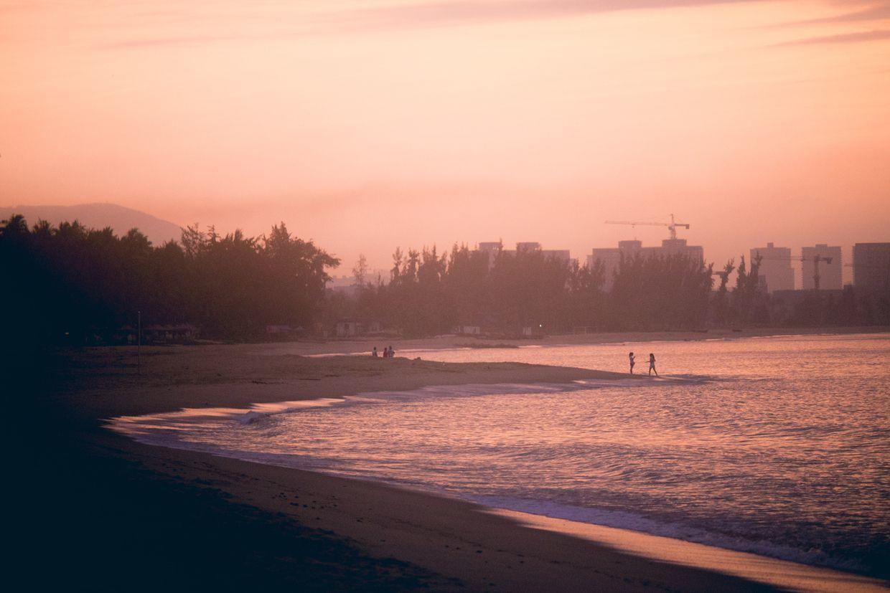

          
            
**2017.06.23**

本篇继续回顾一下清明去三亚的美丽风景。

早上5点多起床，去海边，乌云密布，远处的太阳刚刚要钻出来。

红红的阳光，慵懒地洒在海面上。

沙滩上嬉水的人影。

换上超广角，别有一番风味，尽收眼底。

海浪来了又去，只有一排排脚印。

换上长焦，拍一下滚滚的海浪。

远处岛上耸立的高塔，海边上的渔船，相映成趣。

回过头来，是酒店的中庭，空无一人的样子，只有此时得见。

阳光洒在海浪上，分不清是早晚。

突然窜出了寄居蟹，静静地在旁边，反复对焦才找到了它。

到了吃早饭的时间，酒店的自助餐也是一道靓丽风景。

酒店泳池竟然还有水滑梯。

走着走着，发现了红色蜥蜴，伏在灌木丛上，一动不动。

波光粼粼的池水，有些魔幻。

高大的椰树上，已经有了很多大椰子。

下午的海滩上，大伞下已经坐了不少人。

蓝蓝的大海，风浪不小，游泳的人不多。

未完待续。

**个人微信公众号，请搜索：摹喵居士（momiaojushi）**

          
        