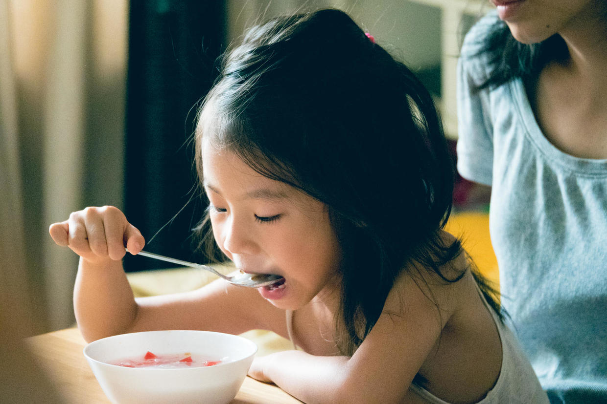
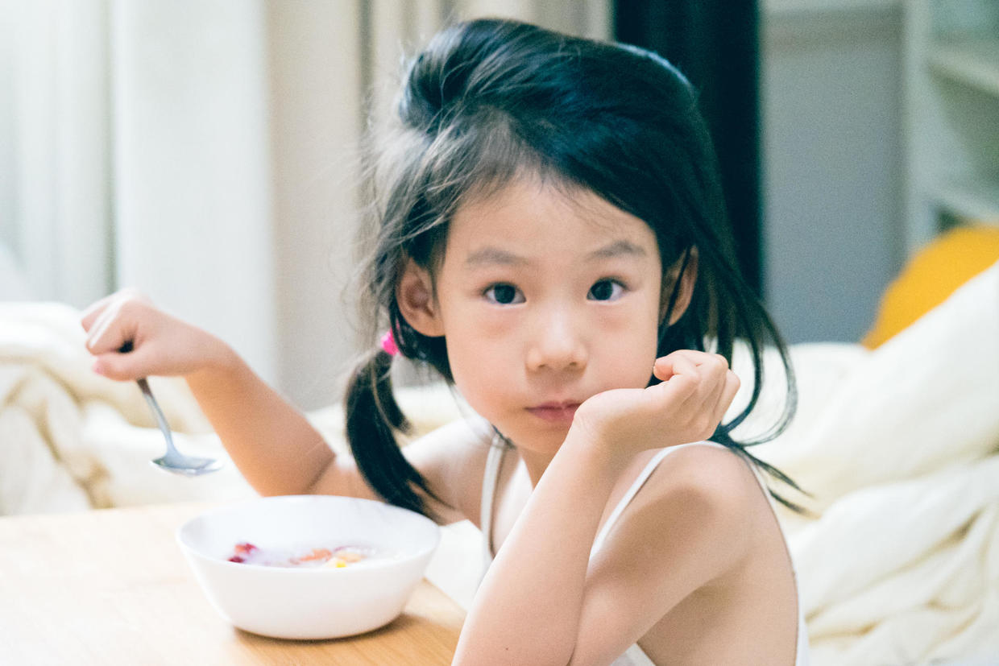

          
            
**2017.06.24**

周六啦，这一周的主题就是养病。

喵从周一开始发烧，周二去医院，检查结果是病毒感染。

大夫让回家休养，按时吃退烧药，其余只能交给免疫系统了。

早上起床，自己拿着勺子喝粥。

头发都散了，显得很憔悴。

翻了一下喵的日志，上一次发烧还是2016年12月份。

这次发烧也正好是舞蹈考级结束，看来小人儿是带病完成了考试。

不过可惜的是，这一周幼儿园全班合影和开放日都因病错过了。

不过随着年龄增长，看病和吃药都已经比以前好很多了。

去医院扎指尖血，已经不哭了，看着小针扎进去，非常镇静。

吃退烧药的时候，也很配合了，直接一口闷，然后喝一大杯水。

回忆一下2岁的时候，死活不喝药，不喝水，只能那小针管硬灌下去。

**个人微信公众号，请搜索：摹喵居士（momiaojushi）**

          
        