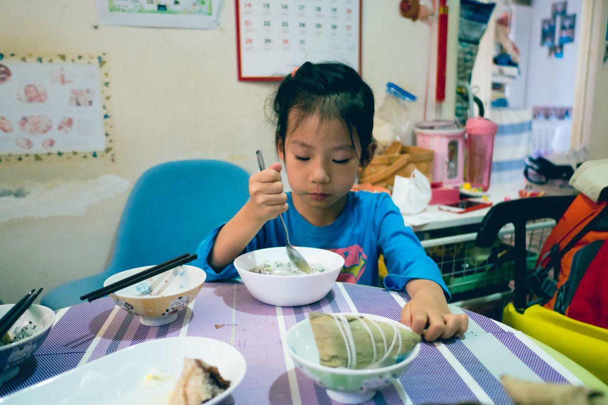
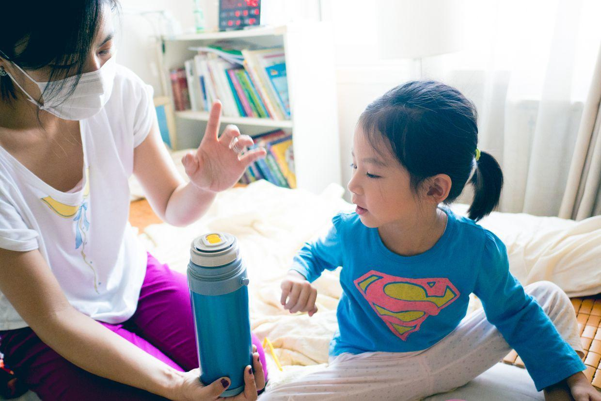
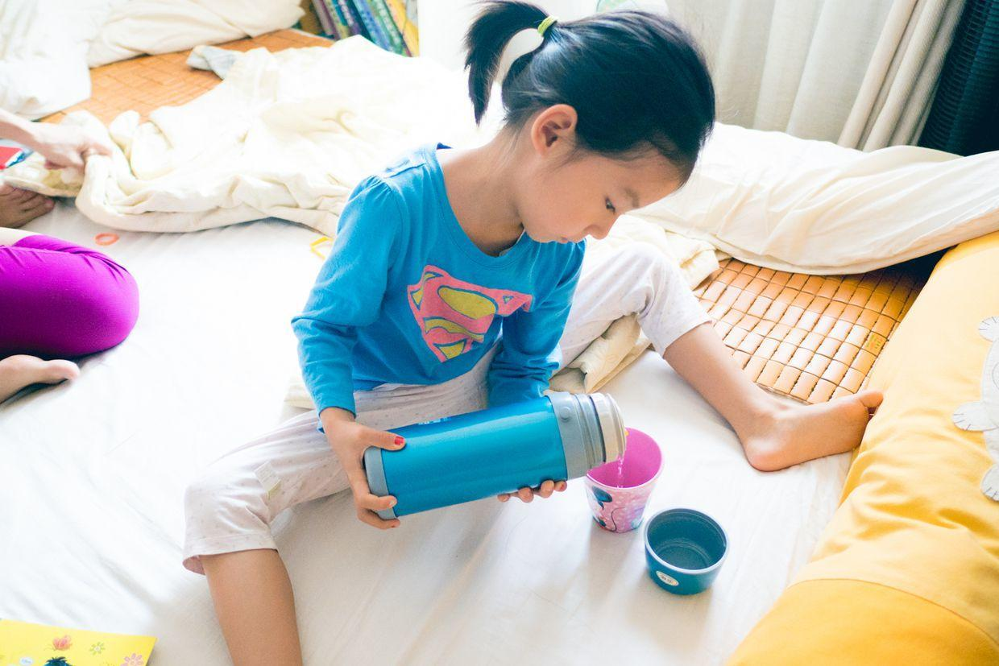
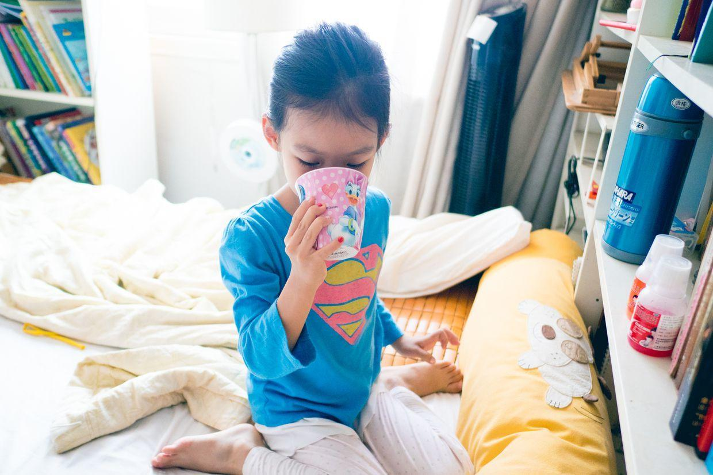
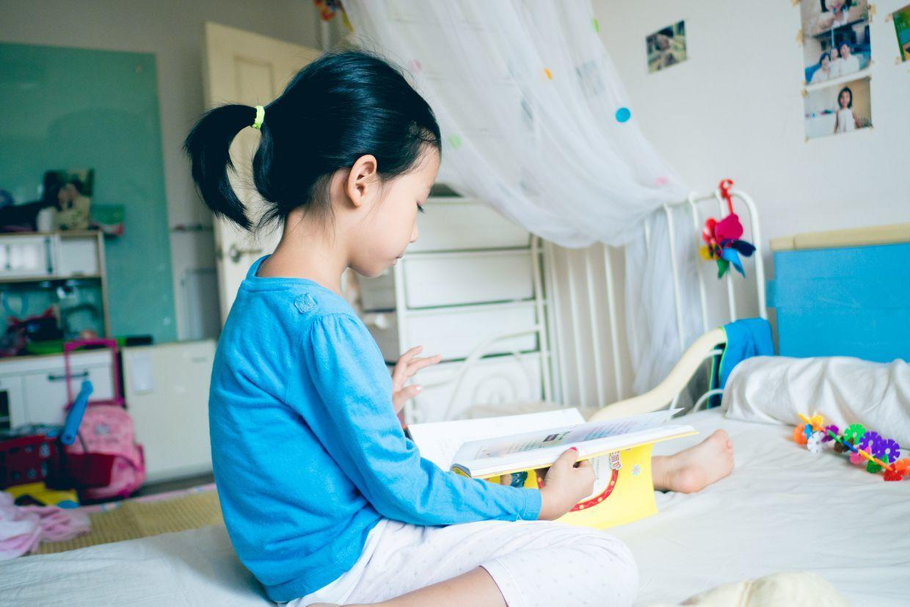
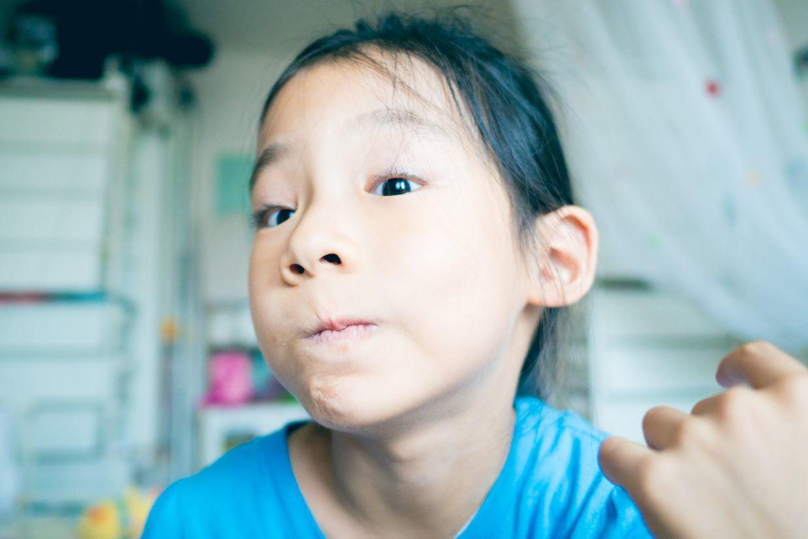
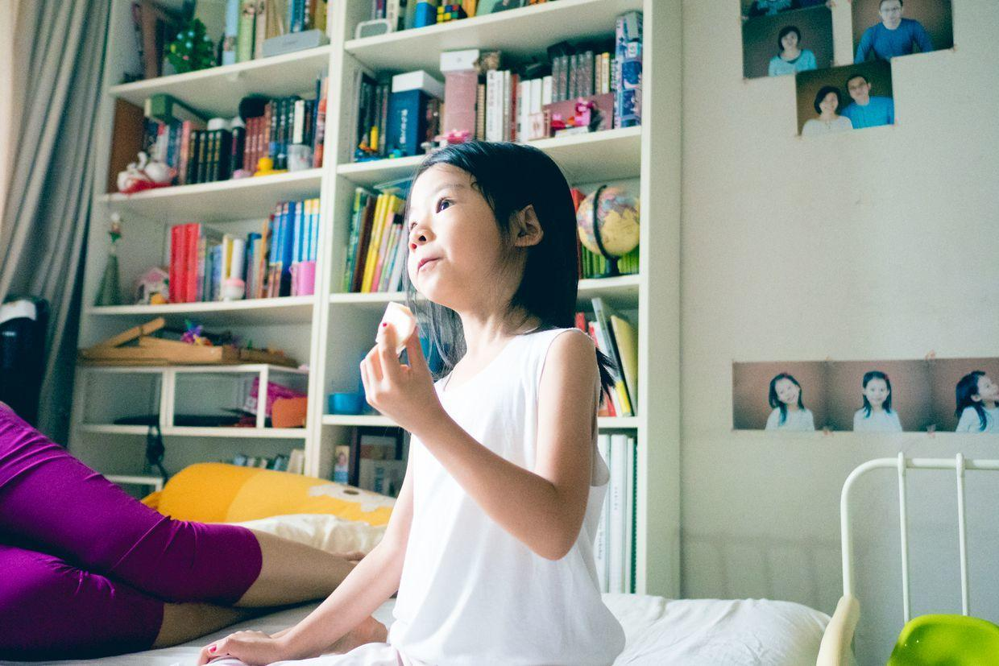
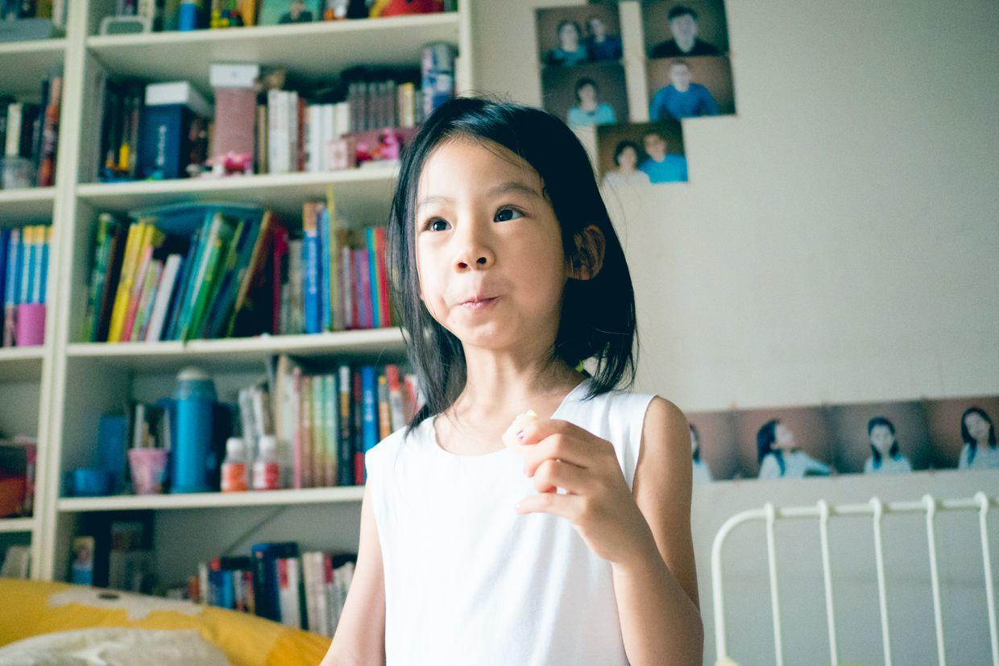
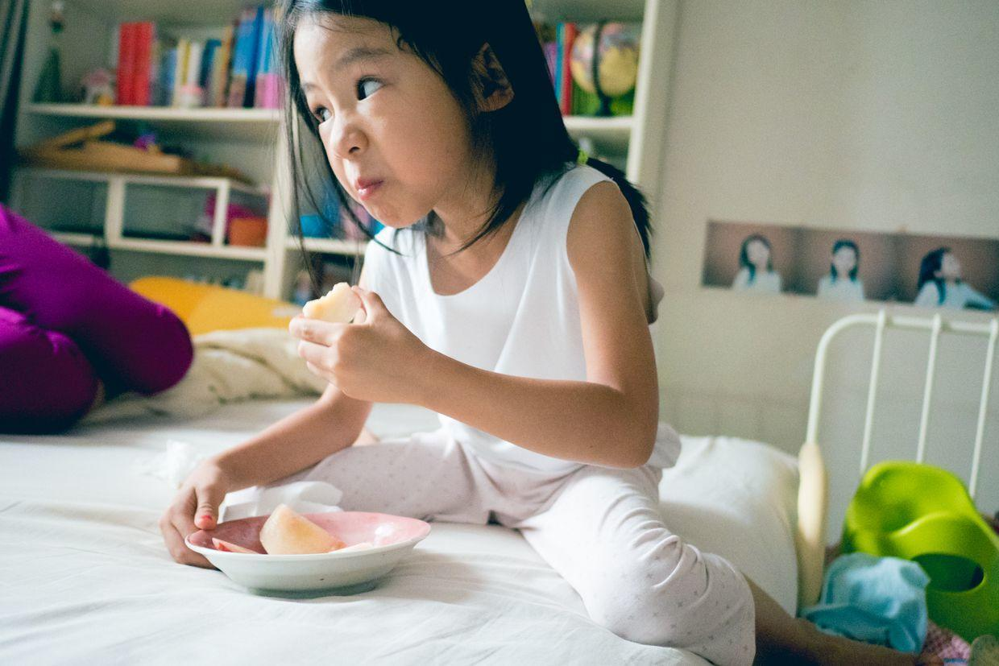

          
            
**2017.06.25**

周日啦，阳光很灿烂。

今天烧已经彻底退了，继续在家里休息。

早上起床，喝点火龙果白粥。

在床上学着自己用保温壶，这个保温壶是这次发烧生病时的大功臣。

自己试着倒水。

喝上一大杯水。

自己看会儿书。

精神头好些了，开始做鬼脸了。

讲了一个上午的故事书，听音乐，跟姥姥姥爷视频。

还要求看了3集小猪佩奇的动画片。

午饭吃西红柿鸡蛋打卤面。

吃过饭，睡了一大觉，起床吃点桃子。

吃着桃子还挺开心。

好像有点酸了。

本来想下楼透透气，但是外面有阴天起风，好像要下雨的样子。

下周好好休息一周，就要开始准备练琴。

时间还挺紧张，7.7号要去钢琴表演，要背下谱子来。

后面还要上游泳课，保养好身体，才能好好玩儿。

**个人微信公众号，请搜索：摹喵居士（momiaojushi）**

          
        