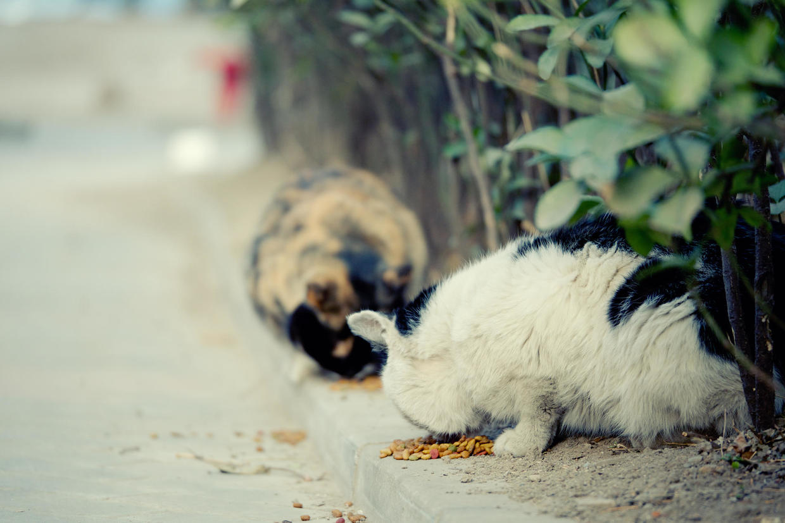

          
            
**2017.07.03**

**拍摄时间：2014.03.01**

**拍摄地点：楼下**

这张照片是2014年去拍的。

当时天气很冷，下午太阳出来，带喵去楼下晒太阳。

小区里有很多野猫，一到下午暖和了，也纷纷出来晒太阳。

大部分的野猫都胖得圆滚滚的，草丛和路边都有人放了很多猫粮和水碗。

带喵远远地看着这些小猫，冷不丁就有两只从灌木丛中钻了出来。

问了问路边的猫粮，开始大快朵颐起来。

说起来挺奇怪，楼下遛狗的人也不少，但是这些猫和狗似乎已经混得很熟了。

彼此都能和谐相处，很少见到互相追逐的场景。

喵那时还不到2岁，看着这些野猫，远远地观察，不敢靠近。

最近1年，小区看了不少树，就为了折腾停车位。

如今，野猫也很少见了。

每次看着想这些，寒风中瑟瑟发抖地的肥胖身影，总是感觉有些奇怪。

**个人微信公众号，请搜索：摹喵居士（momiaojushi）**

          
        