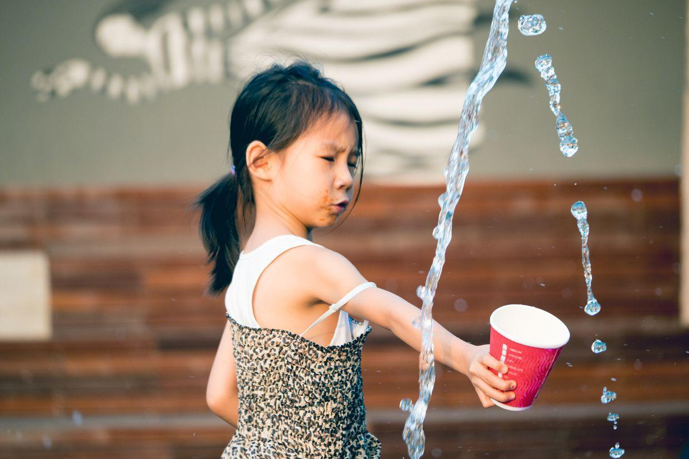

          
            
**2017.07.08**

周六啦，一晚上雷雨之后，天气还是很热。

吃过早饭，还是先练琴。

然后出门去游泳。

自己在泳池里奋力游泳。

深吸一口气，潜入水中，向前。

小脚都从水里蹬出来了。

游泳眼镜在脸上压出两个大圆圈。

游完了，裹成一个大粽子。

出了游泳馆，看见了和脸一样大的芙蓉葵。

吃过午饭，睡个觉，下午提前了1个小时去上钢琴课。

下课，开心地出来。

去吃饭，自己发盘子。

拿叉子吃绿菜。

发现了一个室外的喷泉。

开心地玩儿起了水。

哈哈，开心得不得了。

跑起来像只小鹿。

拿杯子接水。

吃的一嘴的酱。

无数的小朋友，穿梭在喷泉之间。

偶尔一回头，表情还挺严肃。

捧着小杯子，生怕裙子湿了。

提着裙子，在喷泉之间跑。

紧张啊。

看着两边的喷泉。

一钻出来就精神了。

精神地跑起来。

被子都快要泡烂了。

开心啊。

又差点被浇到。

带着妈妈一起进来跑。

紧张的一天过去了，继续练琴，给演出做准备。

**个人微信公众号，请搜索：摹喵居士（momiaojushi）**

          
        