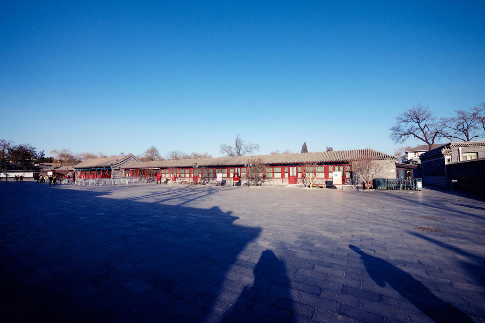

          
            
**2017.07.10**

**拍摄时间：2014.01.01**

**拍摄地点：恭王府门口**

这张照片是2014年元旦，我们早上出去遛弯的时候拍的。

前短时间那张钟楼，也是同一天，车停在鼓楼，然后开始步行溜达。

天气非常寒冷，出门也早，路上有人很少。

穿行在各条胡同小巷，看见一队队的什刹海人力三轮车师傅在揽客。

而如今，这里已经充斥着共享单车了。

绕了很大一个圈子，终于到了恭王府，门前的广场非常大。

赶上了难得的好天气，在蓝天的映衬下，显得格外萧瑟。

大部分的游客都还没到，可以安安静静地在这里转一转。

来到售票处，80每人，一摸兜，忘带钱了，于是连忙拿出信用卡结账。

出口里冷冷甩出一句：“刷不了卡”。

于是，在寒风中欣赏了一下外墙，就走了。

今天，恐怕不会再有这种尴尬的局面了。

**个人微信公众号，请搜索：摹喵居士（momiaojushi）**

          
        