          
            
**2017.07.19**

上周的喵参加了本学期妙思的钢琴沙龙，表演了自己最近学的曲子《轻轻地划》。

晚上18点多，就到了钢琴教室。

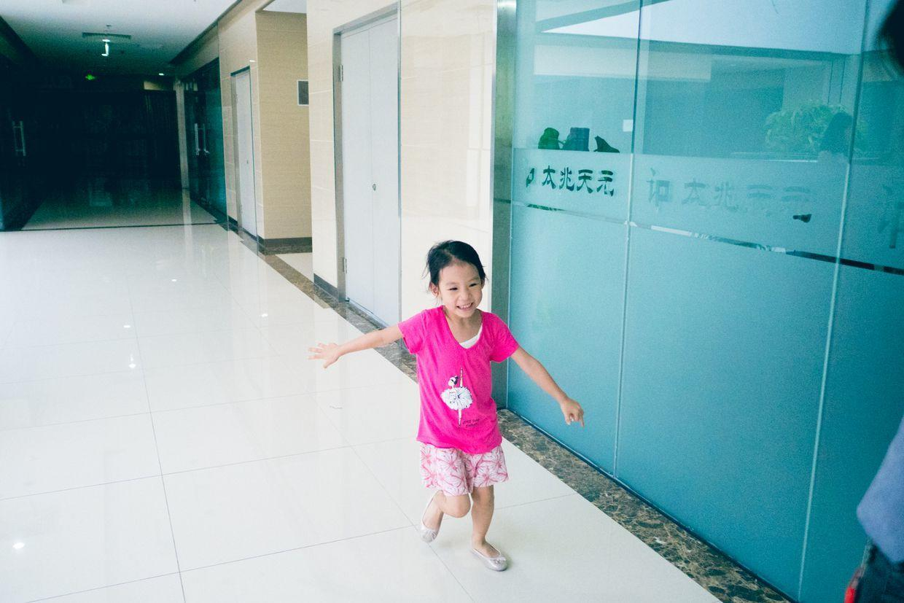

噔噔噔地跑进了教室。

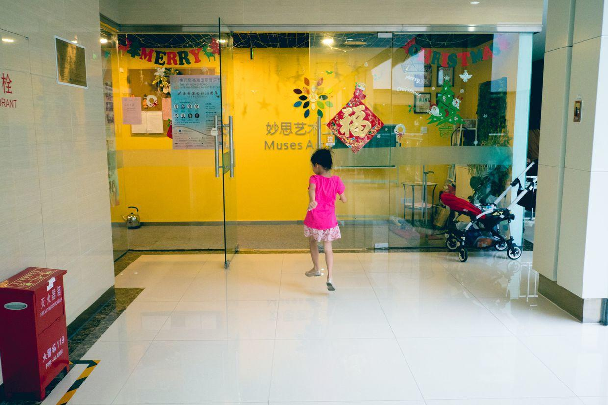

老师们已经把舞蹈教室布置好了，家长们的座椅一排排。

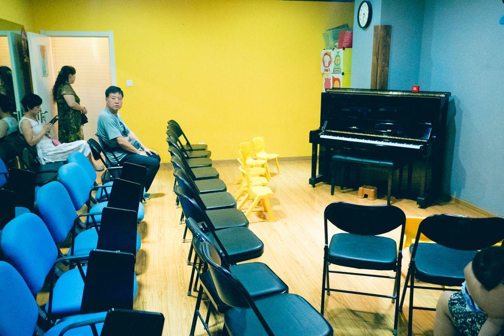

小朋友们坐在最前排的小椅子上。

喵叫妈妈给自己化妆。

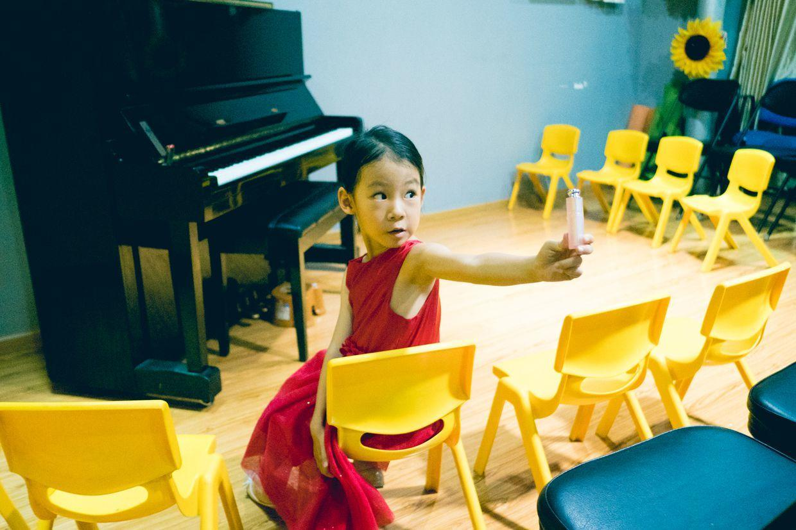

既当口红又当腮红。

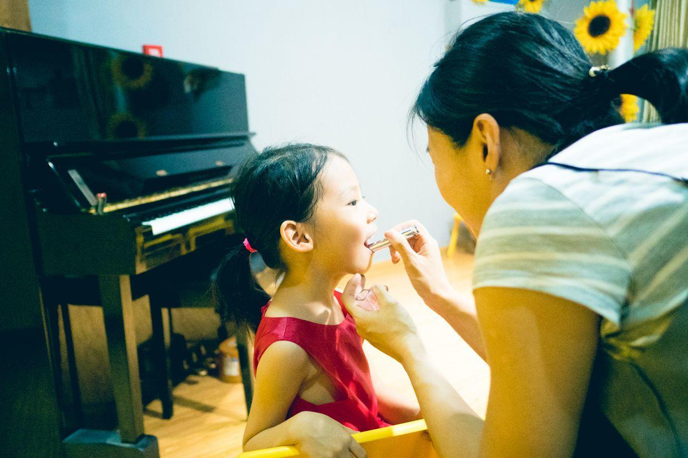

节目单，一共有24个小朋友来表演自己学的曲目。

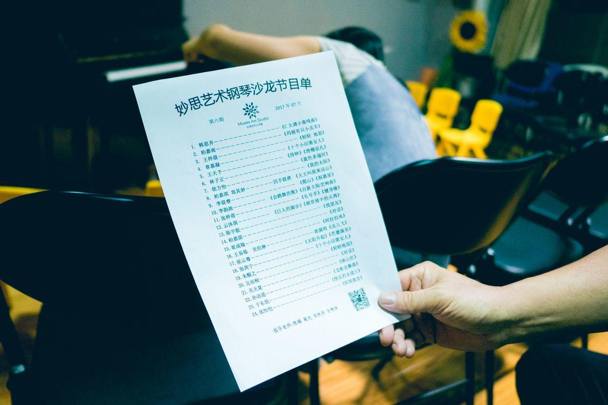

化好了妆，整个人都开心了。

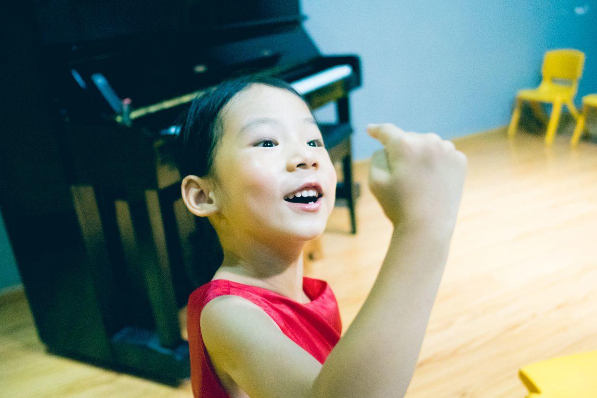

家长和小朋友们都陆续来了。

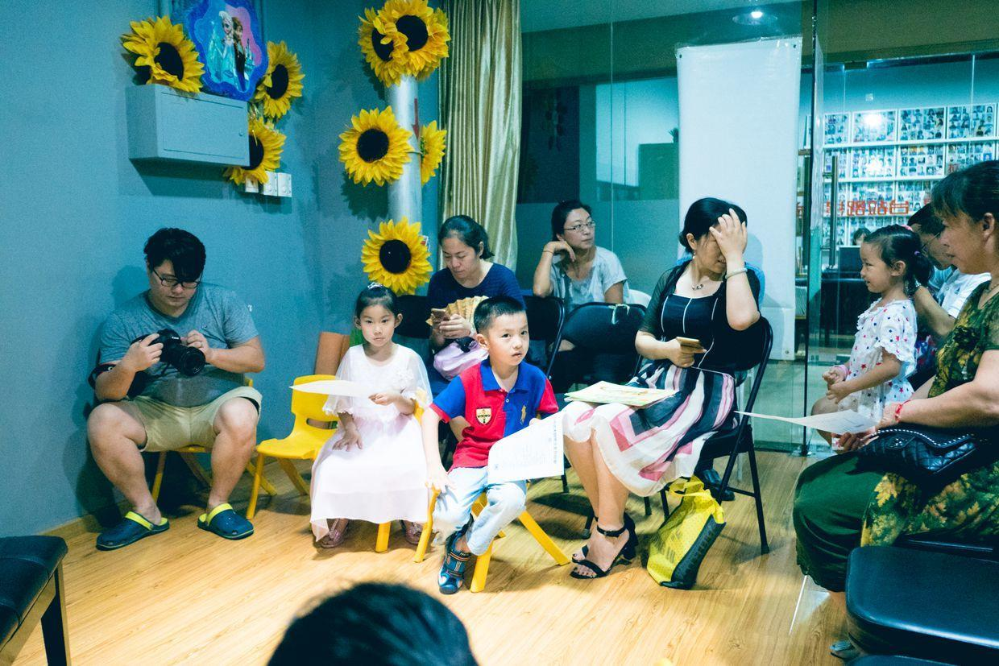

校长老师给大家简短地讲话。

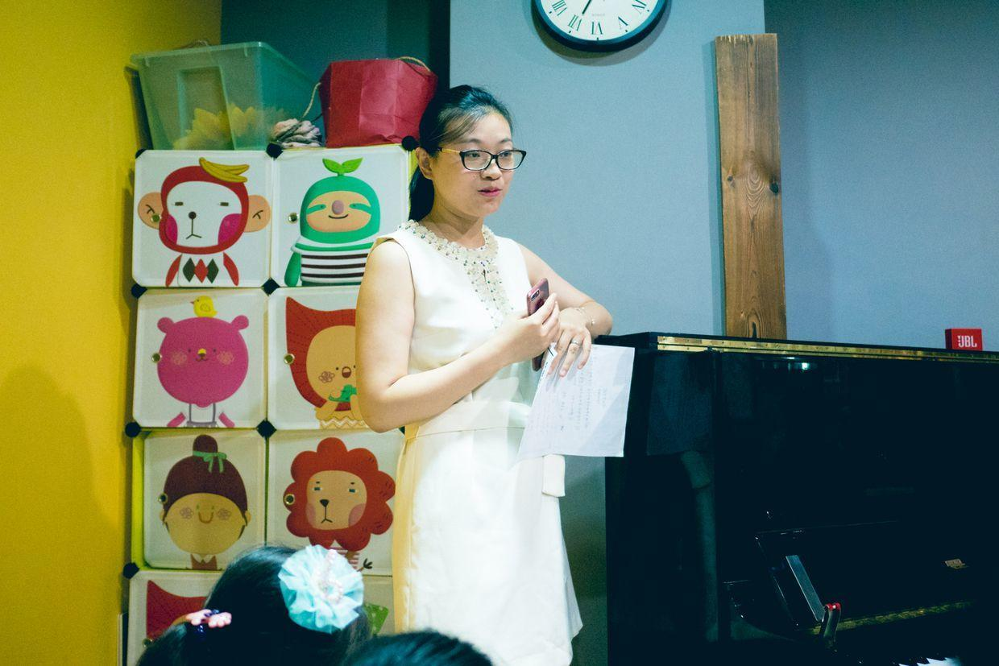

喵自己抿着嘴，看大家的演奏。

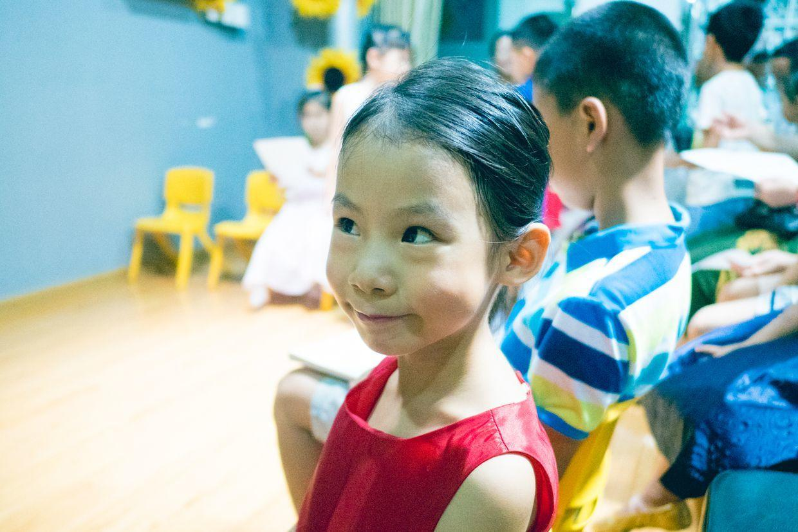

轮到喵自己登场了，完整地背着弹玩《轻轻地划》，一点也没出错。

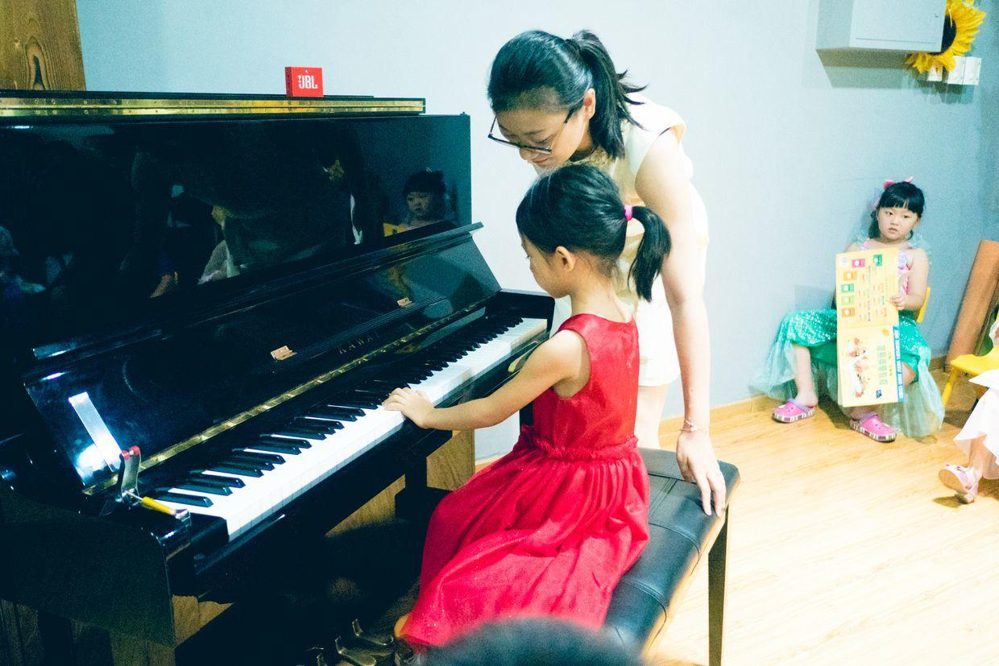

结束了，小朋友们一起拍照合影。

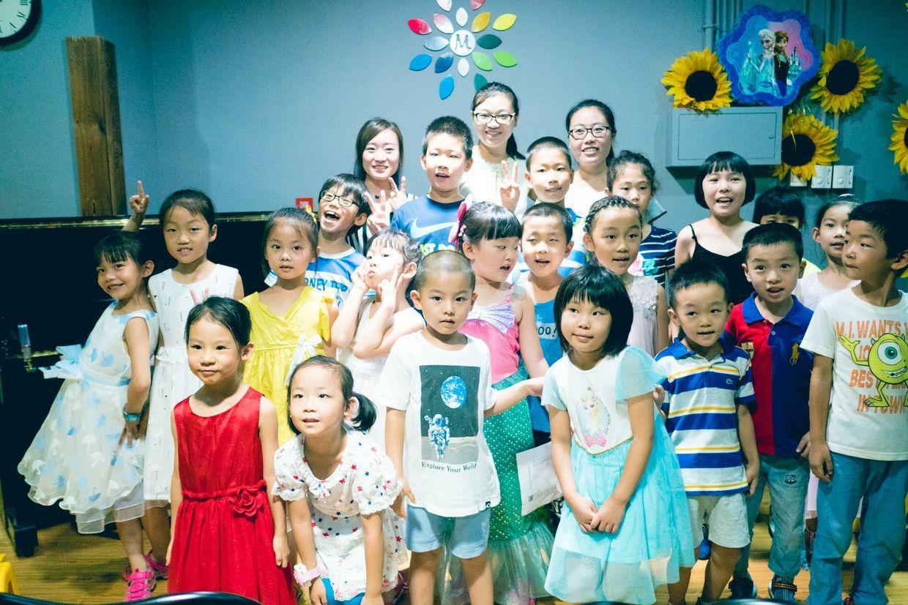

喵和自己的彤彤老师一起合影。

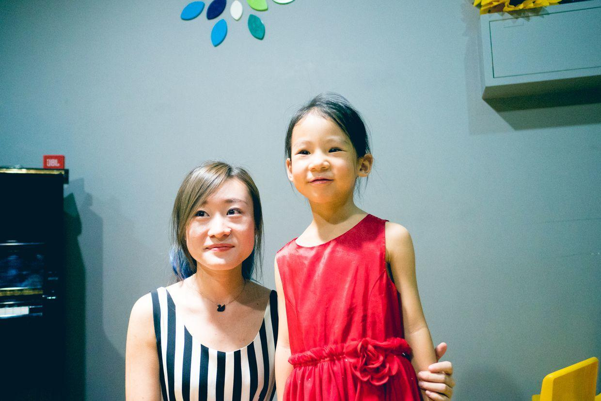

老师们非常棒，除了教学之外，还给同学们安排演出的机会。

从今年3月份开始学琴，喵的进步还是很快的。

就像校长老师最后说的，没有别的窍门，就是要每天练琴。

**个人微信公众号，请搜索：摹喵居士（momiaojushi）**

          
        