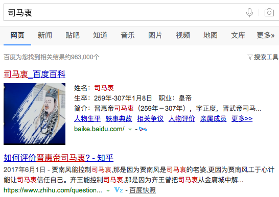

          
            
**2017.07.20**

>晋惠帝司马衷（259年-307年），字正度，晋武帝司马炎次子，母武元皇后杨艳，西晋第二位皇帝，290年-307年在位。在位17年。

>司马衷于267年被立为皇太子，290年即位，改元永熙。他为人痴呆不任事，初由太傅杨骏辅政，后皇后贾南风杀害杨骏，掌握大权。在八王之乱中，惠帝的叔祖赵王司马伦篡夺了惠帝的帝位，并以惠帝为太上皇，囚禁于金墉城。齐王司马冏与成都王司马颖起兵反司马伦，群臣共谋杀司马伦党羽，迎晋惠帝复位，诛司马伦及其子。又由诸王辗转挟持，形同傀儡，受尽凌辱。306年，东海王司马越将其迎归洛阳。307年，惠帝去世，时年48岁，相传被东海王司马越毒死。

西晋的八王之乱，起始于晋惠帝司马衷。

司马家前4位英雄好汉似乎把几代人的精明全带走了。

司马衷看起来，应该不算是痴呆，其实是个很天真的人，应该是和阿甘差不多。

何不食肉糜，这种千古名言，也算是彪炳史册了。

而后面的一系列悲剧，又是祸起于他的皇后贾南风。

**个人微信公众号，请搜索：摹喵居士（momiaojushi）**

          
        