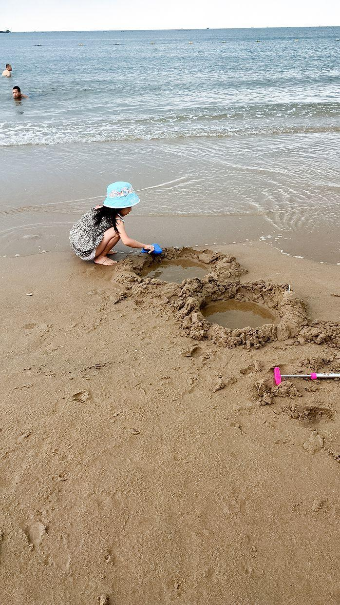

          
            
**2017.07.22**

周六啦，我们早已回北京，喵还在南戴河跟爷爷奶奶继续玩儿。

和北京不一样，南戴河这一周都很凉快。

带着帽子去沙滩。

挖水坑。

两个连环大水坑，向里面灌水，养小鱼。

刮风的时候，穿上件长袖。

终于肯下水了，像小乌龟一样爬到海里。

挖了个小水库。

和兜妹拥抱。

三个小姐妹在一起。

两个妹妹聚拢起来。

三人一起拥抱一下。

一起跑向大海。

滋水枪。

海浪充到脚上很开心。

一起在海里爬行。

和爷爷一起玩儿沙子。

三个人手拉手在海里跳。

跃过海浪。

高高跃起。

回屋吃打卤面。

一人吃一大碗。

和爷爷奶奶在南戴河，每天也保持规律生活。

早起，吃饭，喝牛奶，吃小熊糖，看书，练琴，刷牙，睡觉，去海滩。

假期里，和妹妹们在一起度过快乐的时光，真是件幸福的事啊。

**个人微信公众号，请搜索：摹喵居士（momiaojushi）**

          
        