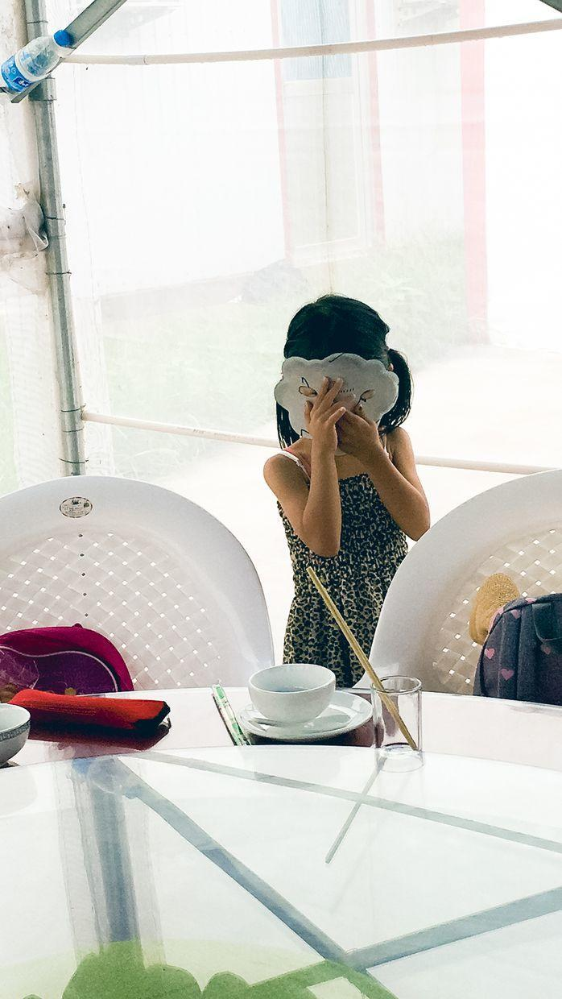
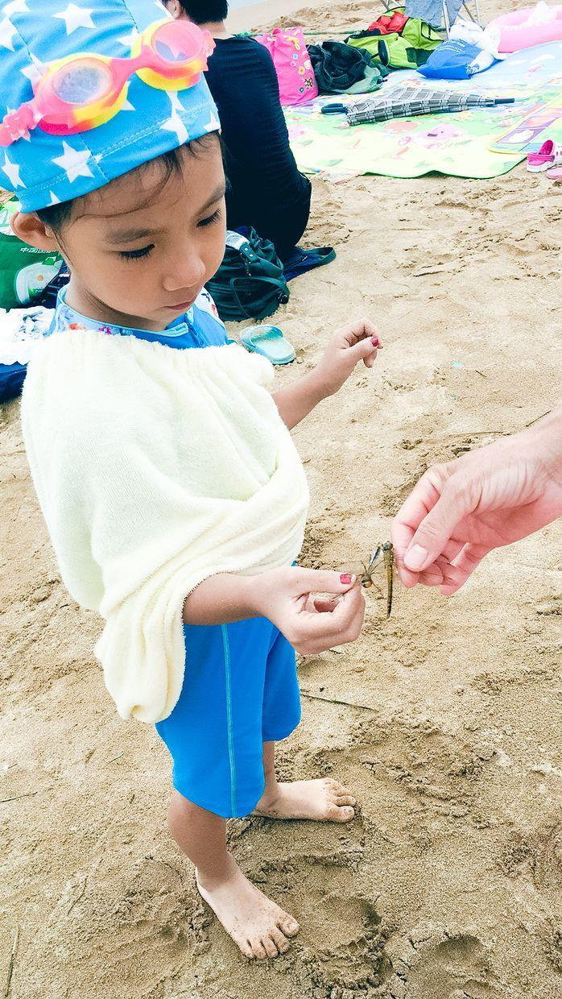
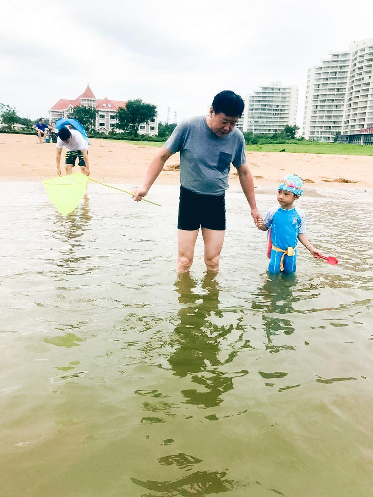
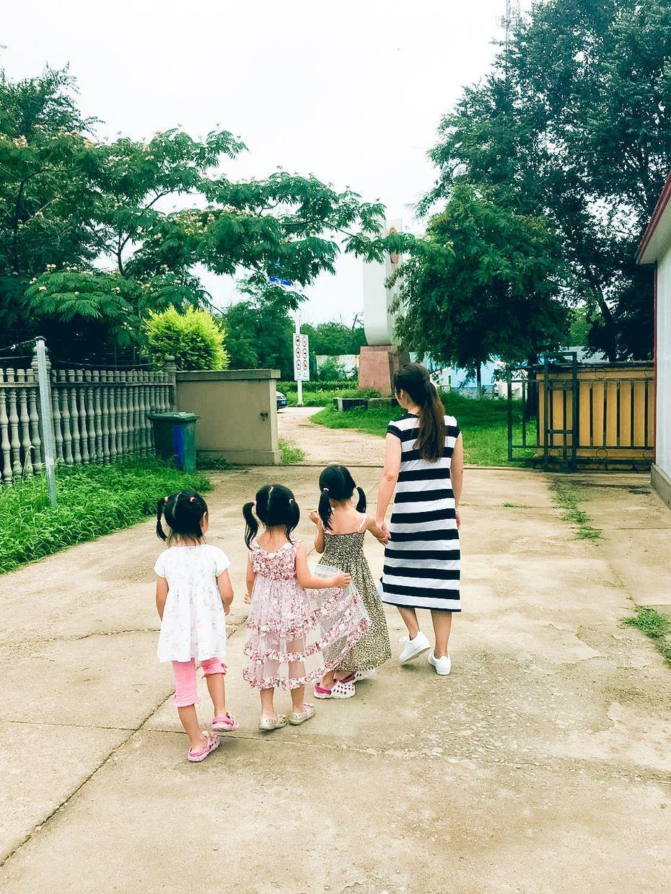
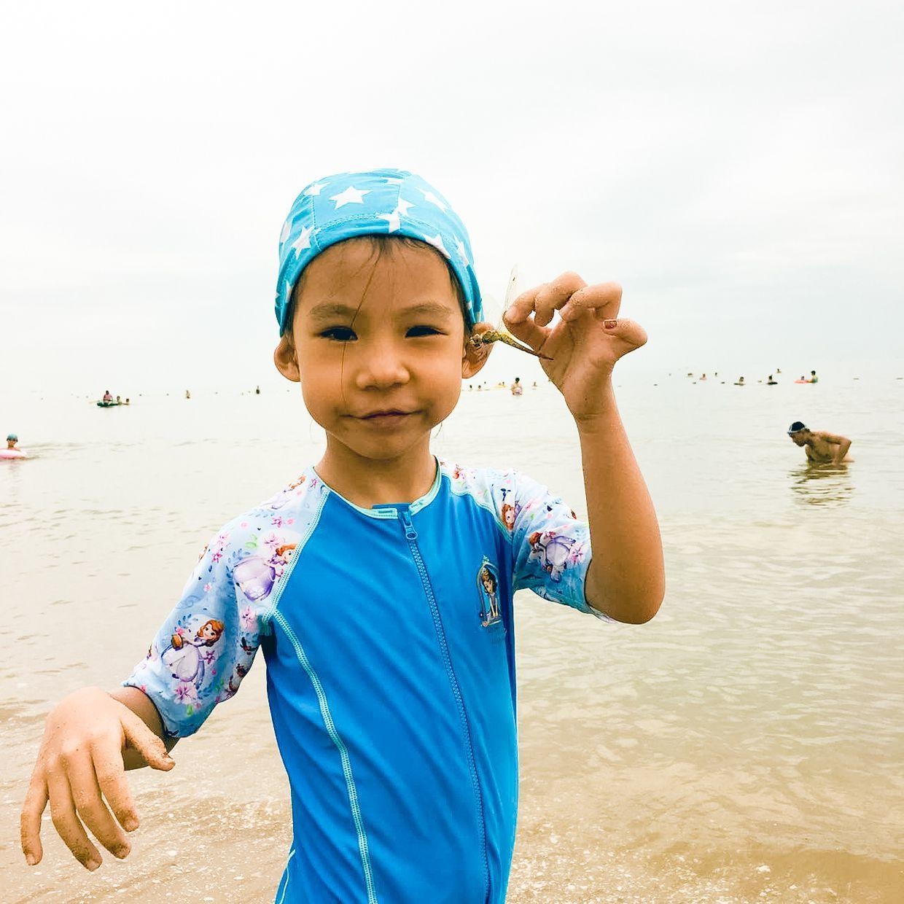
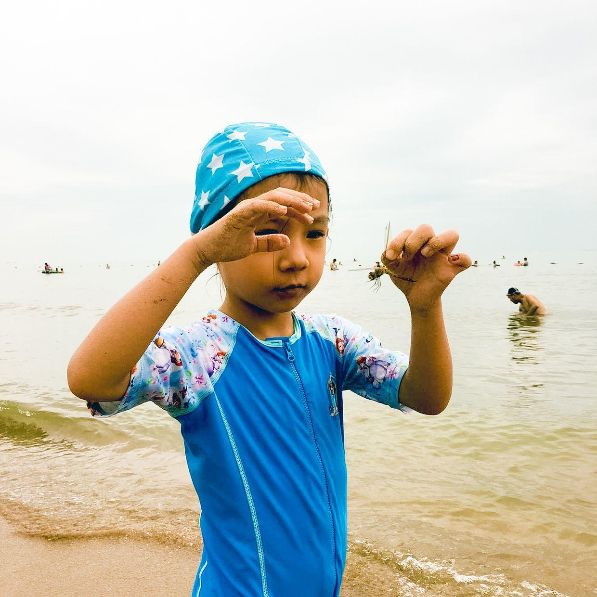
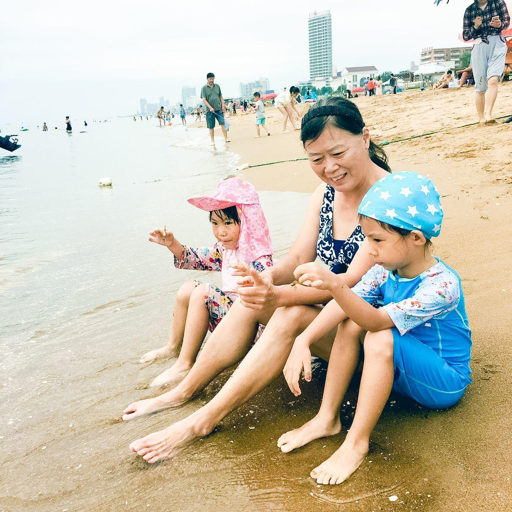
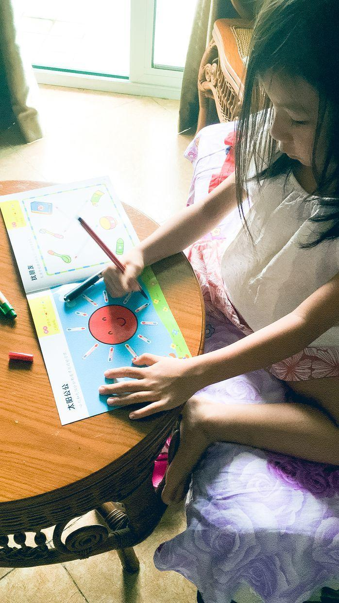

          
            
**2017.07.23**

周日啦，继续直播喵和爷爷奶奶在南戴河的照片。

这两天那边刮大风，还下雨了，天气还是很凉快的。

小姑姑和小姑父去南戴河，带去了很多玩具。

喵带上了个小面具。

在海滩上，爷爷抓到两只蜻蜓。

和爷爷一起下海捞小鱼。

小姑姑带着三个小朋友去看树。

胆子还挺大，敢捏着小蜻蜓的翅膀。

动作还提供谨慎的。

和姑奶奶坐在一起，一人一只蜻蜓。

回到屋里，自己玩儿涂颜色。

三个小朋友在南戴河玩儿得非常好。

兜妹安安静静地画画，喵和悦妹一见面就一起疯跑，一起吃饭的时候三个人最爱捉迷藏。

回到屋里，好好喝牛奶，吃小熊糖，练琴，睡觉。

听奶奶说，喵爱上吃大馒头和咸菜了，早上吃馒头、鸡蛋、咸菜、黄瓜。

不知道玩了这么久，有没有被晒黑。

**个人微信公众号，请搜索：摹喵居士（momiaojushi）**

          
        