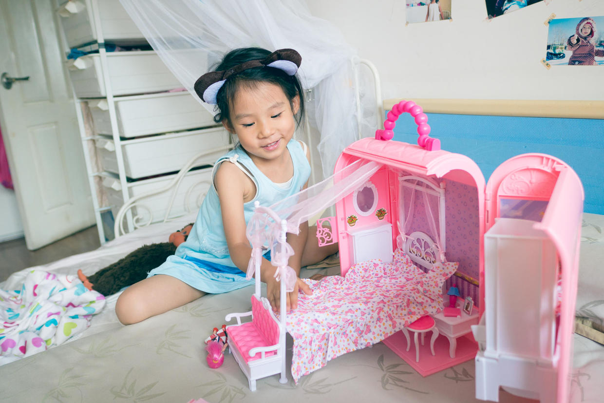

          
            
**2017.07.24**

**拍摄时间：2016.06.05**

**拍摄地点：家里**

这张照片是2016年拍的。

那时喵开始对娃娃特别感兴趣了。

于是儿童节就专门买了一个手提的娃娃家作为礼物。

红色的手提箱，可以从侧面打开。

主题结构是一个卧室，从上到下，可以放下一张床。

床上面挂了幔帐，还有彩色的床单和枕头。

床脚还有一个小沙发。

床的旁边是梳妆台和小椅子。

侧面的小柜子里有浴室等等。

到了中午，吃过饭，喵就会跑回自己的小屋，拿出娃娃家和自己的芭比娃娃开始玩儿。

也经常会叫上我们一起玩儿，我们来扮演老师的角色。

喵扮演妈妈的角色，娃娃们是孩子。

早上她去上班，孩子们送到老师这里，下班后，她来幼儿园接孩子回家。

一会儿可能生病发烧了，还要照顾孩子。

总之，自己生活的一点一滴，都能惟妙惟肖地表演出来。

**个人微信公众号，请搜索：摹喵居士（momiaojushi）**

          
        