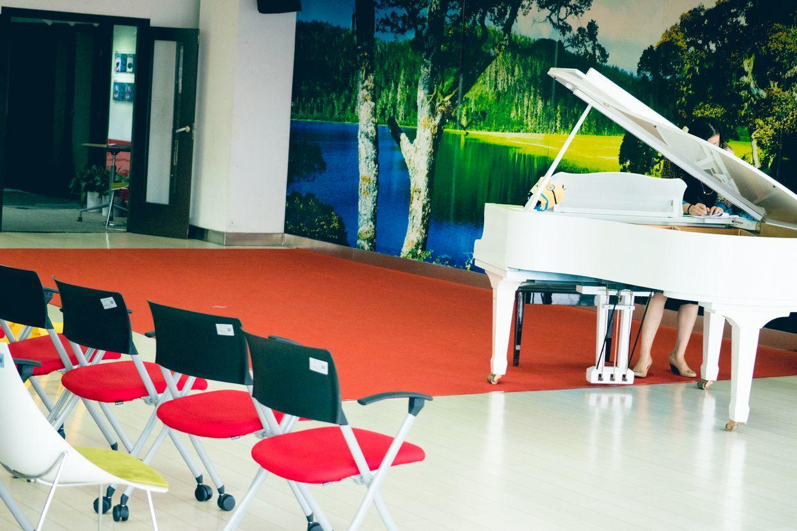
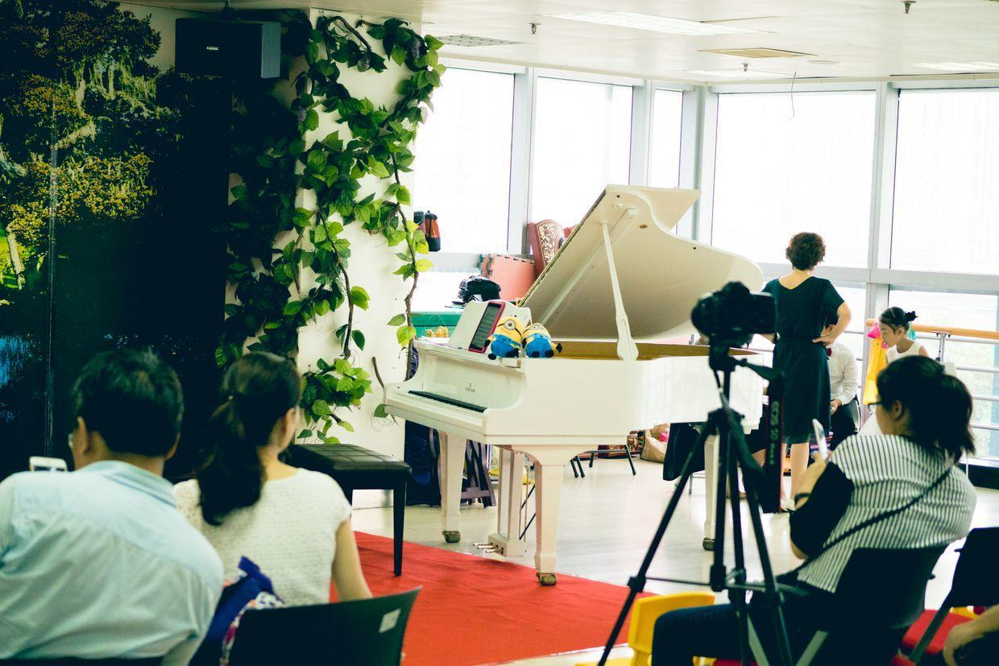
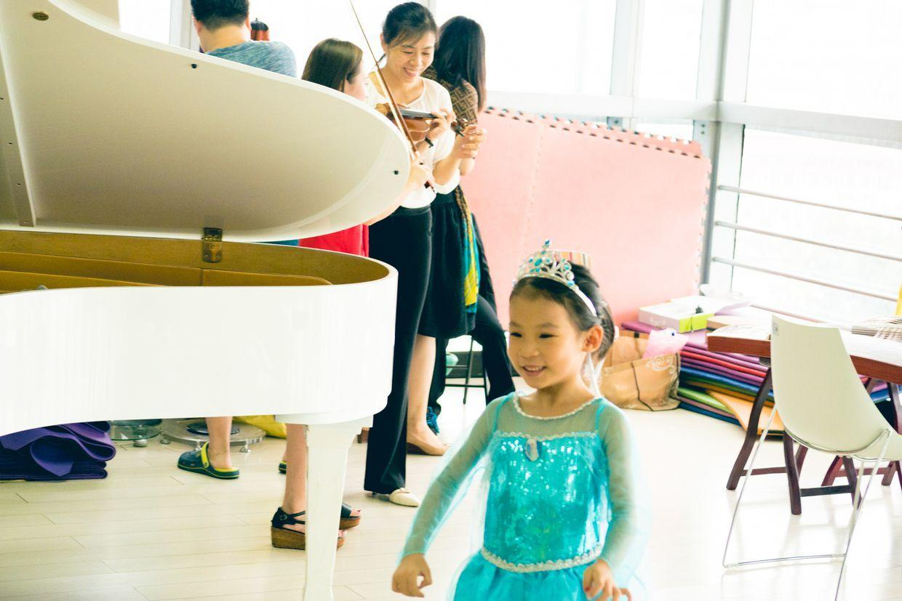
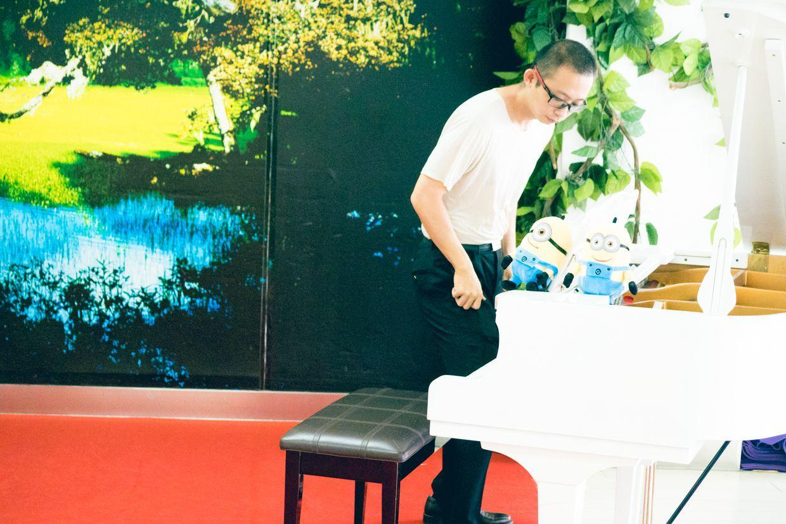
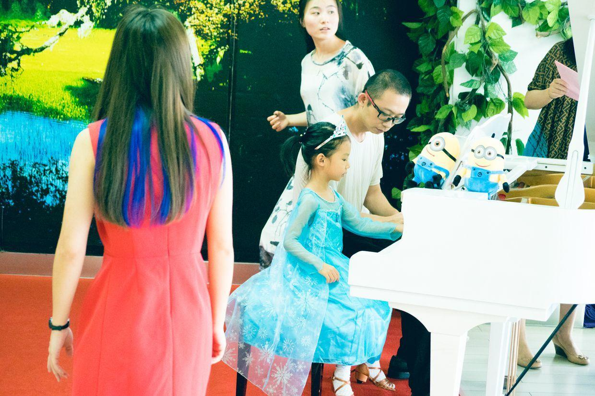
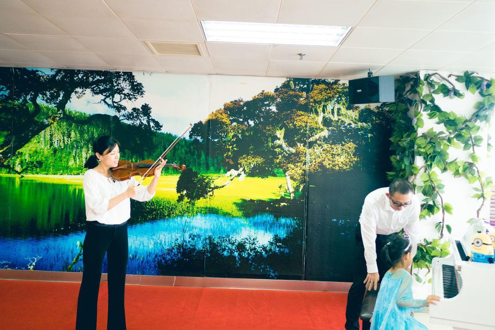
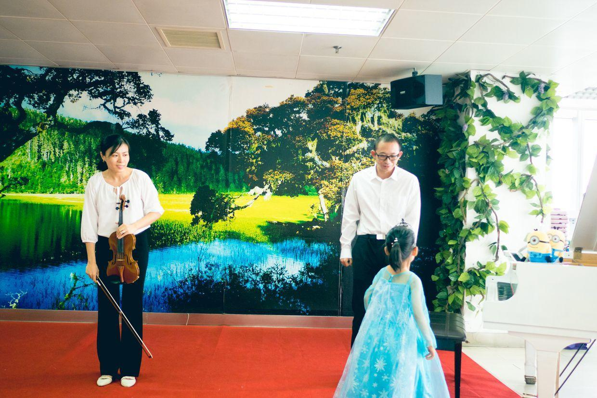
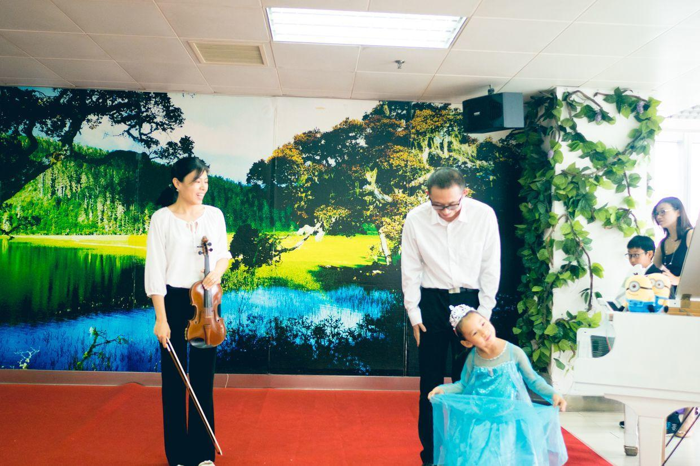

          
            
**2017.07.25**

周日是喵一直期待的钢琴演出的日子。

妙思艺术工作室，每个学期会举行一次很大规模的演出，给所有小学员一个展示自己的机会。

会场上安排了巨大的白色钢琴。

大家早早到场，小朋友们开始热身准备。

喵穿上了自己最爱的冰雪奇缘套装。

我也要熟悉一下钢琴。

我们一起进行曲目热身，熟悉一下钢琴。

演出的过程非常顺利，我和喵四手连弹，喵妈小提琴主旋律。

一个音都没有错。

结束后，喵很郑重地向观众谢幕。

最后，参加表演的小朋友和老师们一起合影留念。

演出非常精彩，有小主持人，还有歌舞表演。

更多的还是钢琴独奏，喵看大哥哥大姐姐们的精彩演奏，非常投入。

到了喵自己的演奏，非常让人佩服的一点是，她完全不紧张，非常享受演出的过程，而且演奏也很完美。

**个人微信公众号，请搜索：摹喵居士（momiaojushi）**

          
        