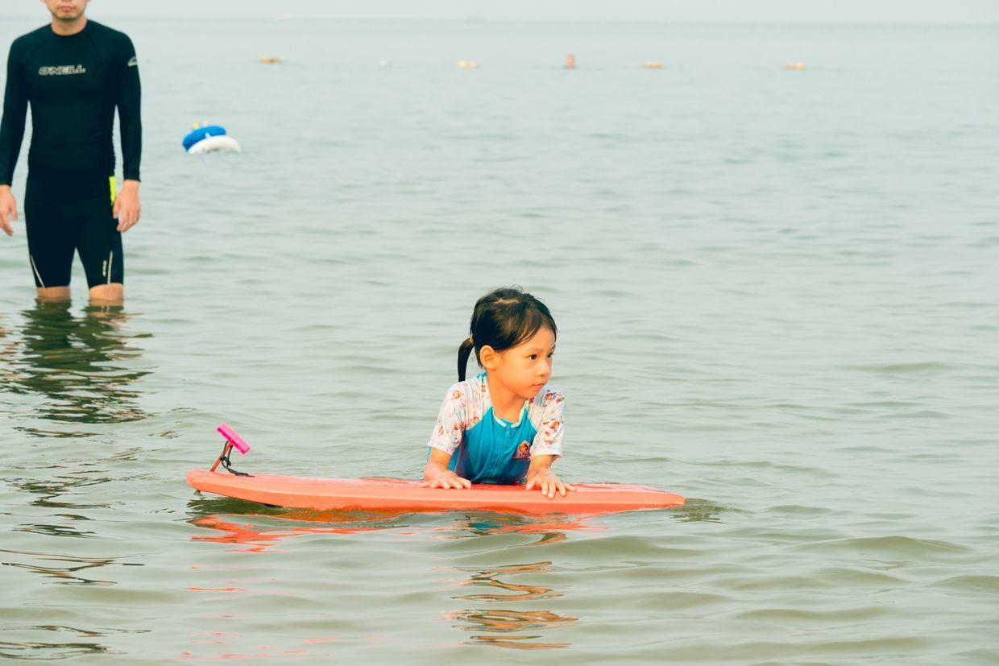
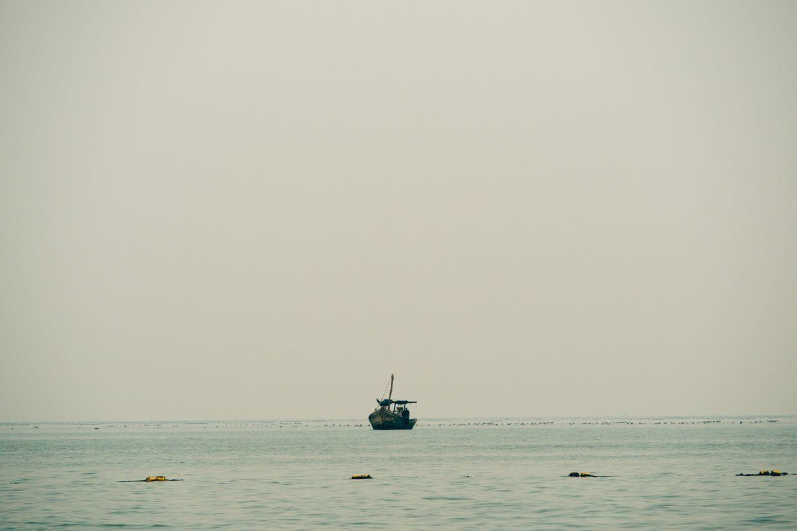

          
            
**2017.08.06**

周日啦，最有一天去大海啦。

带上了冲浪板。

中午去吃炒蛏子。

还有最喜欢的西红柿炒鸡蛋。

中午睡个大觉，下午继续去玩儿水。

趴在我身上，把我压到水里。

可是自己熟悉上冲浪板了。

学着妈妈的样子。

扶着冲浪板，冲我一歪嘴。

用水枪，拉着自己的冲浪板。

拉着冲浪板上岸。

扑向冲浪板，掉进水里。

跑到妈妈那里，一起自拍。

远处的瞭望塔。

远处的海船。

开始挖泥坑。

和奶奶一起走过来。

一起合影。

全家合影。

爱上冲浪板了。

拉着冲浪板。

自己蹬着出发了。

打水出发。

趴在冲浪板上。

很神气的样子。

哈哈，冲浪板跑了。

高高探起身子。

封面

开心啊，还能调整方向。

手脚并用，变成了小汽艇。

海边的假期结束啦，明天就要回家了。

回家继续去泳池练游泳啦。

**个人微信公众号，请搜索：摹喵居士（momiaojushi）**

          
        