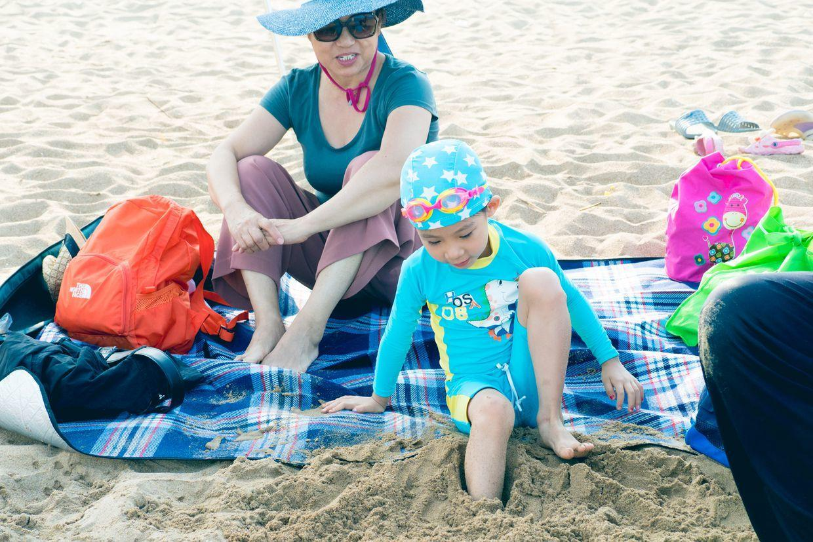
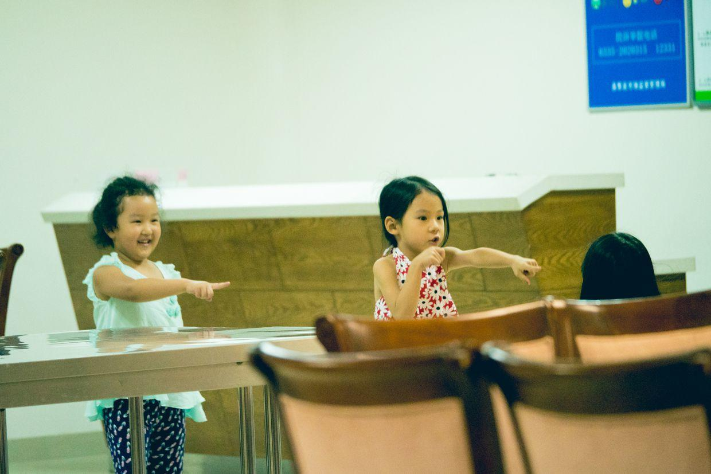

          
            
**2017.08.08**

喵的悠长暑假结束啦，和爷爷奶奶一起，在南戴河玩儿了三周多。

第一天晚上一到，就去游泳啦，玩儿得兴高采烈。

玩起沙子是没够的。

挖沙坑，还要在里面蓄上水，虽然水马上就渗走了。

和自己的小沙堆照个相。

和爷爷奶奶们一起玩儿。

把自己的腿埋到沙子里。

拎着水桶去取水，来做城堡。

中午吃完饭，在餐厅里和妹妹们玩儿捉迷藏。

和妹妹们一起沙滩巡游。

叔叔、姑姑和父亲，姐弟三个一起合影。

全家的老同志们一起合影。

远处看着别人游泳，自己玩儿沙子。

各种花样，怎么玩儿都玩儿不腻。

姐弟三人一起游泳。

自己带着水壶，一起散步。

挑选自己的小玩具。

做快艇出海。

住的地方渐渐变成一道海岸线。

中午吃饭。

就着西红柿鸡蛋，吃了4碗米饭。

来接喵了，一起合影。

一家三口，第一次来时，我和喵差不多大。

终于爱上冲浪了。

敢做各种动作。

手脚并用。

封面

快乐地假期，和妹妹们、哥哥、姐姐来来回回玩儿了很久。

大海、沙滩、游乐场和海洋公园，都转了个遍。

一个暑假，收获了无数幸福的童年回忆。

**个人微信公众号，请搜索：摹喵居士（momiaojushi）**

          
        