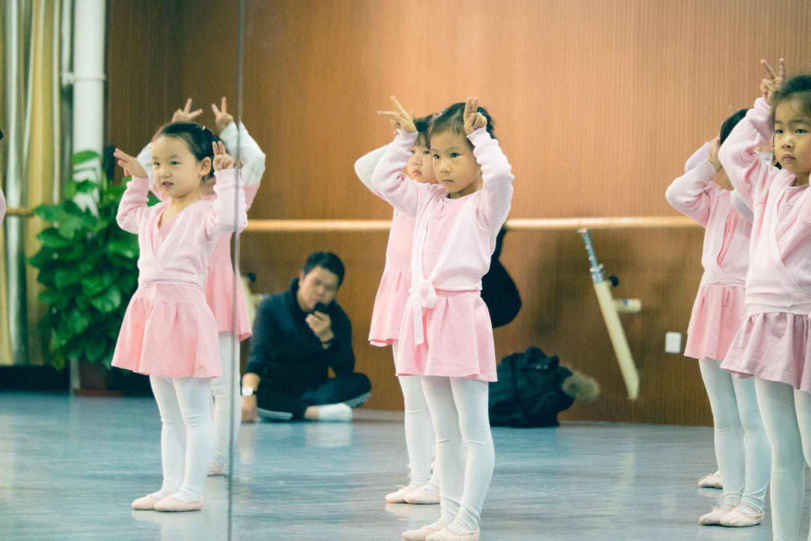
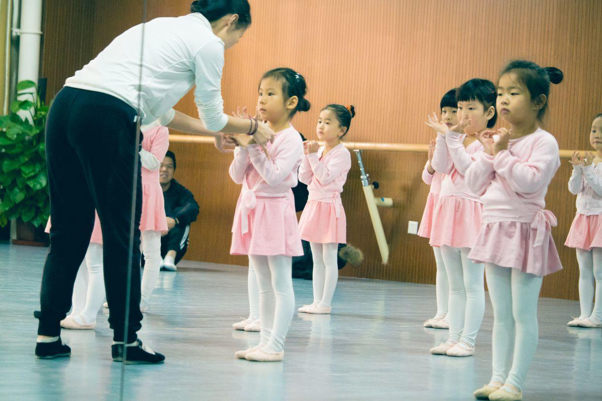
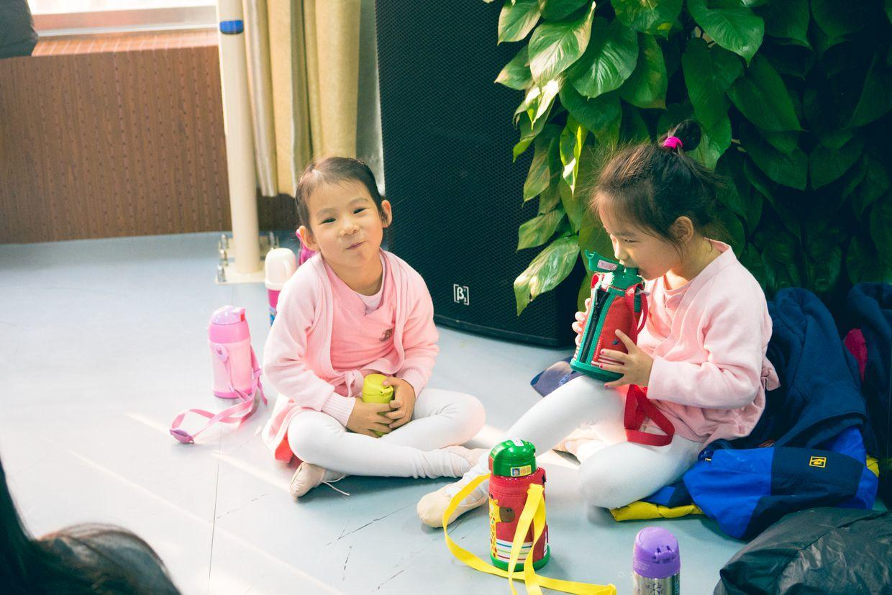
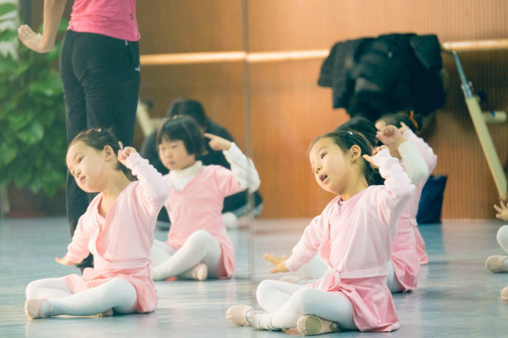
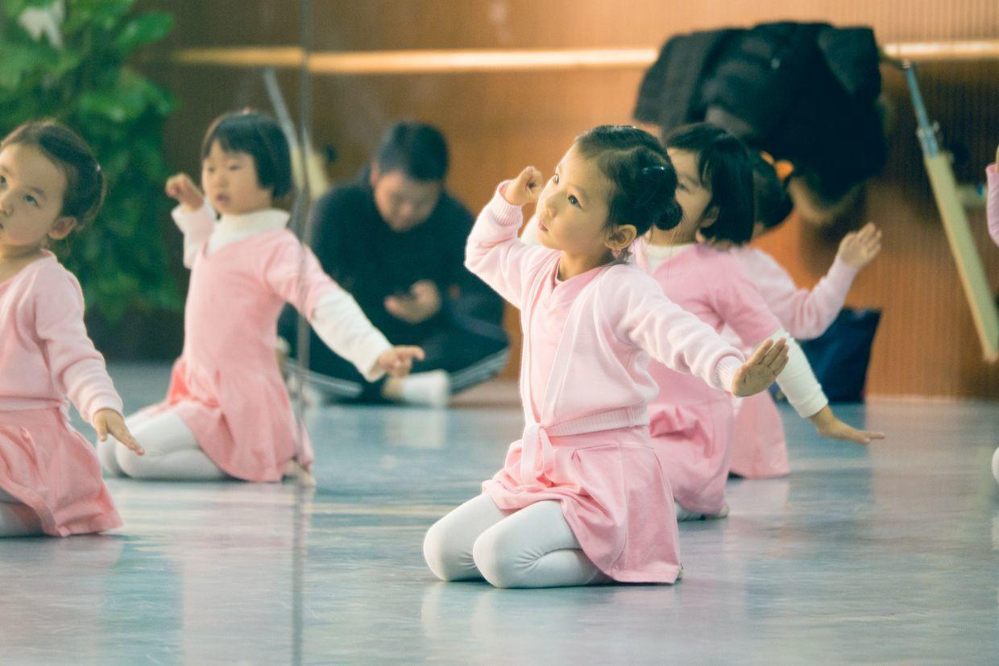

          
            
**2017.08.25**

本篇回顾一下去年冬天的一次舞蹈公开课。

每个月底的舞蹈课，是对家长们开放的公开课，家长可以做到教室后面看着孩子们上课。

到了教室，先要梳头。

那会儿只是简单地把头发扎紧。

拎着书包进教室。

在门口向老师问好。

书包和水壶放到固定地点。

上课前开始活动活动。

坐在地上有些无聊。

看着周围的同学。

同学们开始排好位子。

看着老师们在做上课准备。

开始做准备活动。

还没有进入状态。

老师纠正脚部动作，要绷直。

老师很认真。

看着老师的示范。

下腰。

伸臂。

下腰，保持住。

活动肩膀。

轻轻跳。

兔子耳朵。

兔耳朵都耷拉了。

小裙边。

花朵。

老师详细指导手的动作。

手部动作。

边唱边做。

踏步。

头部动作。

拍手。

小裙边，手要绷直。

开始坐姿。

小裙边准备。

弯腰转腰。

转腰。

老师在前面示范。

每个人的动作都要纠正。

目光有些呆滞。

转身。

换个方向。

唱得很认真。

唱得撅起小嘴。

弯腰的时候，脖子也下去了。

跟着老师学唱。

一排人很整齐。

转起身来就不整齐了。

头部向上。

布谷鸟。

课间休息，跑去卫生间。

开心。

笑得真开心。

样子很神气。

喝水休息。

一整杯。

和好朋友一起喝水。

看着我们笑。

看见别的小朋友。

很开心。

捂着嘴笑。

非常放松。

两个人亲切交流。

人越来越多。

聚在一起玩儿。

大长腿。

玩儿的很热闹。

孩子们各玩儿各的。

开始跳起来。

小兔子。

互相追跑。

开心极了。

还有人在地上爬。

边爬边跑。

上课了，回到位置上。

坐好。

小花猫。

指耳朵。

睡觉。

左右指。

摊手。

向前喵。

动作要保持住。

有些迟疑，仔细看着老师。

继续做动作。

反复练习。

一遍又一遍。

显得有些自信了。

动作也标准些。

非常整齐。

小手很漂亮。

从后面看，效果很不一样。

动作各有不同。

前后不一。

还是指耳朵。

左右反复。

向前保持住。

下课了，收拾东西。

出教室。

中午去吃饭，给我们讲解动作。

兴致来了，马上开始练习起来。

新学期的舞蹈课很快又要开始了，继续加油。

**个人微信公众号，请搜索：摹喵居士（momiaojushi）**

          
        