          
            
**2017.08.26**

周六啦，一早起床，太阳还挺足。

吃过早饭，开始一起打扫卫生，扫地擦地。

玩儿一会儿跳棋。

出门去上钢琴课。

上周的曲子是《从前》。

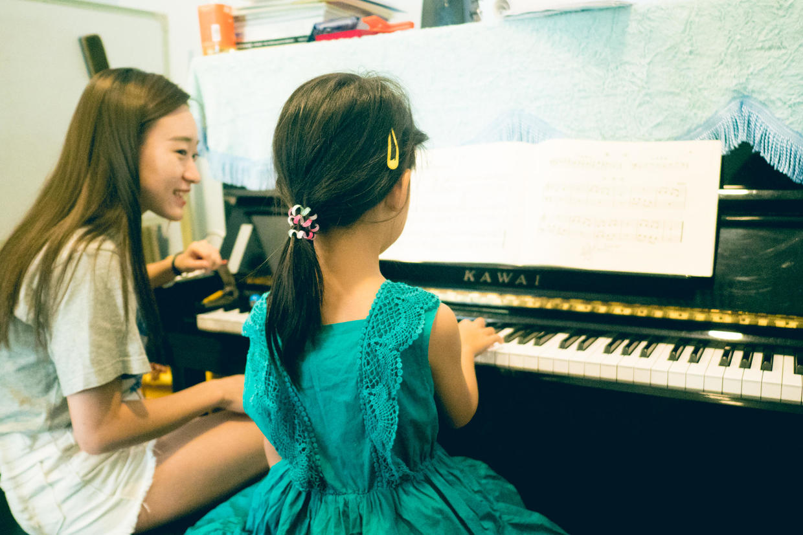

手上还被蚊子咬了。

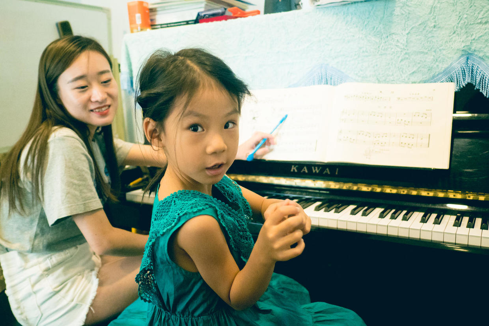

下了个，去超市挑了一包薯条。

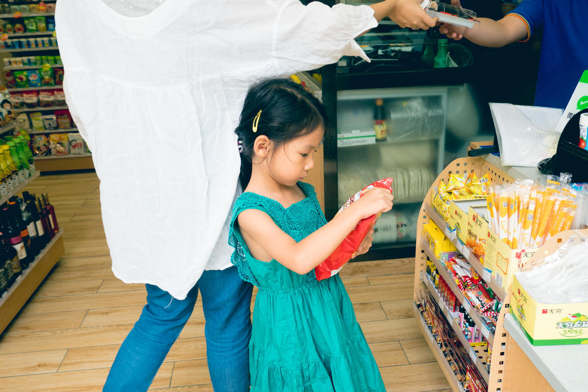

中午回家吃饭，睡个大觉。

下午准备去国家大剧院听音乐会。

开车赶去大剧院，路上稍微有点堵车。

买了汉堡，在大剧院门口先吃饭，再去安检。

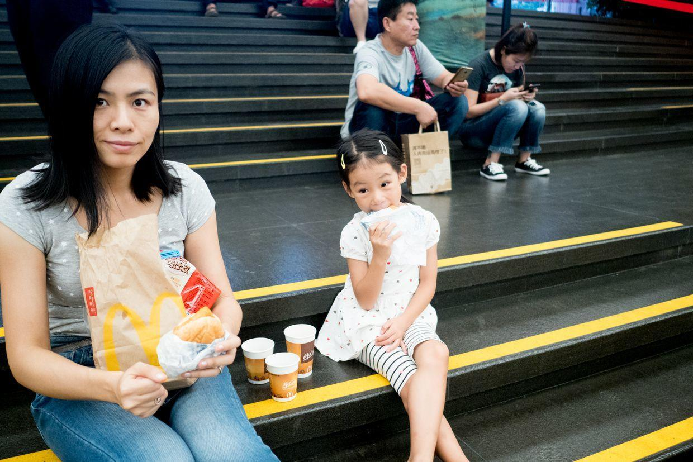

宏伟的入口大厅，各种雕塑艺术品和一年前没有任何变化。

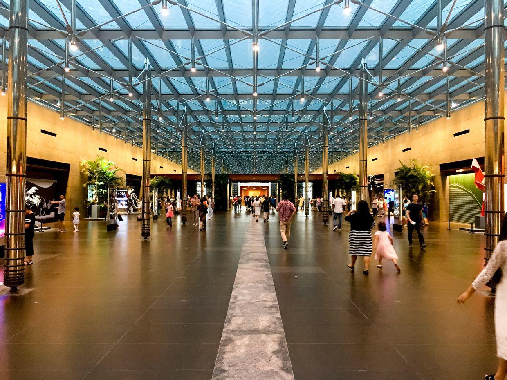

开始跳舞。

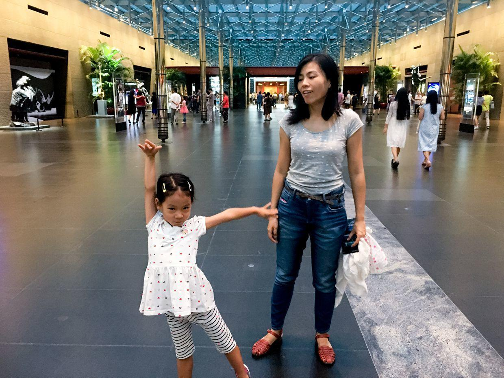

一起合影。

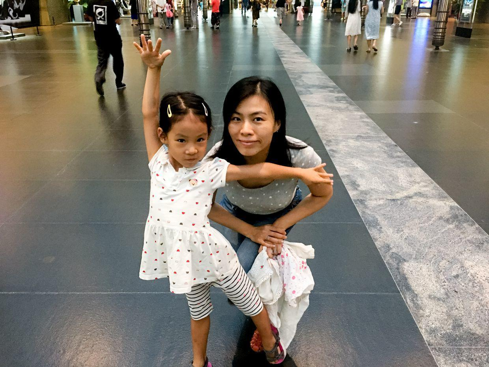

这个结构每次看都感觉很魔幻。

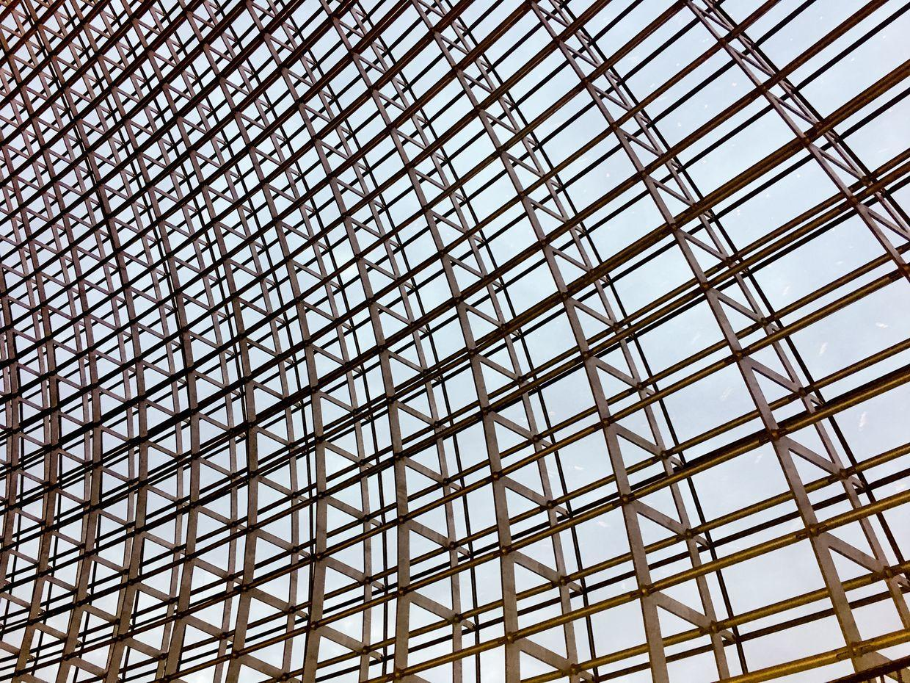

音乐厅。

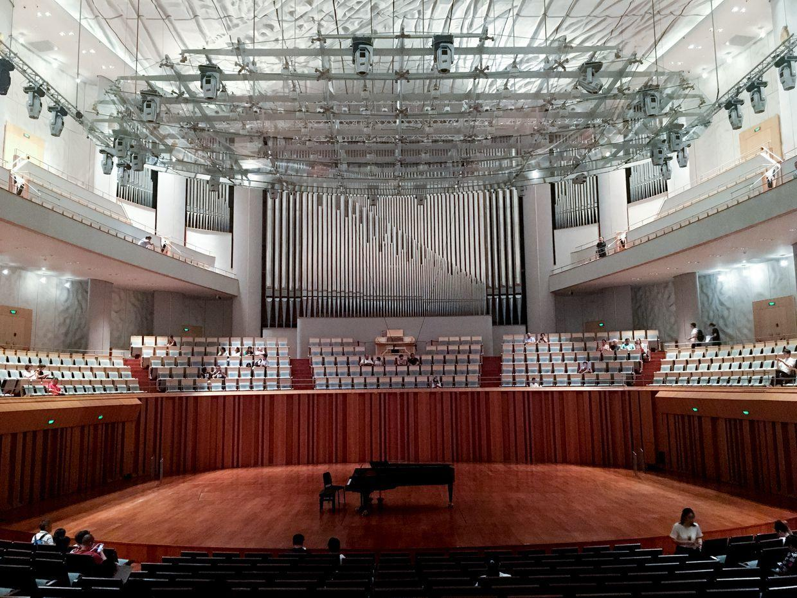

一起合影。

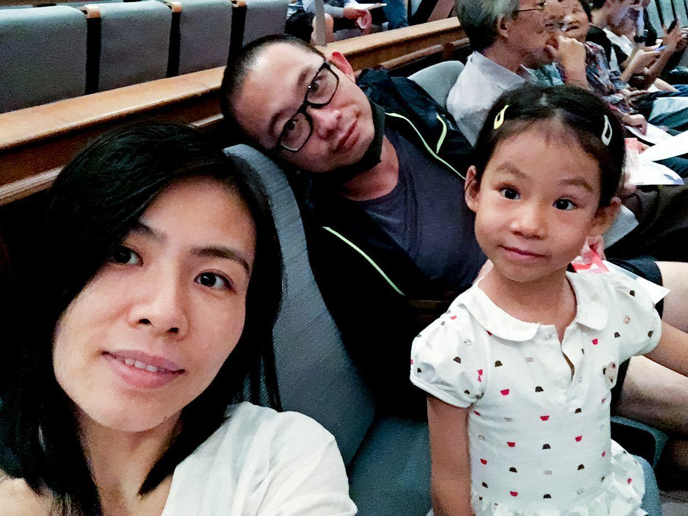

上半场四首意大利歌剧，下半场是中国歌剧。

《江姐》、《洪湖赤卫队》都是家喻户晓的唱段。

演出非常成功。

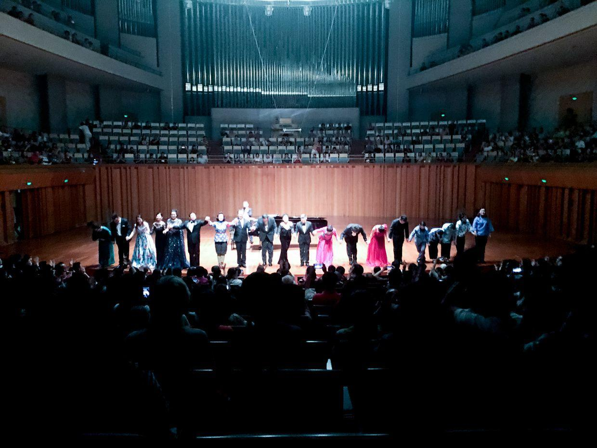

老演员们一起即兴表演《祝酒歌》。

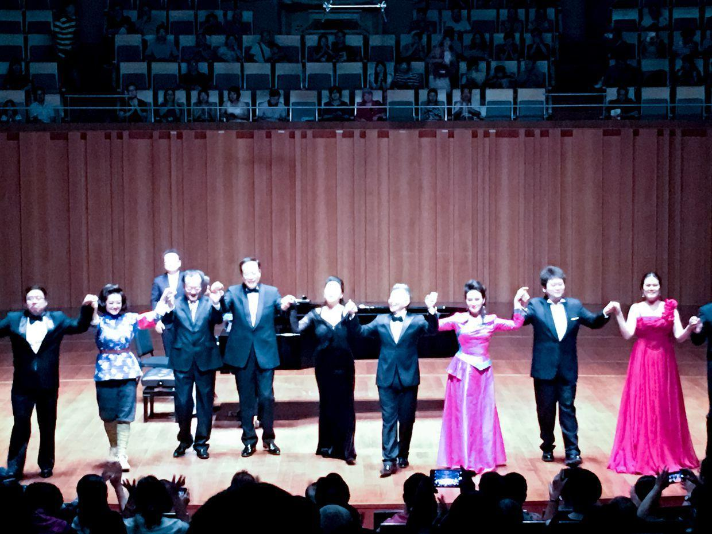

开车回家，路上经过长安街，看到了华灯下的天安门广场。

**个人微信公众号，请搜索：摹喵居士（momiaojushi）**

          
        