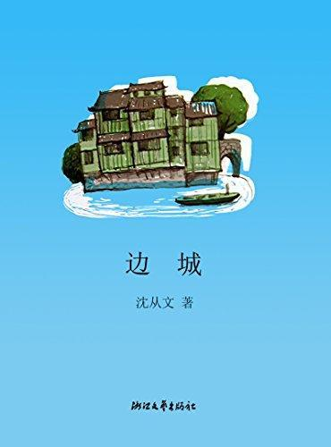

          
            
**2017.08.31**

大名鼎鼎的《边城》，故事情节其实很简单，不超过10句话就能讲完。

写散文一样写小说，再看汪曾祺的散文，果然是沈从文的好学生。
>边城

溪边有座白色小塔，塔下住了一户单独的人家。这人家只一个老人，一个女孩子，一只黄狗。

渡头属公家所有，过渡人本不必出钱；有人心中不安，抓了一把钱掷到船板上时，管渡船的必为一一拾起，依然塞到那人手心里去，俨然吵嘴时的认真神气：“我有了口粮，三斗米，七百钱，够了！谁要你这个！”

但是，凡事求个心安理得，出气力不受酬谁好意思，不管如何还是有人要把钱的。管船人却情不过，也为了心安起见，便把这些钱托人到茶峒去买茶叶和草烟，将茶峒出产的上等草烟，一扎一扎挂在自己腰带边，过渡的谁需要这东西必慷慨奉赠。

坐船的人要给钱，摆渡的人不收钱，非要给钱，拿着钱买成烟草或茶叶，招待坐船的人。真是纯朴啊。
>管理这渡船的，就是住在塔下的那个老人。活了七十年，从二十岁起便守在这小溪边，五十年来不知把船来去渡了若干人。

女孩子的母亲，老船夫的独生女，十七年前同一个茶峒屯防军人唱歌相熟后，很秘密的背着那忠厚爸爸发生了暧昧关系。

屯戍兵见她无远走勇气，自己也不便毁去作军人的名誉，就心想一同去生既无法聚首，一同去死应当无人可以阻拦，首先服了毒。

女儿一面怀了羞惭，一面却怀了怜悯，依旧守在父亲身边。等待腹中小孩生下后，却到溪边故意吃了许多冷水死去了。在一种近乎奇迹中这遗孤居然已长大成人，一转眼间便十五岁了。为了住处两山多竹篁，翠色逼人而来，老船夫随便给这个可怜的孤雏，拾取了一个近身的名字，叫作“翠翠”。

老人的女儿和戍屯兵有私情，先后殉情，留下一个女儿，老人起名翠翠
>翠翠在风日里长养着，把皮肤变得黑黑的，触目为青山绿水，一对眸子清明如水晶，自然既长养她且教育她。

为人天真活泼，处处俨然如一只小兽物。人又那么乖，和山头黄麂一样，从不想到残忍事情，从不发愁，从不动气。

生长在自然之间
>由于边地的风俗淳朴，便是作妓女，也永远那么浑厚，遇不相熟的主顾，做生意时得先交钱，数目弄清楚后，再关门撒野。人既相熟后，钱便在可有可无之间了。

感情好的，别离时互相咬着嘴唇咬着颈脖发了誓，约好了“分手后各人不许胡闹”；四十天或五十天，在船上浮着的那一个，同在岸上蹲着的这一个，便各在分上呆着打发这一堆日子，尽把自己的心紧紧缚定远远的一个人。

娼妓都很痴情
>两兄弟既年已长大，必须在各一种生活上来训练他们的人格，作父亲的就轮流派遣两个小孩子各处旅行。向下行船时，多随了自己的船只充当伙计，甘苦与人相共。荡桨时选最重的一把，背纤时拉头纤二纤，吃的是干鱼、辣子、臭酸菜，睡的是硬帮帮的舱板。

顺顺是瘸子，买船做生意，有了2个儿子
>向上行从旱路走去，则跟了川东客货，过秀山、龙潭、酉阳作生意，不论寒暑雨雪，必穿了草鞋按站赶路。且佩了短刀，遇不得已必须动手，便霍的把刀抽出，站到空阔处去，等候对面的一个，继着就同这个人用肉搏来解决。地方的风气，既为“对付仇敌必须用刀，联结朋友也必须用刀”，到需要刀时，他们也就从不让它失去那点机会。学贸易，学应酬，学习到一个新地方去适应各种生活，且学习用刀保护身体同名誉。教育的目的，似乎在使两个孩子学得做人的勇气与义气。

一分教育的结果，弄得两个人结实如老虎，却又和气亲人，不骄惰，不浮华，不倚势凌人。故父子三人在茶峒边境上，为人所提及时，人人对这个名姓无不加以一种尊敬。

两个儿子，带在身边，学尽各种本领
>两省接壤处，十余年来主持地方军事的，知道注重在安辑保守，处置还得法，并无特别变故发生。水陆商务既不至于受战争停顿，也不至于为土匪影响，一切莫不极有秩序，人民也莫不安分乐生。

这就是天堂啊
>边城所在一年中最热闹的日子，是端午、中秋和过年。

端午日，当地妇女、小孩子，莫不穿了新衣，额角上用雄黄蘸酒画了个王字。任何人家到了这天必可以吃鱼吃肉。

河中龙船以长潭某处作起点，税关前作终点，作比赛竞争。

端午节，赛龙舟
>掌水码头的龙头大哥顺顺，年轻时节便是一个泅水的高手，入水中去追逐鸭子，在任何情形下总不落空。但一到次子傩送年过十岁时，已能入水闭气汆着到鸭子身边，再忽然冒水而出，把鸭子捉到，这作爸爸的便解嘲似的向孩子们说：“好，这种事情有你们来作，我不必再下水和你们争显本领了。”于是当真就不下水与人来竞争捉鸭子。但下水救人呢，当作别论。凡帮助人远离患难，便是入火，人到八十岁，也还是成为这个人一种不可逃避的责任！

顺顺上了年纪，不在和儿子争鸭子下水，但遇到救人还是当仁不让
>另外一些人家，又有划拳行酒的吵嚷声音。同时停泊在吊脚楼下的一些船只，上面也有人在摆酒炒菜，把青菜萝卜之类，倒进滚热油锅里去时发出沙沙的声音。

炒菜下锅很有烟火气
>“爷爷，那个人去年送我回家，他拿了火把走路时，真像个山上的喽罗！”

那人一看是守渡船的，且看到了翠翠，就笑了。“翠翠，你长大了！二老说你在河边大鱼会吃你，我们这里河中的鱼，现在可吞不下你了。”

从祖父和那长年谈话里，翠翠听明白了二老是在下游六百里外沅水中部青浪滩过端午的。但这次不见二老，却认识了大老，且见着了那个一地出名的顺顺。

顺顺看上翠翠，想要给大老提亲，可是翠翠对二老一直忘不了
>那水上名人同祖父谈话时，翠翠虽装作眺望河中景致，耳朵却把每一句话听得清清楚楚。那人向祖父说，翠翠长得很美，问过翠翠年纪，又问有不有了人家。祖父则很快乐的夸奖了翠翠不少，且似乎不许别人来关心翠翠的婚事，因此一到这件事便闭口不谈。

祖父对婚事还是很慎重
>“人大了就应当守船呢。”

“人老了才应当守船。”

“人老了应当歇憩！”

白日渐长，不知什么时节，守在船头的祖父睡着了，躺在岸上的翠翠同黄狗也睡着了。

温馨的画面
>祖父心想：“你总有一天会要走的！”但不敢提起这件事。祖父一时无话可说，于是走过屋后塔下小圃里去看葱，翠翠跟了过去。

“爷爷，我决定不去，要去让船去，我替船陪你！”

“好，翠翠，你不去我去，我还得戴了朵红花，装刘姥姥进城去见世面！”

两人为这句话笑了许久。所争持的事，不求结论了。

总是要出去闯一闯的
>翠翠眼见在船头站定、摇动小旗指挥进退、头上包着红布的那个年轻人，便是送酒葫芦到碧溪岨的二老，心中便印着两年前的旧事：

“大鱼吃掉你！”

“吃掉不吃掉，不用你这个人管！”

“好的，我就不管！”

“狗，狗，你也看人叫！”

看见了二老，又想起了第一次端午节见面的情景
>翠翠脸发着烧走到另外一处去，又听有两个人提及这件事，且说：“一切早安排好了，只需要二老一句话。”

又说：“只看二老今天那么一股劲儿，就可以猜想得出，这劲儿是岸上一个黄花姑娘给他的！”

谁是激动二老的黄花姑娘？听到这个，翠翠心中不免有点儿乱。

听到别人议论二老，非要选一个渡船的姑娘
>翠翠心想：“碾坊陪嫁，希奇事情咧。”二老不能逼迫翠翠回去，到后便各自走开了。

翠翠到河下时，小小心腔中充满了一种说不分明的东西。是烦恼吧，不是！是忧愁吧，不是！是快乐吧，不，有什么事情使这个女孩子快乐呢？是生气了吧，——是的，她当真仿佛觉得自己是在生一个人的气，又像是在生自己的气。

心里喜欢二老，所以生气烦恼
>翠翠说：“爷爷，你醉疯了。”祖父说：“爷爷不醉不疯，……去，我们到河边看他们放鸭子去。可惜我老了，不能下水里去捉只鸭子回家焖紫姜吃。”他还想说：“二老捉得鸭子，一定又会送给我们的。”话不及说，二老来了，站在翠翠面前微笑着。翠翠也不由不抿着嘴微笑着。

笑得真是腼腆
>这一对难兄难弟原来同时都爱上了那个撑渡船的外孙女。

这事情在本地人说来也并不希奇。边地俗话说：“火是各处可烧的，水是各处可流的，日月是各处可照的，爱情是各处可到的。”有钱船总儿子，爱上一个弄渡船的穷人家女儿，不能成为希罕的新闻。

大老喜欢翠翠，找人说亲。二老家里安排了娶碾坊家的，可是也喜欢翠翠
>“我要坐船下桃源县过洞庭湖，让爷爷满城打锣去叫我，点了灯笼火把去找我。”她便同祖父故意生气似的，很放肆的去想到这样一件不可能事情。且想象她出走后，祖父用各种方法寻觅她都无结果，到后无可奈何躺在渡船上。

“人家喊：‘过渡，过渡，老伯伯，你怎么的！不管事！’‘怎么的？我家翠翠走了，下桃源县了！’‘那你怎么办？’‘怎么办吗，拿了把刀，放在包袱里，搭下水船去杀了她！’……”

祖父说：“翠翠，我来慢了，你就哭，这还成吗？我死了呢？”翠翠不做声。祖父又说：“不许哭，做一个大人，不管有什么事都不许哭。要硬扎一点，结实一点，才配活到这块土地上！”

生祖父的气，离家出走，又担心祖父
>祖父夜来兴致很好，为翠翠把故事说下去，就提到了本城人二十年前唱歌的风气，如何驰名于川、黔边地。翠翠的父亲，便是当地唱歌的第一手，能用各种比喻解释爱与憎的结子，这些事也说到了。翠翠母亲如何爱唱歌，且如何同父亲在未认识以前在白日里对歌，一个在半山上竹篁里砍竹子，一个在溪面渡船上拉船，这些事也说到了。翠翠问：“后来怎么样？”祖父说：“后来的事当然长得很，最重要的事情，就是这种歌唱出了你。”

摘虎耳草！白日里拉船时，她仰头望着崖上那些肥大虎耳草已极熟悉。

听祖父讲母亲的故事，去摘虎耳草
>“伯伯，我正有事情告你，碰巧你就来城里！”“什么事情？”“你听我说：天保大老坐下水船到茨滩出了事，闪不知这个人掉到滩下漩水里就淹坏了。早上顺顺家里得到这个信息，听说二老一早就赶去了。”

大老回家淹死了
>日子平平的过了一个月，一切人心上的病痛，似乎都在那份长长的白日下医治好了。

祖父不起身，也不答应，就赶回家里去，到得床边摇了祖父许久，祖父还不做声。原来这个老年人在雷雨将息时已死去了。

“他管船，管了五十年的船，尽过了责任，——他死了啊！”

祖父去世
>杨马兵是个近六十岁了的人，原本和翠翠的父亲同营当差，说故事的本领比翠翠祖父还高一筹，加之为人特别热忱，做事又勤快又干净，因此同翠翠住下来，使翠翠仿佛去了一个祖父，却新得了一个伯父。

时候变了，一切也自然都不同了，皇帝已被掀下了金銮宝殿，不再坐江山，平常人还消说！杨马兵想起自己年轻作马夫时，打扮的索索利利，牵了马匹到碧溪岨来对翠翠母亲唱歌，翠翠母亲总不理会，到如今自己却成为这孤雏的唯一靠山，唯一信托人，不由得不苦笑。

杨马兵照顾翠翠，回忆起当年自己也追求过翠翠的母亲
>两人每个黄昏必谈祖父，以及这一家有关系的问题。后来便说到了老船夫死前的一切，翠翠因此明白了祖父活时所不提到的许多事。二老的唱歌，顺顺大儿子的死，顺顺父子对于祖父的冷淡，中寨人用碾坊作陪嫁妆奁，诱惑傩送二老，二老既记忆着哥哥的死亡，且因得不到翠翠理会，又被逼着接受那座碾坊，意思还在渡船，因此赌气下行。祖父的死因，又如何和翠翠有关……凡是翠翠不明白的事情，如今可全明白了。翠翠把事情弄明白后，哭了一个夜晚。

二老因为大老的死，不愿见翠翠，也不愿娶碾坊，开始去川东做生意
>到了冬天，那个圮坍了的白塔，又重新修好了。那个在月下唱歌，使翠翠在睡梦里为歌声把灵魂轻轻浮起的年轻人，还不曾回到茶峒来。这个人也许永远不回来了，也许明天回来！

翠翠还在渡船，等着这个人回来
>柏子

落着雨，刮着风，各船上了篷，人在篷下听雨声风声，江波吼哮如癫子，船只纵互相牵连互相依靠，也簸动不止，这一种情景是常有的。

坐船人对此决不奇怪，不欢喜，不厌恶，因为凡是在船上生活，这些平常人的爱憎便不及在心上滋生了。

描写船和人，妙笔
>这是其中之一个，名叫柏子，日里爬桅子唱歌，不知疲倦；到夜来，还依然不知道疲倦。

灯光多无数，每一小点灯光便有一个或一群水手。灯光还不及塞满这个小房，快乐却将水手们胸中塞紧，欢喜在胸中涌着，各人眼睛皆眯了起来。

这个隐晦的描写，绝妙
>萧萧

萧萧做媳妇就不哭。这小女子没有母亲，从小寄养到伯父种田的庄子上，终日提个小竹兜箩，在路旁田坎捡狗屎挑野菜。出嫁只是从这家转到那家。因此到那一天，这女人还只是笑。她又不害羞，又不怕。她是什么事也不知道，就做了人家的新媳妇了。

天真烂熳的无知少女
>萧萧做媳妇时年纪十二岁，有一个小丈夫，年纪还不到三岁。丈夫比她年少九岁，还不曾断奶。按地方规矩，过了门，她喊他做弟弟。她每天应作的事是抱弟弟到村前柳树下去玩，到溪边去玩。

童养媳，带着自己的小丈夫去玩儿
>丈夫哭到婆婆无可奈何，于是萧萧轻脚轻手爬起床来，睡眼迷蒙，走到床边，把人抱起，给他看月光，看星光；或者仍然啵啵的亲嘴，互相觑着，孩子气的“嗨嗨，看猫呵！”那样喊着哄着，于是丈夫笑了。

逗自己未来的丈夫玩儿
>萧萧嫁过了门，做了拳头大丈夫的小媳妇，一切并不比先前受苦，这只看她一年来身体发育就可明白。风里雨里过日子，像一株长在园角落不为人注意的蓖麻，大叶大枝，日增茂盛。这小女人简直是全不为丈夫设想那么似的，一天比一天长大起来了。

描写小姑娘长大，妙笔
>女学生由祖父方面所知道的是这样一种人：

她们穿衣服不管天气冷热，吃东西不问饥饱，晚上交到子时才睡觉，白天正经事全不作，只知唱歌打球，读洋书。

她们都会花钱，一年用的钱可以买十六只水牛。

她们在省里京里想往什么地方去时，不必走路，只要钻进一个大匣子中，那匣子就可以带她到地。城市中还有各种各样的大小不同匣子，都用机器开动。

她们在学校，男女在一处上课读书，人熟了，就随意同那男子睡觉，也不要媒人，也不要财礼，名叫“自由”。

她们也做做州县官，带家眷上任，男子仍然喊作“老爷”，小孩子叫“少爷”。

她们自己不养牛，却吃牛奶羊奶，如小牛小羊；买那奶时是用铁罐子盛的。

她们无事时到一个唱戏地方去，那地方完全像个大庙，从衣袋中取出一块洋钱来（那洋钱在乡下可买五只母鸡），买了一小方纸片儿，拿了那纸片到里面去，就可以坐下看洋人扮演的影子戏。

她们被冤了，不赌咒，不哭。

她们年纪有老到二十四岁还不肯嫁人的，有老到三十四十居然还好意思嫁人的。

她们不怕男子，男子不能使她们受委屈，一受委屈就上衙门打官司，要官罚男子的款，这笔钱她有时独占自己花用，有时和官平分。

她们不洗衣煮饭，也不养猪喂鸡；

有了小孩子，也只花五块钱或十块钱一月，雇个人专管小孩，自己仍然整天看戏打牌，或者读那些没有用处的闲书……

旧时代对女学生的描写
>世界上人把日子糟蹋，和萧萧一类人家把日子吝惜是同样的，各有所得，各属分定。许多城市中文明人，把一个夏天完全消磨到软绸衣服、精美饮料以及种种好事情上面。萧萧的一家，因为一个夏天的劳作，却得了十多斤细麻，二三十担瓜。

夏天劳作的成果
>大肚子作证，什么也没有可说。照习惯，沉潭多是读过“子曰”的族长爱面子才作出的蠢事。伯父不读“子曰”，不忍把萧萧当牺牲，萧萧当然应当嫁人作“二路亲”了。

批判了那些夫子，有了私情怀孕的萧萧，没有被沉潭
>生下的既是儿子，萧萧不嫁别处了。到萧萧正式同丈夫拜堂圆房时，儿子已经年纪十岁，有了半劳动力，能看牛割草，成为家中生产者一员了。平时喊萧萧丈夫做大叔，大叔也答应，从不生气。

私生子是个男孩儿，便被接纳为劳动力了，管萧萧的小丈夫叫大叔
>这儿子名叫牛儿。牛儿十二岁时也接了亲，媳妇年长六年。媳妇年纪大，才能诸事作帮手，对家中有帮助。唢呐吹到门前时，新娘在轿中呜呜的哭着，忙坏了那个祖父、曾祖父。

这一天，萧萧抱了自己新生的毛毛，在屋前榆蜡树篱笆间看热闹，同十年前抱丈夫一个样子。

私生子娶了媳妇，萧萧抱着自己的新生儿，在一旁看着，一个新的轮回
>丈夫

男人。地方实在太穷了，一点点收成照例要被上面的人拿去一大半，手足贴地的乡下人，任你如何勤省耐劳的干做，一年中四分之一时间，即或用红薯叶和糠灰拌和充饥，总还是不容易对付下去。

生活苦得不可想象
>地方虽在山中，离大河码头只三十里，由于习惯，女子出乡讨生活，男人通明白这做生意的一切利益。他懂事，女人名分仍然归他，养得儿子归他，有了钱，也总有一部分归他。

只能靠女人出外讨生活
>三三

凡是到杨家碾坊碾过谷子的，都知道杨家三三。妈妈二十年前嫁给守碾坊的杨，三三五岁，爸爸就丢下碾坊同母女，什么话也不说死去了。爸爸死去后，母亲作了碾坊的主人，三三还是活在碾坊里，吃米饭同青菜、小鱼、鸡蛋过日子，生活毫无什么不同处。三三先是眼见爸爸成天全身是糠灰；到后爸爸不见了，妈妈又成天全身是糠灰……于是三三在哭里笑里慢慢的长大了。

童年丧夫，再哭里笑里长大，妙笔
>母亲就从没有照到女儿意思折断过谁的竿子，照例将说：“三三，鱼多咧，让别人钓吧。鱼是会走路的，上面堡子塘里的鱼，因为欢喜我们这里的水，都跑来了。”

远人不服，则修文德以来之
>走到外边站在溪岸旁，望着清清的溪水，记起从前有人告诉她的话，说这水流下去，一直从山里流一百里，就流到城里了。

很有画意，妙笔

**个人微信公众号，请搜索：摹喵居士（momiaojushi）**

          
        