          
            
**2017.09.02**

周六啦，今天是新学期的第一节舞蹈课。

天气雾霾很厉害，中央电视塔近在咫尺都看不到。

一路上堵了半天车，等到了教室，喵已经进去上课了。

舞蹈课下课啦。

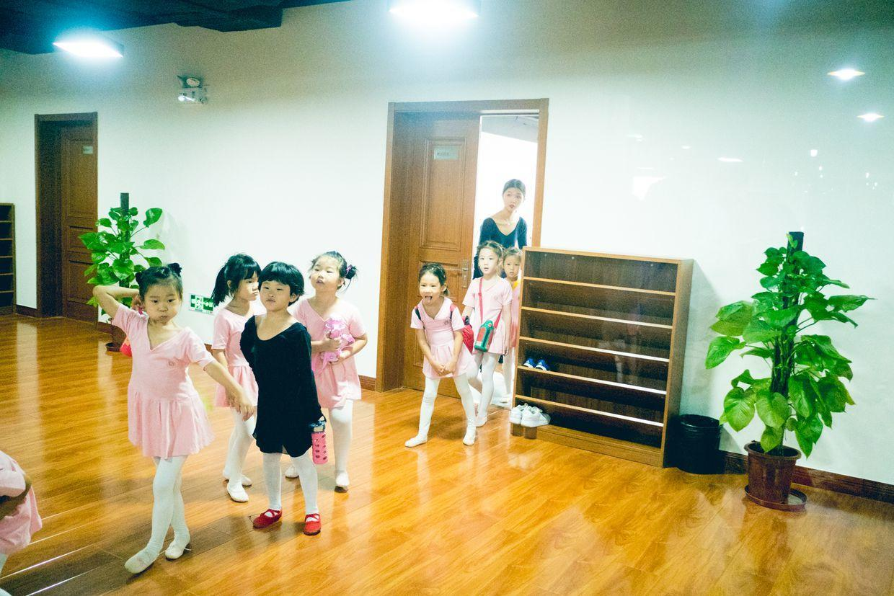

背着书包出来了。

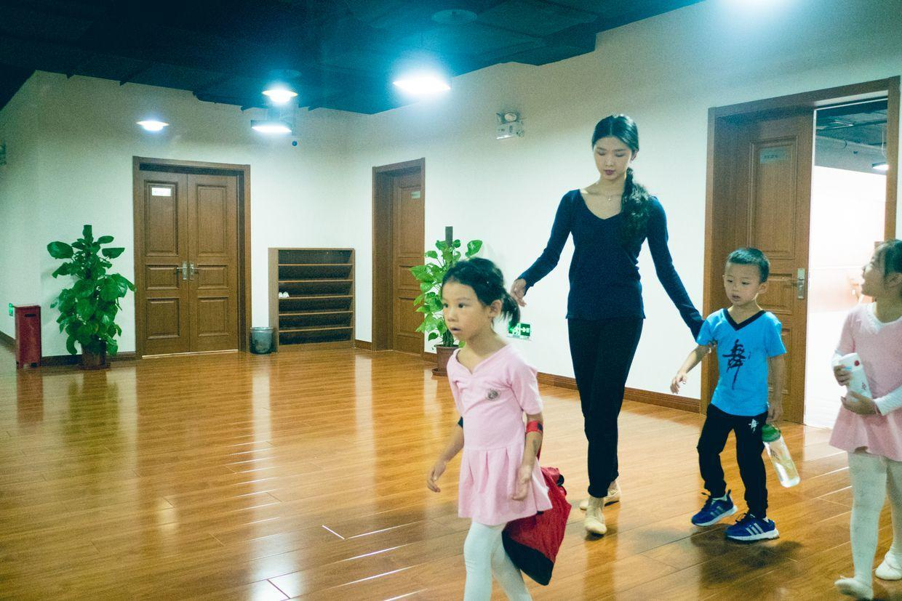

开始换鞋啦。

照例去坐旋转木马。

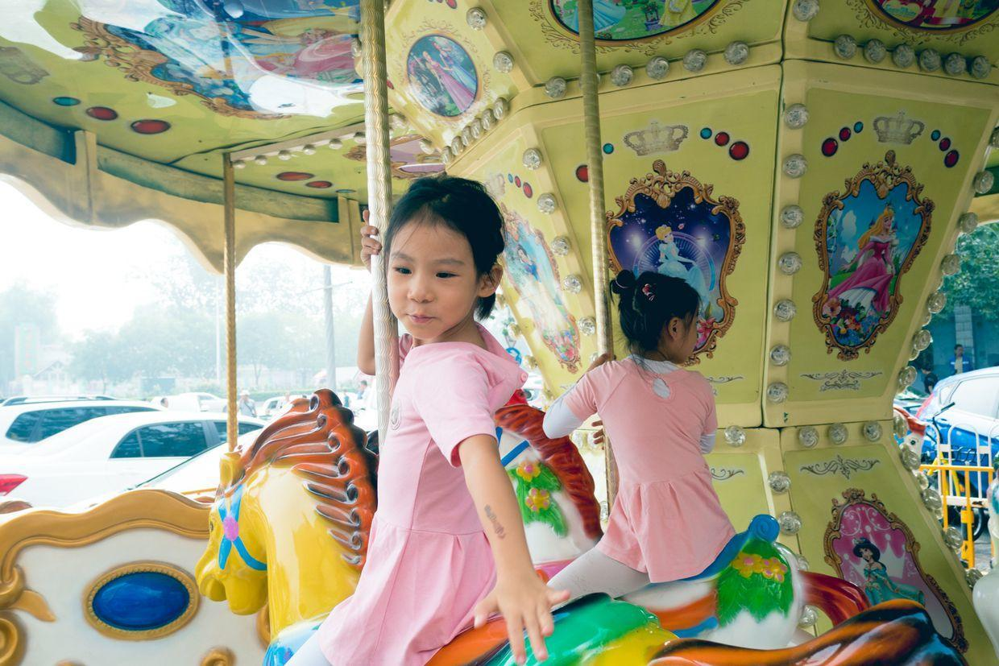

和同学一起玩儿，手拉着手。

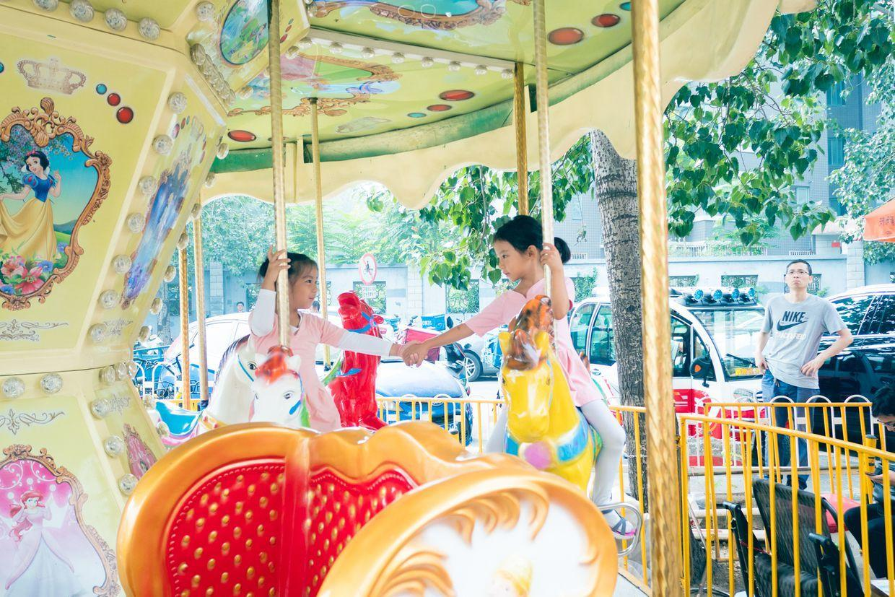

非常开心的一个上午。

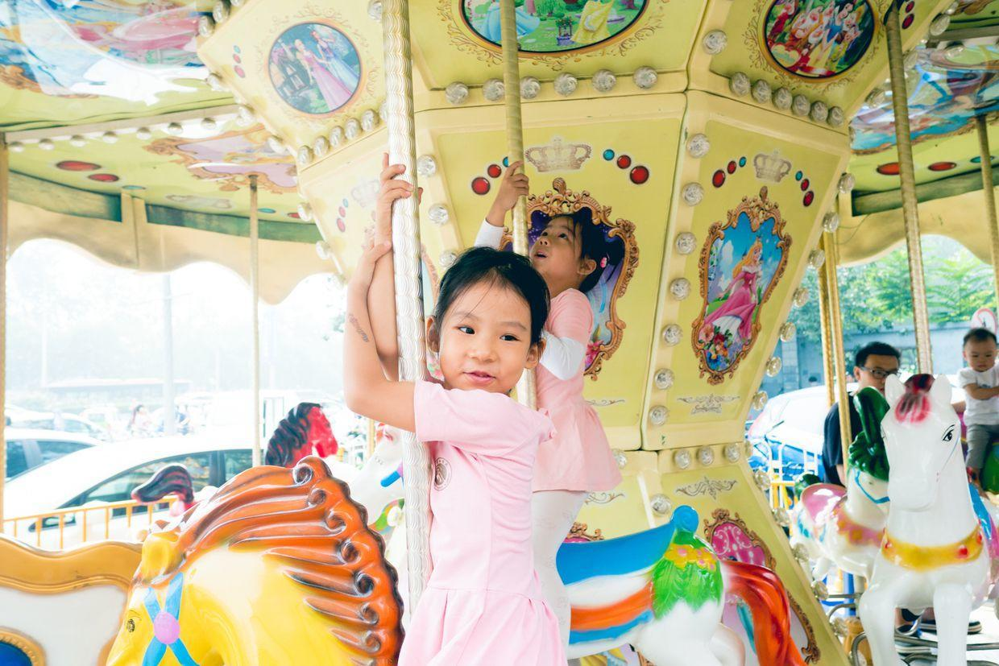

一起散步，要求妈妈托着自己的小手，像艾莎公主一样。

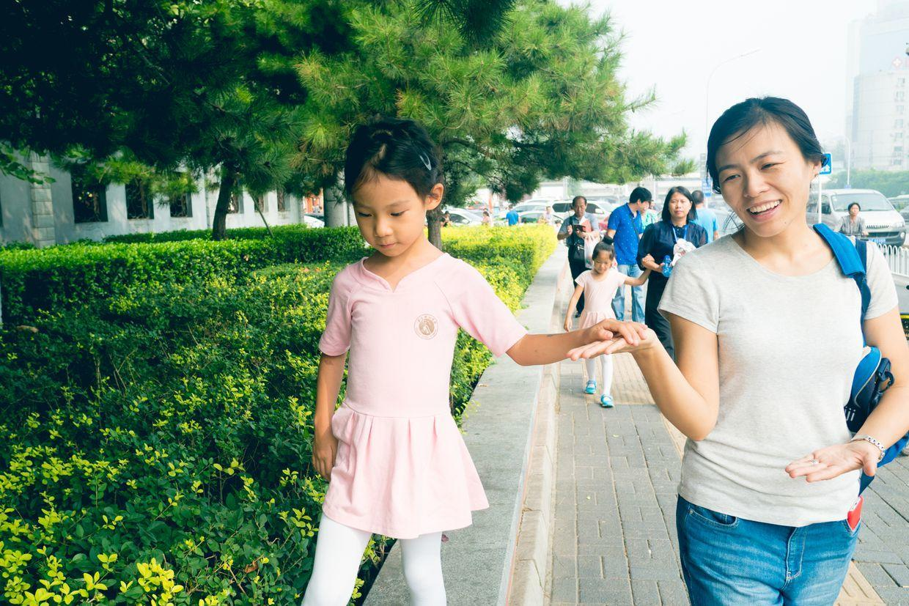

中午回家吃顿饭，睡个觉。

下午去上钢琴课。

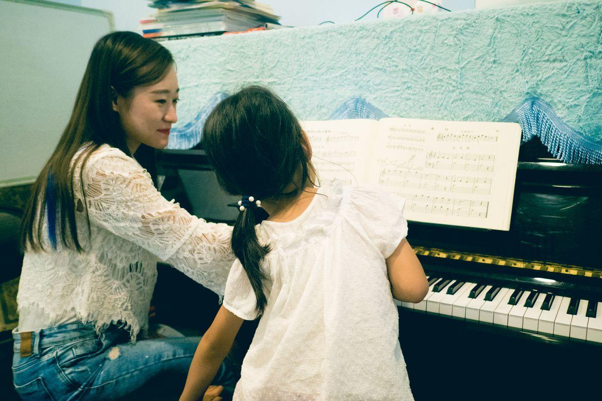

钢琴课下课，去商场买开学用的笔和本子。

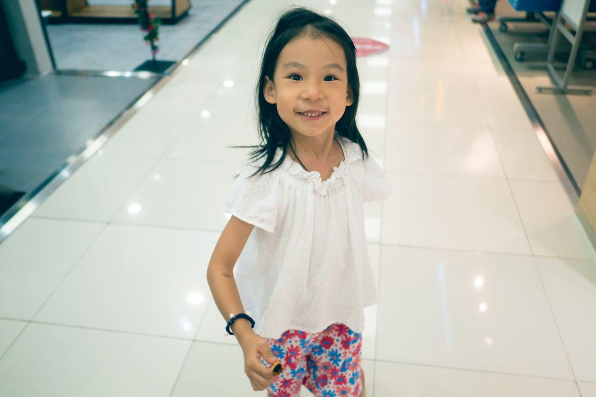

开心地又蹦又跳。

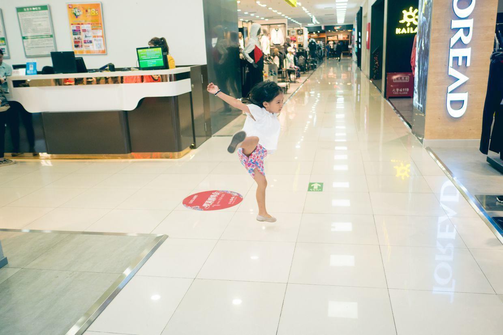

先去商场游乐场里跑一会儿，一堆堆的孩子此起彼伏的。

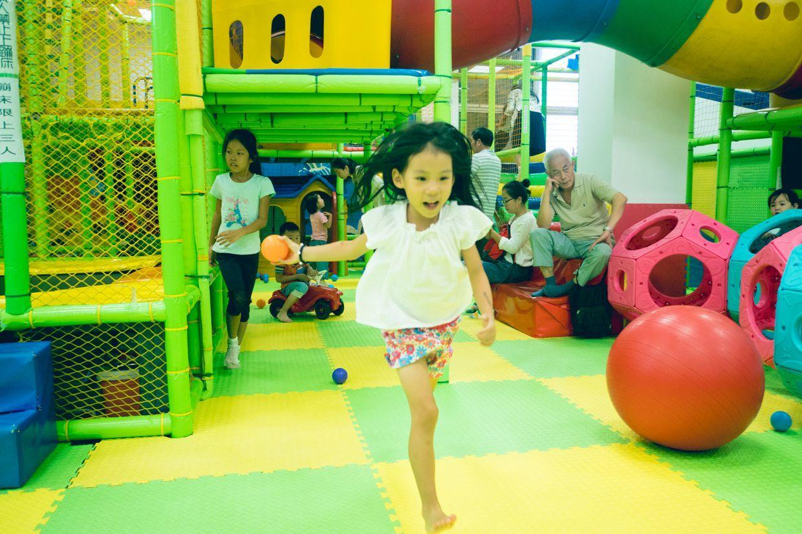

挑好了各种文具，买了一大兜子，自己拎着出来了。

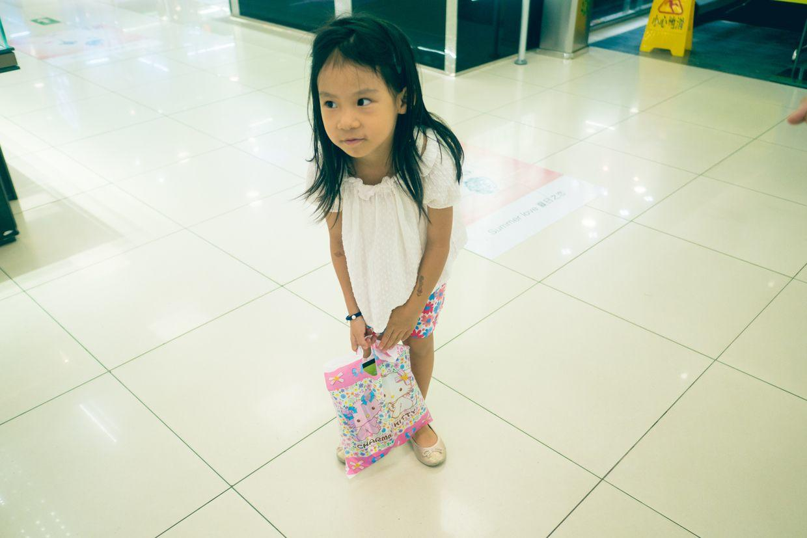

开始画起画了。

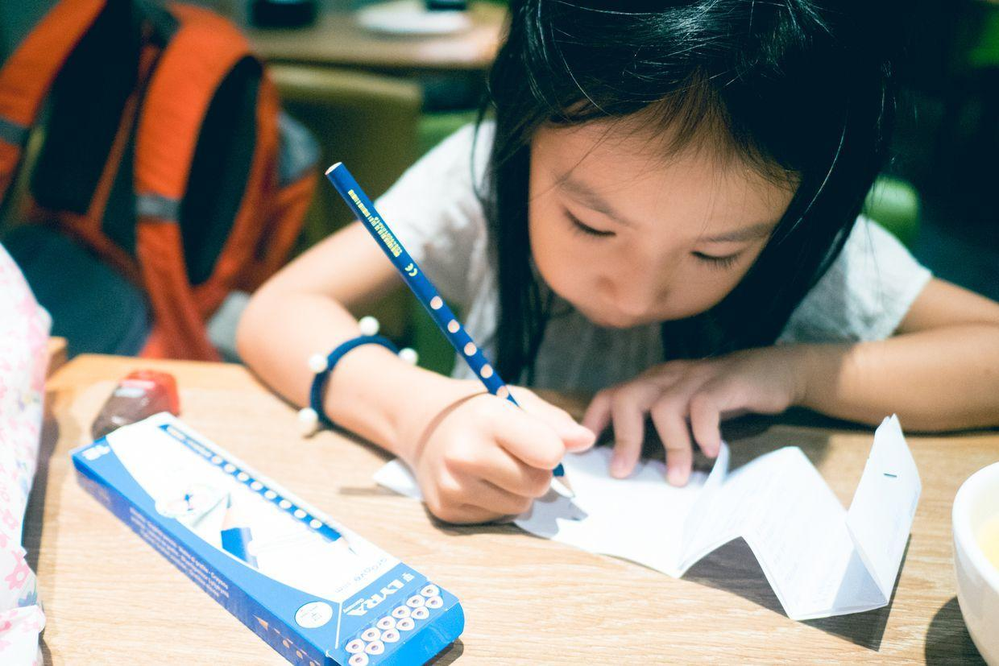

一天很快就过去了。

晚上吃完饭，去蛋糕店给妈妈买了个小生日蛋糕，回家提前给妈妈过个生日。

**个人微信公众号，请搜索：摹喵居士（momiaojushi）**

          
        